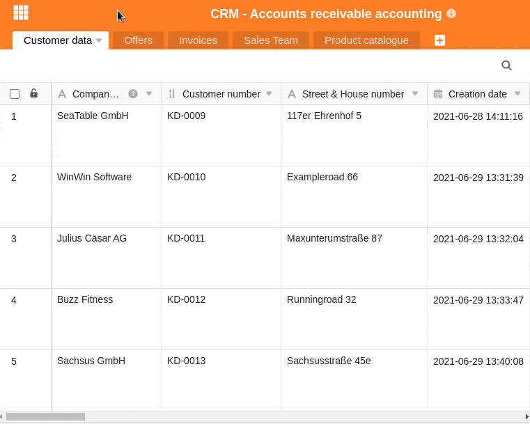
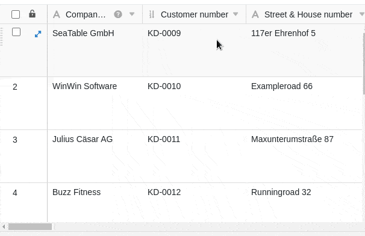

| xx                       | Calc                       | Planmaker                  | Google Sheets     | Zoho Sheet           | Ethercalc       | SeaTable                            |
| ------------------------ | -------------------------- | -------------------------- | ----------------- | -------------------- | --------------- | ----------------------------------- |
| Entwickler               | LibreOffice und OpenOffice | Softmaker GmbH             | Google Inc.       | Zoho Corp. Pvt. Ltd. | Community       | Seafile Ltd.                        |
| Plattform                | Windows, Mac, Linux        | Windows, Mac, Linux        | Browser-basiert   | Browser-basiert      | Browser-basiert | Browser-basiert                     |
| Dateiformat              | ODS                        | PMDX oder XLSX             | \[cross\]         | \[cross\]            | \[cross\]       | \[cross\]                           |
| Kosten                   | kostenlos                  | Kauf: 100€ Miete: 30€ p.a. | kostenlose Option | kostenlose Option    | kostenlos       | kostenlose Option                   |
| **Erfassung**            |                            |                            |                   |                      |                 |                                     |
| Text-Felder              |        | \[check\]                  | \[check\]         | \[check\]            | \[check\]       | \[check\]                           |
| Zahlen-Felder            | \[check\]                  | \[check\]                  | \[check\]         | \[check\]            | \[check\]       | \[check\]                           |
| Datum-Felder             | \[check\]                  | \[check\]                  | \[check\]         | \[check\]            | \[check\]       | \[check\]                           |
| Formeln                  | \[check\]                  | \[check\]                  | \[check\]         | \[check\]            | \[check\]       | \[check\]                           |
| Einfachauswahl           | \[check\]                  | \[check\]                  | \[check\]         | \[check\]            | \[cross\]       | \[check\]                           |
| Mehrfachauswahl          | \[cross\]                  | \[cross\]                  | \[cross\]         | \[cross\]            | \[cross\]       | \[check\]                           |
| Formatierter Text        | \[cross\]                  | \[cross\]                  | \[cross\]         | \[cross\]            | \[cross\]       | \[check\]                           |
| Dateien                  | \[cross\]                  | \[cross\]                  | \[cross\]         | \[cross\]            | \[cross\]       | \[check\]                           |
| Bilder                   |        | \[cross\]                  | \[cross\]         | \[cross\]            | \[cross\]       | \[check\]                           |
| Positionsdaten           | \[cross\]                  | \[cross\]                  | \[cross\]         | \[cross\]            | \[cross\]       | \[check\]                           |
| Ersteller                | \[cross\]                  | \[cross\]                  | \[cross\]         | \[cross\]            | \[cross\]       | \[check\]                           |
| Erstellungszeit          | \[cross\]                  | \[cross\]                  | \[cross\]         | \[cross\]            | \[cross\]       | \[check\]                           |
| Letzer Bearbeiter        | \[cross\]                  | \[cross\]                  | \[cross\]         | \[cross\]            | \[cross\]       | \[check\]                           |
| Bearbeitungszeit         | \[cross\]                  | \[cross\]                  | \[cross\]         | \[cross\]            | \[cross\]       | \[check\]                           |
| Relationen               | \[cross\]                  | \[cross\]                  | \[cross\]         | \[cross\]            | \[cross\]       | \[check\]                           |
| Max. Spalten Max. Zeilen | 1.024 1.048.576            | 16.384 1.000.000           | 5.000.000 cells   | 256 65.536           | n/a             | 2.000 bis ∞ abhängig vom Abonnement |
| **Auswertung**           |                            |                            |                   |                      |                 |                                     |
| Datenvalidierung         | \[check\]                  | \[check\]                  | \[check\]         | \[check\]            | \[check\]       | \[check\]                           |
| Sortierung               | \[check\]                  | \[check\]                  | \[check\]         | \[check\]            | \[check\]       | \[check\]                           |
| Filter                   | \[check\]                  | \[check\]                  | \[check\]         | \[check\]            | \[cross\]       | \[check\]                           |
| Gruppierung              | \[check\]                  | \[check\]                  | \[check\]         | \[check\]            | \[cross\]       | \[check\]                           |
| Bedingte Formatierung    | \[check\]                  | \[check\]                  | \[check\]         | \[check\]            | \[cross\]       | \[check\]                           |
| Zielwertsuche            | \[check\]                  | \[check\]                  | \[check\]         | \[check\]            | \[cross\]       |                                     |
| Pivot Tabellen           | \[check\]                  | \[check\]                  | \[check\]         | \[check\]            | \[cross\]       | \[check\]                           |
| Diagramme                | \[check\]                  | \[check\]                  | \[check\]         | \[check\]            | \[check\]       | \[check\]                           |
| Karten-Ansicht           | \[cross\]                  | \[cross\]                  | \[cross\]         | \[check\]            | \[cross\]       | \[check\]                           |
| Galerie-Ansicht          | \[cross\]                  | \[cross\]                  | \[cross\]         | \[cross\]            | \[cross\]       | \[check\]                           |
| Zeitleisten-Ansicht      | \[cross\]                  | \[cross\]                  | \[cross\]         | \[cross\]            | \[cross\]       | \[check\]                           |
| **Integrationen**        |                            |                            |                   |                      |                 |                                     |
| Externe Daten            | \[cross\]                  | \[cross\]                  | \[check\]         | \[check\]            | \[cross\]       | \[check\]                           |
| API                      | \[cross\]                  | \[check\]                  | \[check\]         | \[check\]            | \[check\]       | \[check\]                           |
| Plugins                  | \[cross\]                  | \[check\]                  | \[check\]         | \[check\]            | \[cross\]       | \[check\]                           |
| SDK                      | \[check\]                  | \[cross\]                  | \[check\]         | \[check\]            | \[cross\]       | \[check\]                           |

Wenn Sie Ihre Tabellen nach und nach mit einer Vielzahl an neuen Spalten gefüllt haben, wird es ab einem gewissen Zeitpunkt nicht mehr möglich sein, alle Tabellenspalten im Blick zu haben, ohne nach rechts scrollen zu müssen. SeaTable erlaubt daher das **Fixieren von einer oder mehreren Spalten**, welche dann unabhängig vom Scrollen an ihrer Position bleiben.

Durch das Fixieren der ersten Spalte(n) können Sie deren **Daten** auch noch **nach dem Scrollen lesen**. Diese Funktion ist sehr nützlich, wenn Sie Werte aus einer der vorderen Spalten mit jenen aus den hinteren Spalten zusammen betrachten oder vergleichen möchten.

Die fixierten Spalten gelten immer für die gesamte Tabelle inklusive aller Ansichten.

## Anzahl der fixierten Spalten anpassen

1. Fahren Sie mit der Maus über die **Trennlinie** zwischen den ersten beiden Spalten, bis anstatt des Mauszeigers ein Hand-Symbol mit der Anweisung **Anzahl der fixierten Spalten durch Ziehen anpassen** erscheint.
2. **Ziehen** Sie den **Cursor** bis zum Ende der letzten **Spalte**, die Sie fixieren möchten.



## Fixieren der ersten Spalte

Zusätzlich zum oben beschriebenen Weg gibt es noch eine **andere Möglichkeit**, Spalten zu fixieren. Diese Option steht jedoch ausschließlich für die **erste Spalte** jeder Tabelle zur Verfügung. Wenn Sie diese Option auswählen, wird folglich **nur** die erste Tabellenspalte fixiert.

1. Klicken Sie auf das dreieckige **Drop-down-Symbol** rechts im Tabellenkopf der ersten Spalte.
2. Klicken Sie auf **Spalte fixieren**.
   


