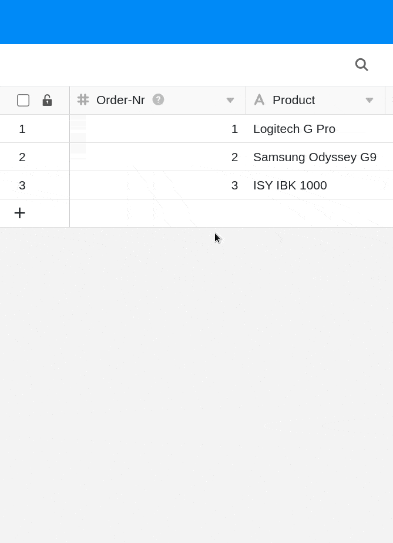
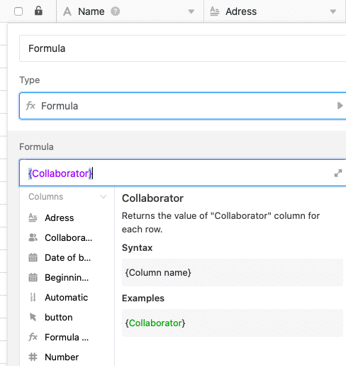

The **first column** of a table in SeaTable has several special features and restrictions compared to the other columns. Here you can find out how to customize the first column in SeaTable.

## The peculiarities of the first column in SeaTable

- Unlike the other columns, you **cannot hide** the first column of a table.
- Unlike the other columns, you **cannot move** the first column of a table.
- Unlike the other columns, you **cannot delete** the first column of a table.
- In contrast to the other columns, however, you can **fix** the first column individually.
- The first column supports only [Text](https://seatable.io/en/docs/text-und-zahlen/die-spalten-text-und-formatierter-text/), [Number](https://seatable.io/en/docs/text-und-zahlen/die-zahlen-spalte/), [Date](https://seatable.io/en/docs/datum-dauer-und-personen/die-datum-spalte/), [Single Select](https://seatable.io/en/docs/auswahlspalten/anlegen-einer-einfachauswahl-spalte/), [Auto Number](https://seatable.io/en/docs/text-und-zahlen/der-spaltentyp-automatische-nummer/) and [Formula](https://seatable.io/en/docs/formeln/grundlagen-von-seatable-formeln/) column **types**.

## How to customize the type of the first column

1. Click on the triangular **drop-down icon** to the right of the name of the first column.
2. Go to **Customize column type**.
3. Click in the **field of** the current column type.
4. Select a **new column type** for the first column.
5. Make **format settings** if necessary.
6. Click **Submit**.
7. Confirm the adjustment by clicking **Convert**.

There are only **six column types** to choose from for the **first** **column**:

- [Text](https://seatable.io/en/docs/text-und-zahlen/die-spalten-text-und-formatierter-text/)
- [Number](https://seatable.io/en/docs/text-und-zahlen/die-zahlen-spalte/)
- [Date](https://seatable.io/en/docs/datum-dauer-und-personen/die-datum-spalte/)
- [Single selection](https://seatable.io/en/docs/auswahlspalten/anlegen-einer-einfachauswahl-spalte/)
- [Automatic number](https://seatable.io/en/docs/text-und-zahlen/der-spaltentyp-automatische-nummer/)
- [Formula](https://seatable.io/en/docs/formeln/grundlagen-von-seatable-formeln/)

## Formulas in the first column

If you define a **formula** as the **first column** of a table, you can use the simple formula **{column name}**, for example, to **quote** the entries from almost all other columns in your table. This even works if the other column type is **not** supported in the first column.

## Frequently asked questions



What are the limitations of the first column?|||

The first column cannot be **hidden**, **moved** or **deleted**.

---

Is it possible to change the type of the first column afterwards?|||

Yes, this is possible. However, in some cases information may be **lost** when [changing the column type](https://seatable.io/en/docs/arbeiten-mit-spalten/wie-man-den-spaltentyp-anpasst/), for example from text to number. Therefore, after a conversion, check whether all information has been transferred correctly and completely.

---

What is an automatic number?|||

If you want your rows to have a **unique identification number**, the [Automatic number](https://seatable.io/en/docs/text-und-zahlen/der-spaltentyp-automatische-nummer/) column type could serve you well. Examples include invoice numbers, test cases or employee IDs. The number can also be supplemented with any prefix.


