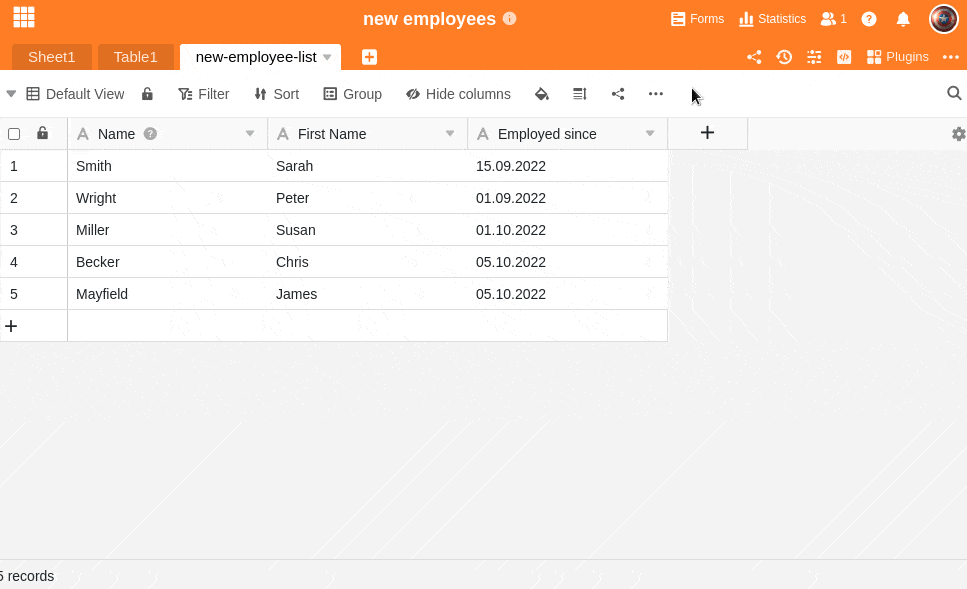

Dans SeaTable, les tableaux sont composés de colonnes et de lignes. Dans une base, vous pouvez ajouter jusqu'à 500 colonnes à un tableau. Pour chaque colonne, vous avez la possibilité de choisir individuellement un **type de colonne** approprié en fonction du type de données.

Vous trouverez [ici](https://seatable.io/fr/docs/spalten/uebersicht-alle-spaltentypen/) un aperçu détaillé de tous les types de colonnes actuellement disponibles dans SeaTable.

## Ajouter une colonne

1. Cliquez sur le **symbole \[+\]** à droite de la dernière colonne de votre tableau.
2. Dans le champ supérieur, **nommez** la colonne que vous souhaitez ajouter.
3. Dans le champ inférieur, attribuez à la colonne un **type de colonne** approprié à partir du **menu déroulant**.
4. Pour une grande partie des types de colonnes, vous devez en outre effectuer d'autres **réglages spécifiques** pour la colonne.
5. Confirmez l'opération en cliquant sur **Envoyer**.
   
