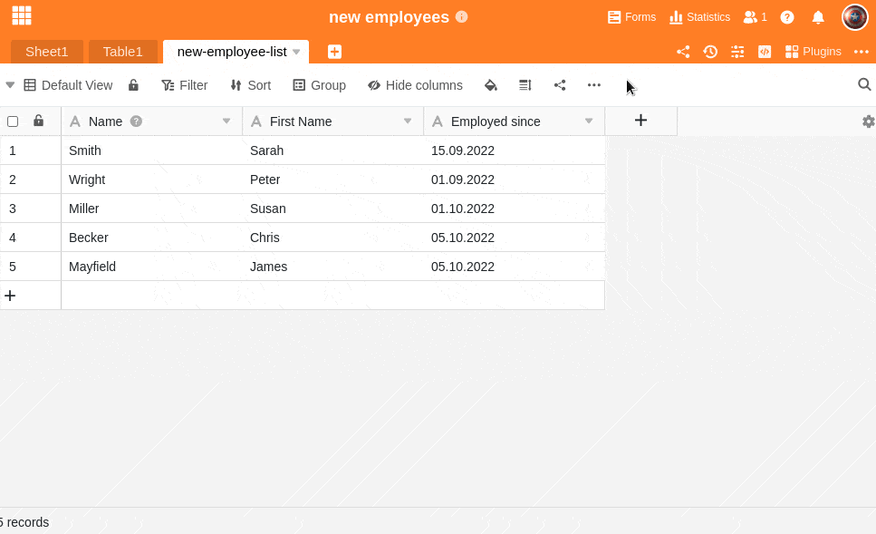

Таблицы в SeaTable состоят из столбцов и строк. В рамках базы в таблицу можно добавить до 500 столбцов. Для каждого столбца у вас есть индивидуальная возможность выбрать подходящий тип **столбца** в зависимости от типа данных.

Подробный обзор всех типов колонок, доступных в настоящее время в SeaTable, можно найти [здесь](https://seatable.io/ru/docs/spalten/uebersicht-alle-spaltentypen/).

## Добавить колонку

1. Нажмите на **символ \[+\]** справа от последнего столбца вашей таблицы.
2. В верхнем поле **дайте имя** столбцу, который вы хотите добавить.
3. В нижнем поле назначьте **столбцу** подходящий **тип столбца** из **выпадающего меню**.
4. Для большинства типов колонн необходимо также выполнить дополнительные **специфические настройки** для колонны.
5. Подтвердите процесс, нажав кнопку **Отправить**.
   
