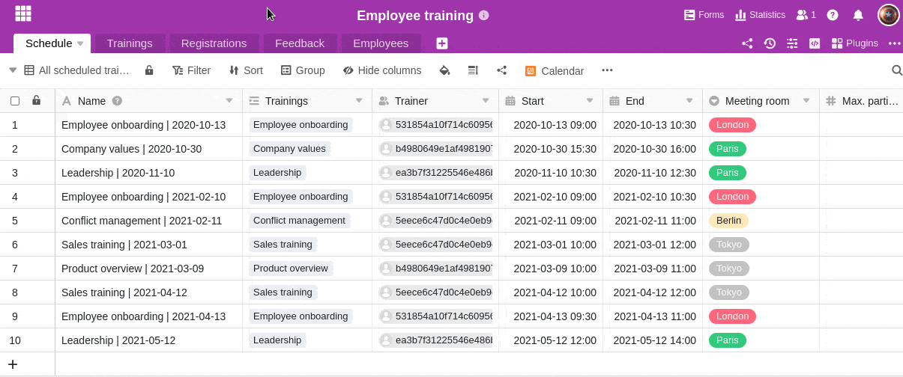

Para armazenar informações, instruções ou explicações sobre uma coluna, pode adicionar uma descrição às colunas da sua tabela no SeaTable. Saiba como fazer isto aqui:

1. Clique no **ícone** triangular do menu **pendente** à direita do nome de uma coluna .
2. Seleccionar a opção **Editar Descrição da Coluna**.
3. Insira uma descrição da coluna na **caixa de texto** que se abre.
4. Guarde a sua entrada clicando em **Submeter**.

A descrição da coluna é apresentada quando se move o ponteiro do rato sobre o **símbolo de informação** .
