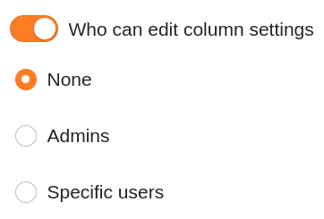
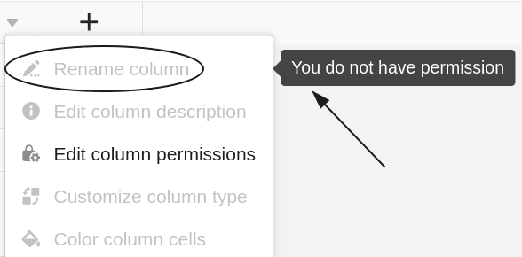



If you have owner or administrator rights, you can define in each table column **who is authorized to edit cells and settings of the respective column**. You have three different options in each case.



## column permissions determine

1. Click the  **drop-down icon** in the header of any column.
2. Click **column permissions edit**.
3. Set the desired **Authorisations** fixed. For each column you can **two** set different permissions:
    - Authorization to edit the cells in this column
    - Authorization to edit the column settings
4. The settings made are **saved automatically**.

## Authorization to edit the cells

Using this permission, you can restrict who can **edit** the **cells of** the selected column. You can choose between **three** options:

- **Option 1**: No one can edit the cells of the selected column.

If you select this option, **no user**, regardless of his role, will be able to edit the cells of the column until the corresponding permission is revoked by the _group owner_ or by a _group administrator_.

**All users** will see a corresponding **lock icon**  next to the column name along with a hint.

- **Option 2**: Administrators can edit the cells of the selected column.

If you select this option, only **owners** and **administrators** will be able to edit the cells of the column.

**Group members**, on the other hand, **cannot** edit the cells and will see the **lock icon**  next to the column name along with a note.

- **Option 3**: Certain users can edit the cells of the selected column.

This option allows you to **select the group members** who should have the permission to edit the cells of the column.

Group members who are **not** selected by you, on the other hand, **cannot** edit the cells and will see the **lock icon**  next to the column name along with a note.

## Authorization to edit the column settings

Using this permission, you can restrict who can **change** the **settings of** the selected column.

The following settings are affected:

- Rename column
- Edit column description
- Customize column type
- Format cells of the column

You can choose between **three** options when assigning permissions:

- **Option 1**: No one can edit the settings of the selected column.
- **Option 2**: Administrators can edit the settings of the selected column.
- **Option 3**: Specific users can edit the settings of the selected column.

The individual options here basically have the **same effect** as with the permissions described above for editing the cells. **Users without the corresponding permission** **cannot** edit the settings of the selected column until the lock is removed.

The locked **column settings** are **grayed out** for these users. When they move the mouse pointer over the settings, a **note** also points out the missing permission.

