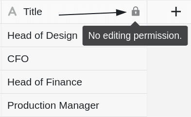



Si tiene derechos de propietario o administrador, puede definir en cada columna de la tabla **quién está autorizado a editar las celdas y los ajustes de la columna correspondiente**. Tienes tres opciones diferentes en cada caso.



## Establecer permisos de columna

1. Haga clic en el **icono desplegable**  de la cabecera de cualquier columna.
2. Haga clic en **Editar permisos de columna**.
3. Ajuste el **Autorizaciones** fijo. Para cada columna puede **dos** establecer permisos diferentes:
    - Autorización para editar las celdas de esta columna
    - Autorización para editar la configuración de la columna
4. Los ajustes realizados se **guardan automáticamente**.

## Autorización para editar las celdas

Con la ayuda de este permiso, puede restringir quién puede **editar** las **celdas de** la columna seleccionada. Puede elegir entre **tres** opciones:

- **Opción 1**: Nadie puede editar las celdas de la columna seleccionada.

Si seleccionas esta opción, **ningún usuario**, independientemente de su rol, podrá editar las celdas de la columna hasta que el permiso correspondiente sea revocado por el _propietario del grupo_ o por un _administrador del grupo_.

A **todos los usuarios** se les muestra el correspondiente **símbolo de candado** junto al nombre de la columna  junto con una nota.

- **Opción 2**: Los administradores pueden editar las celdas de la columna seleccionada.

Si selecciona esta opción, sólo los **propietarios** y **administradores** podrán editar las celdas de la columna.

**Los miembros del grupo**, en cambio, **no pueden** editar las celdas y se les muestra el **símbolo del candado**  junto con una nota al lado del nombre de la columna.

- **Opción 3**: Usuarios específicos pueden editar las celdas de la columna seleccionada.

Con esta opción, puede **seleccionar los miembros del grupo** que deben tener permiso para editar las celdas de la columna.

Por otra parte, los miembros del grupo que **no hayan** sido seleccionados por usted **no podrán** editar las celdas y se les mostrará el **símbolo del candado**  junto con una nota al lado del nombre de la columna.

## Autorización para editar la configuración de la columna

Este permiso le permite restringir quién puede **cambiar** la **configuración de** la columna seleccionada.

Se ven afectados los siguientes ajustes:

- Renombrar columna
- Editar descripción de columna
- Adaptar el tipo de columna
- Formatear las celdas de la columna

Puede elegir entre **tres** opciones a la hora de asignar permisos:

- **Opción 1**: Nadie puede editar los ajustes de la columna seleccionada.
- **Opción 2**: Los administradores pueden editar la configuración de la columna seleccionada.
- **Opción 3**: Usuarios específicos pueden editar la configuración de la columna seleccionada.

Las opciones individuales tienen básicamente el **mismo efecto** que con los permisos para editar las celdas descritos anteriormente. **Los usuarios sin la autorización** correspondiente **no pueden** editar los ajustes de la columna seleccionada hasta que se elimine el bloqueo.

Los ajustes de las **columnas** bloqueadas aparecen **atenuados** para estos usuarios. Cuando pasan el puntero del ratón por encima de los ajustes, una **nota** indica también la falta de autorización.

