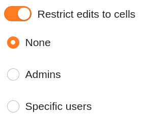
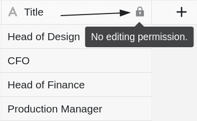
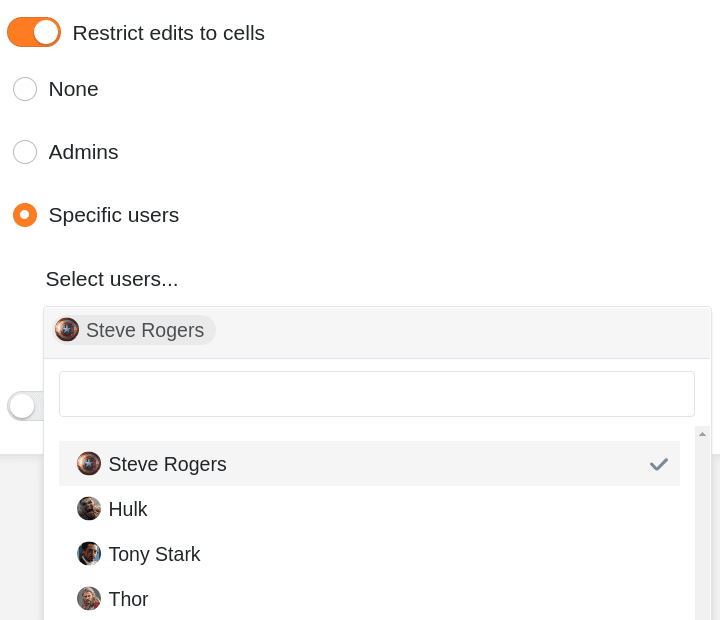
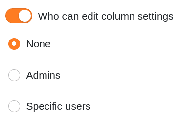
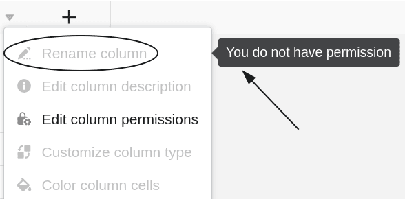



Si vous avez des droits de propriétaire ou d'administrateur, vous pouvez définir dans chaque colonne du tableau qui est **autorisé à modifier les cellules et les paramètres de la colonne en question**. Vous avez trois options différentes.



## Définir les autorisations de colonne

1. Cliquez sur l'**icône déroulante**  dans l'en-tête de n'importe quelle colonne.
2. Cliquez sur **Modifier les autorisations de colonne**.
3. Créez les fichiers souhaités **Autorisations** pour chaque colonne. Pour chaque colonne, vous pouvez **deux** définir différentes autorisations :
    - Autorisation de modifier les cellules de cette colonne
    - Autorisation de modifier les paramètres des colonnes
4. Les réglages effectués sont **automatiquement enregistrés**.

## Autorisation de modifier les cellules

Cette autorisation vous permet de limiter qui peut **modifier** les **cellules** de la colonne sélectionnée. Vous avez le choix entre **trois** options :

- **Option 1**: Personne ne peut modifier les cellules de la colonne sélectionnée.

Si vous sélectionnez cette option, **aucun utilisateur**, quel que soit son rôle, ne pourra modifier les cellules de la colonne tant que le _propriétaire_ ou l'_administrateur du groupe_ n'aura pas retiré l'autorisation correspondante.

**Tous les utilisateurs** voient s'afficher à côté du nom de la colonne un **symbole de cadenas** correspondant  ainsi qu'une remarque.

- **Option 2**: les administrateurs peuvent modifier les cellules de la colonne sélectionnée.

Si vous sélectionnez cette option, seuls les **propriétaires** et **les administrateurs** peuvent modifier les cellules de la colonne.

**Les membres du groupe** ne peuvent par contre **pas** modifier les cellules et voient s'afficher à côté du nom de la colonne le **symbole du cadenas**  ainsi qu'une remarque.

- **Option 3**: certains utilisateurs peuvent modifier les cellules de la colonne sélectionnée.

Cette option vous permet de **sélectionner** les **membres du groupe** qui doivent disposer de l'autorisation de modifier les cellules de la colonne.

Les membres du groupe que vous n'avez **pas** sélectionnés ne peuvent **pas** modifier les cellules et voient s'afficher le **symbole du cadenas**  ainsi qu'une remarque à côté du nom de la colonne.

## Autorisation de modifier les paramètres des colonnes

Cette autorisation vous permet de limiter les personnes qui peuvent **modifier** les **paramètres** de la colonne sélectionnée.

Les paramètres suivants sont concernés :

- Renommer une colonne
- Modifier la description des colonnes
- Personnaliser le type de colonne
- Formater les cellules de la colonne

Vous pouvez choisir entre **trois** options lors de l'attribution des autorisations :

- **Option 1**: Personne ne peut modifier les paramètres de la colonne sélectionnée.
- **Option 2**: les administrateurs peuvent modifier les paramètres de la colonne sélectionnée.
- **Option 3**: certains utilisateurs peuvent modifier les paramètres de la colonne sélectionnée.

Les différentes options ont alors en principe **le même effet** que les autorisations d'édition des cellules décrites ci-dessus. **Les utilisateurs sans autorisation correspondante** ne peuvent **pas** modifier les paramètres de la colonne sélectionnée tant que le blocage n'est pas levé.

Les **paramètres de colonne** bloqués sont **grisés** pour ces utilisateurs. Lorsqu'ils passent le curseur de la souris sur les paramètres, un **message** indique en outre qu'ils ne disposent pas de l'autorisation nécessaire.

