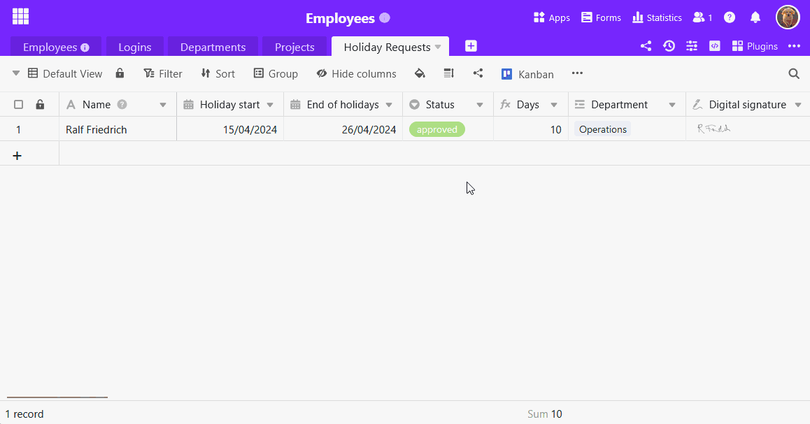
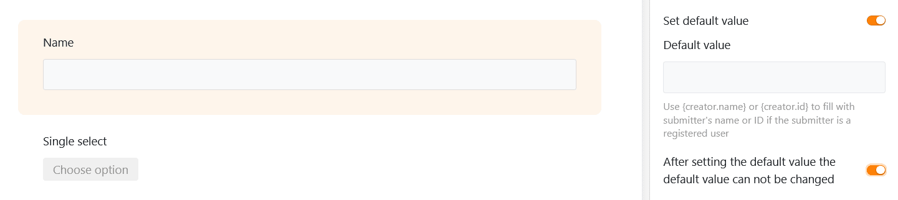

If you define a **default value** for a column, this is **automatically entered in every new row** in the table. With predefined default values, you can save yourself a few clicks when [adding new rows](https://seatable.io/en/docs/arbeiten-mit-zeilen/hinzufuegen-einer-zeile/). Of course, you can still adjust the automatically entered values manually afterwards.

## How to set default values

1. Click on the triangular **drop-down icon**  to the right of the name of the column for which you want to define a default value.
2. Select the **Set default value** option.
3. Enter the desired **default value**. Depending on the column type, you have various options to choose from.
4. Confirm the process with the **Enter key** or by **clicking** outside the dialog window.
5. If you now create a **new row** , SeaTable automatically enters the corresponding values. You can then **adjust** the data as usual.



You can also define a default value directly when [creating a new column](https://seatable.io/en/docs/arbeiten-mit-spalten/hinzufuegen-einer-spalte/).

## For which column types you can define default values

Default values can be defined for many, but not all, [column types in SeaTable](https://seatable.io/en/docs/arbeiten-mit-spalten/uebersicht-alle-spaltentypen/). Columns whose content is automatically generated by SeaTable[(formulas](https://seatable.io/en/docs/formeln/grundlagen-von-seatable-formeln/), [automatic number](https://seatable.io/en/docs/text-und-zahlen/der-spaltentyp-automatische-nummer/), [creator and creation date](https://seatable.io/en/docs/datum-dauer-und-personen/die-spalten-ersteller-und-erstelldatum/), [last editor and editing date](https://seatable.io/en/docs/datum-dauer-und-personen/die-spalten-letzter-bearbeiter-und-bearbeitungsdatum/)) do not offer this option, nor do [buttons](https://seatable.io/en/docs/andere-spalten/die-schaltflaeche/), [image](https://seatable.io/en/docs/dateien-und-bilder/die-bild-spalte/), [file](https://seatable.io/en/docs/dateien-und-bilder/die-datei-spalte/) and [signature columns](https://seatable.io/en/docs/dateien-und-bilder/die-signatur-spalte/).

**Here is an overview of the column types for which you can define default values:**

| Column type        | Supports default values |
| ------------------ | ----------------------- |
| Automatic number   |                         |
| Image              |                         |
| Checkbox           |                         |
| File               |                         |
| Date               |                         |
| Duration           |                         |
| Single selection   |                         |
| E-mail             |                         |
| Creator            |                         |
| Created            |                         |
| Formatted text     |                         |
| Formula            |                         |
| Formula for links  |                         |
| Geoposition        |                         |
| Last editor        |                         |
| Multiple selection |                         |
| Employees          |                         |
| Rating             |                         |
| Button             |                         |
| Signature          |                         |
| Text               |                         |
| URL                |                         |
| Number             |                         |
| Last edited        |                         |

## Referenced default values in text columns

If you specify the reference **{creator.name}** or **{creator.id}** as the default value in a [text column](https://seatable.io/en/docs/text-und-zahlen/die-spalten-text-und-formatierter-text/), the **name** or **ID of the user** who added the row is automatically entered.

## The scope of default values

The default values apply **wherever** you can create new rows :

- in a [table](https://seatable.io/en/docs/arbeiten-mit-zeilen/hinzufuegen-einer-zeile/)
- in a [link column](https://seatable.io/en/docs/verknuepfungen/wie-man-tabellen-in-seatable-miteinander-verknuepft/)
- via [button](https://seatable.io/en/docs/andere-spalten/zeilen-per-schaltflaeche-in-eine-andere-tabelle-kopieren/) (action: "Copyrow to another table")
- via [automation](https://seatable.io/en/docs/automationen/automations-aktionen/) (actions: "Addrow " and "Add new entry in another table")
- in the [calendar](https://seatable.io/en/docs/plugins/neue-kalendereintraege-im-kalender-plugin-anlegen/), [gallery](https://seatable.io/en/docs/plugins/eine-neue-zeile-ueber-das-galerie-plugin-hinzufuegen/) or [Kanban plugin](https://seatable.io/en/docs/plugins/anleitung-zum-kanban-plugin/)
- via [web forms](https://seatable.io/en/docs/webformulare/webformulare/)
- on [table](https://seatable.io/en/docs/seitentypen-in-universellen-apps/tabellenseiten-in-universellen-apps/), [form](https://seatable.io/en/docs/seitentypen-in-universellen-apps/formularseiten-in-universellen-apps/) and [Kanban pages](https://seatable.io/en/docs/seitentypen-in-universellen-apps/kanbanseiten-in-universellen-apps/) of apps

## Default values in web forms

In addition to the default values defined in the table, you have the option of setting default values for the form fields linked to the columns in [web forms](https://seatable.io/en/docs/webformulare/webformulare/). You can also set whether users are allowed to **change** these default values when filling out the form.



## Default values in apps

The default values defined in the base also affect rows , which are entered on **table, form and Kanban pages** of [universal apps](https://seatable.io/en/docs/apps/universelle-app/). The only [page type](https://seatable.io/en/docs/apps/seitentypen-in-der-universellen-app/) for which you can still set default values in the app is the [form page](https://seatable.io/en/docs/seitentypen-in-universellen-apps/formularseiten-in-universellen-apps/). The settings work in exactly the same way as for web forms: To do this, activate the sliders as shown in the screenshot above.
