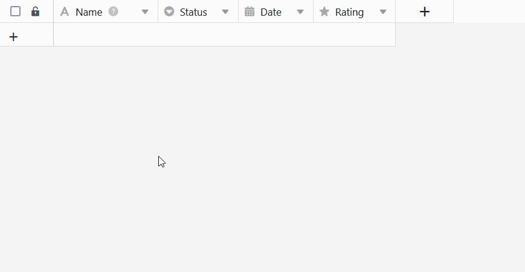
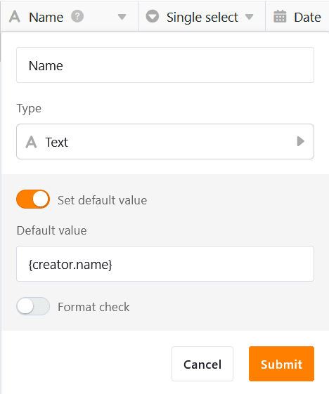
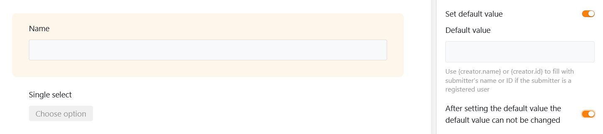

Lorsque vous définissez une **valeur par défaut** pour une colonne, celle-ci est **automatiquement** insérée **dans chaque nouvelle ligne** du tableau. Les valeurs par défaut prédéfinies vous permettent donc d'économiser quelques clics lors de l'[ajout de nouvelles lignes](https://seatable.io/fr/docs/arbeiten-mit-zeilen/hinzufuegen-einer-zeile/). Vous pouvez bien sûr ensuite adapter manuellement les valeurs saisies automatiquement.

## Comment définir des valeurs par défaut

1. Cliquez sur l'**icône** triangulaire **déroulante**  à droite du nom de la colonne pour laquelle vous souhaitez définir une valeur par défaut.
2. Sélectionnez l'option **Définir la valeur par défaut**.
3. Saisissez la **valeur par défaut** souhaitée. Selon le type de colonne, vous avez le choix entre plusieurs possibilités.
4. Confirmez l'opération en appuyant sur la **touche Entrée** ou en **cliquant** en dehors de la boîte de dialogue.
5. Si vous **créez** maintenant une **nouvelle ligne**, SeaTable y inscrit automatiquement les valeurs correspondantes. Vous pouvez ensuite **adapter** les données comme d'habitude.



En outre, vous pouvez déjà définir directement une valeur par défaut lors de la [création d'une nouvelle colonne](https://seatable.io/fr/docs/arbeiten-mit-spalten/hinzufuegen-einer-spalte/).

## les types de colonnes pour lesquels vous pouvez définir des valeurs par défaut

Les valeurs par défaut peuvent être définies pour de nombreux [types de colonnes dans SeaTable](https://seatable.io/fr/docs/arbeiten-mit-spalten/uebersicht-alle-spaltentypen/), mais pas pour tous. Les colonnes dont le contenu est généré automatiquement par SeaTable[(Formules](https://seatable.io/fr/docs/formeln/grundlagen-von-seatable-formeln/), [Numéro automatique](https://seatable.io/fr/docs/text-und-zahlen/der-spaltentyp-automatische-nummer/), [Créateur et date de création](https://seatable.io/fr/docs/datum-dauer-und-personen/die-spalten-ersteller-und-erstelldatum/), [Dernier éditeur et date d'édition](https://seatable.io/fr/docs/datum-dauer-und-personen/die-spalten-letzter-bearbeiter-und-bearbeitungsdatum/)) n'offrent pas cette option, tout comme les [boutons](https://seatable.io/fr/docs/andere-spalten/die-schaltflaeche/), les [colonnes](https://seatable.io/fr/docs/dateien-und-bilder/die-signatur-spalte/) [d'images](https://seatable.io/fr/docs/dateien-und-bilder/die-bild-spalte/), de [fichiers](https://seatable.io/fr/docs/dateien-und-bilder/die-datei-spalte/) et [de signatures](https://seatable.io/fr/docs/dateien-und-bilder/die-signatur-spalte/).

**Voici un aperçu des types de colonnes pour lesquelles vous pouvez définir des valeurs par défaut :**

| Type de colonne        | supporte les valeurs par défaut |
| ---------------------- | ------------------------------- |
| Numéro automatique     |                                 |
| Image                  |                                 |
| Case à cocher          |                                 |
| Fichier                |                                 |
| Date                   |                                 |
| Durée                  |                                 |
| Sélection unique       |                                 |
| Courriel :             |                                 |
| Créateur               |                                 |
| Créé                   |                                 |
| Texte formaté          |                                 |
| Formule                |                                 |
| Formule pour les liens |                                 |
| Géoposition            |                                 |
| Dernier responsable    |                                 |
| Sélection multiple     |                                 |
| Employés               |                                 |
| Rating                 |                                 |
| Bouton                 |                                 |
| Signature              |                                 |
| Texte                  |                                 |
| URL                    |                                 |
| Nombre                 |                                 |
| Dernièrement édité     |                                 |

## Valeurs par défaut référencées dans les colonnes de texte

Si vous définissez comme valeur par défaut dans une [colonne de texte](https://seatable.io/fr/docs/text-und-zahlen/die-spalten-text-und-formatierter-text/) la référence **{creator.name}** ou **{creator.id}**, le **nom** ou l'**ID de l'utilisateur** qui a ajouté la ligne sera automatiquement inscrit.

## Le champ d'action des valeurs par défaut

Les valeurs par défaut s'appliquent **partout** où vous pouvez créer de nouvelles lignes :

- dans un [tableau](https://seatable.io/fr/docs/arbeiten-mit-zeilen/hinzufuegen-einer-zeile/)
- dans une [colonne de liens](https://seatable.io/fr/docs/verknuepfungen/wie-man-tabellen-in-seatable-miteinander-verknuepft/)
- par [bouton](https://seatable.io/fr/docs/andere-spalten/zeilen-per-schaltflaeche-in-eine-andere-tabelle-kopieren/) (action : "Copier une ligne dans un autre tableau")
- par [automatisation](https://seatable.io/fr/docs/automationen/automations-aktionen/) (actions : "Ajouter une ligne" et "Ajouter une nouvelle entrée dans un autre tableau")
- dans le [plug-in](https://seatable.io/fr/docs/plugins/anleitung-zum-kanban-plugin/) [Calendrier](https://seatable.io/fr/docs/plugins/neue-kalendereintraege-im-kalender-plugin-anlegen/), [Galerie](https://seatable.io/fr/docs/plugins/eine-neue-zeile-ueber-das-galerie-plugin-hinzufuegen/) ou [Kanban](https://seatable.io/fr/docs/plugins/anleitung-zum-kanban-plugin/)
- via [des formulaires web](https://seatable.io/fr/docs/webformulare/webformulare/)
- sur [les pages de tableaux](https://seatable.io/fr/docs/seitentypen-in-universellen-apps/tabellenseiten-in-universellen-apps/), de [formulaires](https://seatable.io/fr/docs/seitentypen-in-universellen-apps/formularseiten-in-universellen-apps/) et [de Kanban](https://seatable.io/fr/docs/seitentypen-in-universellen-apps/kanbanseiten-in-universellen-apps/) des apps

## Valeurs par défaut dans les formulaires web

En plus des valeurs par défaut définies dans le tableau, vous avez la possibilité, pour les [formulaires web](https://seatable.io/fr/docs/webformulare/webformulare/), de définir des valeurs par défaut pour les champs de formulaire liés aux colonnes. Ce faisant, vous pouvez également définir si les utilisateurs sont autorisés à **modifier** ces **valeurs par défaut** lorsqu'ils remplissent le formulaire.



## Valeurs par défaut dans les apps

Les valeurs par défaut définies dans la base affectent également les lignes saisies dans les pages de **tableau, de formulaire et de kanban** des [apps universelles](https://seatable.io/fr/docs/apps/universelle-app/). Le seul [type de page](https://seatable.io/fr/docs/apps/seitentypen-in-der-universellen-app/) pour lequel vous pouvez tout de même définir des valeurs par défaut dans l'app est la [page de formulaire](https://seatable.io/fr/docs/seitentypen-in-universellen-apps/formularseiten-in-universellen-apps/). Les paramètres fonctionnent de la même manière que pour les formulaires web : Activez pour cela les curseurs, comme vous pouvez le voir sur la capture d'écran ci-dessus.
