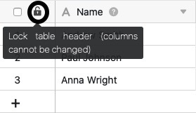
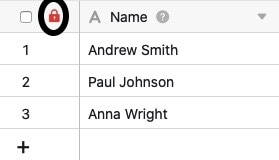

Se tiver a autorização necessária, pode **bloquear** o **cabeçalho da tabela em** cada tabela para impedir a adição, deslocação e edição de colunas na tabela. A grande vantagem é que pode bloquear **todas as colunas ao mesmo tempo** com um clique.

Isto pode ser útil, por exemplo, se trabalhar em conjunto com outros utilizadores numa tabela e não quiser que sejam feitas alterações à **estrutura da coluna**.



## Cabeçalho de mesa de bloqueio

1. Abra a **mesa** em que pretende bloquear o cabeçalho da mesa.
2. Clicar no **cadeado preto aberto no** cabeçalho da mesa.

4. Se o cadeado for então exibido a **vermelho**, o cabeçalho da mesa foi bloqueado com sucesso.



