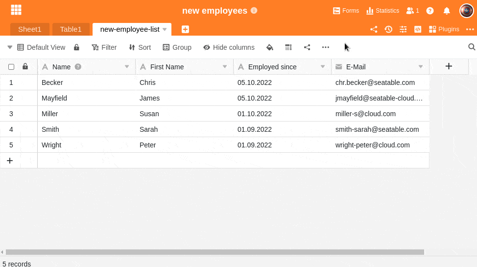

Dependendo dos **valores** que pretende registar no SeaTable, pode atribuir-lhes diferentes **tipos de colunas**. Pode encontrar uma síntese de todos os 25 tipos de colunas no SeaTable [aqui](https://seatable.io/pt/docs/arbeiten-mit-spalten/uebersicht-alle-spaltentypen/).

É possível modificar o tipo de coluna numa data posterior. Aqui pode descobrir como **alterar** o tipo de coluna **retrospetivamente**.

## Como ajustar o tipo de coluna

1. Clique no **ícone** triangular  à direita do nome da coluna cujo tipo pretende personalizar.
2. Seleccionar a opção **Personalizar tipo de coluna**.
3. Atribuir um novo **tipo de coluna** à coluna e fazer outras **configurações** específicas, se necessário.
4. Confirmar o processo clicando em **Submeter**.



## Ajustar a primeira coluna

A **primeira coluna** de uma tabela suporta **apenas 6 dos 25 tipos de coluna**. Estes são

- [Texto](https://seatable.io/pt/docs/text-und-zahlen/die-spalten-text-und-formatierter-text/)
- [Número](https://seatable.io/pt/docs/text-und-zahlen/die-zahlen-spalte/)
- [Data](https://seatable.io/pt/docs/datum-dauer-und-personen/die-datum-spalte/)
- [Selecção única](https://seatable.io/pt/docs/auswahlspalten/anlegen-einer-einfachauswahl-spalte/)
- [Número automático](https://seatable.io/pt/docs/text-und-zahlen/der-spaltentyp-automatische-nummer/)
- [Fórmula](https://seatable.io/pt/docs/formeln/grundlagen-von-seatable-formeln/)

## Aviso de perda de dados

**A conversão de** certos tipos de colunas conduz normalmente a uma **perda** indesejada de **dados**. É o caso, por exemplo, das colunas [de ficheiros](https://seatable.io/pt/docs/dateien-und-bilder/die-datei-spalte/) e [imagens](https://seatable.io/pt/docs/dateien-und-bilder/die-bild-spalte/) ou quando converte [colunas de texto](https://seatable.io/pt/docs/text-und-zahlen/die-spalten-text-und-formatierter-text/) em colunas numéricas. Nestes casos, o SeaTable apresenta uma **mensagem de aviso** a perguntar se pretende realmente alterar o tipo de coluna.
