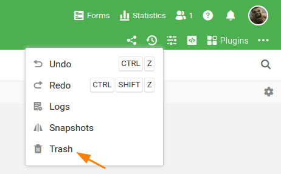

In diesem Artikel lernen Sie, wie Sie eine **einzelne Zeile**, **mehrere Zeilen** und **Einträge** aus einer Zeile **löschen** können.

## Löschen einer Zeile

1. Klicken Sie mit der **rechten Maustaste** auf eine Zeile, um das **Drop-down-Menü** aufzurufen.
2. Wählen Sie die Option **Zeile löschen** aus.



## Löschen mehrerer Zeilen

1. Bewegen Sie die Maus auf die **Nummerierungsspalte**.
2. Wählen Sie die **Zeilen** aus, die Sie löschen wollen, indem Sie die **Kästchen** der jeweiligen Zeilen anklicken.
3. Klicken Sie mit der **rechten Maustaste** auf eine beliebige Stelle innerhalb des ausgewählten Bereichs, um das **Drop-down-Menü** zu öffnen.
4. Wählen Sie die Option **Zeilen löschen** aus.



## Löschen von Einträgen aus einer Zeile

Sie können den Eintrag in jeder Zelle einer Zeile löschen, indem Sie mit einem Klick die **Zelle auswählen** und den Eintrag mit der **Backspace-Taste** oder \[keybt\]Entf\[/keybt\] löschen.

## Wiederherstellen gelöschter Zeilen

Wenn Sie eine **gelöschte Zeile** wiederherstellen möchten, finden Sie diese im **Papierkorb der Base**. In diesem finden Sie sämtliche gelöschte Zeilen und können diese mit einem Klick **wiederherstellen**.

Außerdem können Sie mit der Tastenkombination \[keybt\]STRG\[/keybt\] + \[keybt\]Z\[/keybt\] Ihre letzten Arbeitsschritte rückgängig machen und gelöschte Zeilen wiederherstellen, sofern Sie seit der Löschung die Base nicht verlassen haben.
