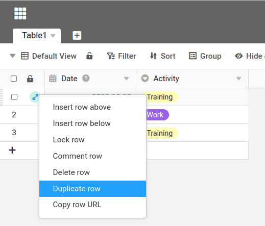
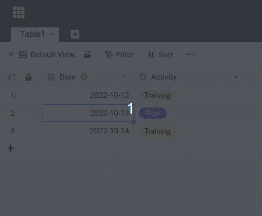

Em SeaTable tem várias possibilidades de duplicar uma fila. Pode descobrir qual é o melhor procedimento na sua situação neste artigo.

## Duplicar com o botão direito do rato

Clique com o botão direito do rato sobre uma linha e seleccione a opção **Duplicar linha** a partir do menu pendente. É criada uma nova fila com o mesmo conteúdo.

## Duplicação de uma fila várias vezes

Se quiser duplicar uma linha várias vezes, pode fazê-lo facilmente com a chamada pega de preenchimento. Primeiro criar o número desejado de linhas vazias, por exemplo, com a combinação de teclas +. Depois seleccione a fila desejada e arraste-a para a **pequeno quadrado** no canto inferior direito da última célula seleccionada para criar as cópias desejadas.

Em vez do cabo de preenchimento, pode também preencher os dados com a ajuda do atalho de teclado familiar + e + cópia.
