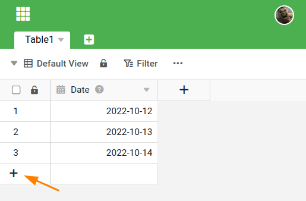
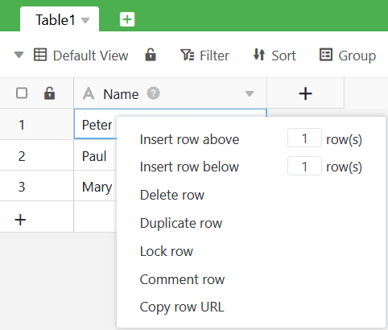
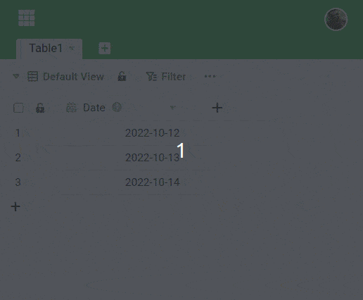

Существует несколько способов добавления **нового ряда в** SeaTable. В этой статье вы узнаете о различных возможностях.

## Способы создания нового ряда

Первый вариант - нажать на **символ плюса** в **колонке нумерации** в левом нижнем углу таблицы. Это создаст новую пустую строку в нижней части таблицы.

Второй способ вставить новый ряд - **щелкнуть правой кнопкой мыши** на ряду и выбрать в меню пункт **Insert Row Above/Below**. В небольшом поле ввода вы можете определить количество добавляемых рядов.

Чтобы быстро **несколько новых линий** вы также можете использовать комбинацию клавиш  +  использовать. Сначала нажмите на **Линия**под которыми вы хотите вставить новые строки. Затем удерживайте нажатой кнопку **Клавиша Shift** нажмите и нажмите кнопку **клавиша Enter**для быстрого добавления пустых строк.

Кроме того, некоторые **плагины** SeaTable предлагают возможность добавления новых записей. К ним относятся [галерея](https://seatable.io/ru/docs/galerie-plugin/eine-neue-zeile-ueber-das-galerie-plugin-hinzufuegen/), [календарь](https://seatable.io/ru/docs/kalender-plugin/neue-kalendereintraege-im-kalender-plugin-anlegen/) и [плагин Kanban](https://seatable.io/ru/docs/kanban-plugin/anleitung-zum-kanban-plugin/).

## Почему вы не можете создавать новые линии

Вы не можете добавить новую строку в таблицу и не отображается символ плюса? Тогда, вероятно, у вас нет соответствующих **прав** в Base или View.

Например, возможно, при **совместном использовании** вам были предоставлены права только на чтение вместо **прав на чтение и запись**. Если у вас нет необходимых прав, обратитесь к пользователю общего доступа или **администратору** в вашей команде.
