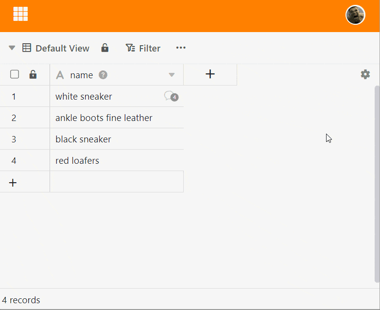

Dans SeaTable, vous pouvez commenter des lignes pour vous donner mutuellement un feedback au sein d'une équipe, par exemple. Il y **a deux façons** d'accéder à cette fonction.

## Commenter les lignes via le menu déroulant

1. Cliquez avec **le bouton droit de la souris** sur une ligne pour faire apparaître le **menu déroulant**.
2. Sélectionnez l'option **Commenter la ligne**.
3. Une nouvelle fenêtre s'ouvre, dans laquelle vous pouvez écrire des commentaires sur une entrée de ligne.

## Commenter les lignes via la vue détaillée

1. Déplacez la souris sur la numérotation en début de ligne.
2. Ouvrez les **détails de la ligne** en cliquant sur l'**icône en forme de double flèche**.
3. Dans la fenêtre qui s'affiche, cliquez sur l'**icône de la porte** en haut à droite.
4. Dans la catégorie **Commentaires**, vous pouvez écrire des commentaires.

## Ajouter des membres d'équipe au chat

Vous pouvez attirer l'attention des membres de l'équipe sur votre commentaire en utilisant le **Symbole plus** à ajouter au chat. Vous pouvez également utiliser un  et le **Nom du membre** pour ajouter des membres de l'équipe au chat. Le membre reçoit une **Notification dans SeaTable** et sera averti des nouveaux commentaires dans l'historique du chat, même si aucune autre mention n'est faite sur  aura lieu.

## Affichage des lignes commentées

Dans la première colonne du tableau, pour les lignes commentées, une **icône en forme de bulle** apparaît avec un chiffre qui indique le **nombre de commentaires** au cours des 180 derniers jours. En cliquant sur l'icône, vous ouvrez la fenêtre des commentaires avec l'historique du chat.



## Supprimer les commentaires et les marquer comme faits

Seul le **créateur** lui-même peut **supprimer** ses commentaires ou les **marquer comme étant terminés**. Pour ce faire, il clique sur les **trois points** à droite de son commentaire et choisit l'option souhaitée. Les commentaires marqués comme terminés sont signalés par une couleur verte.

## Ajouter des images à un commentaire

Vous pouvez également ajouter **des images** à vos commentaires via l'**icône d'image** située sous le champ de saisie. Celles-ci ne sont visibles que dans la fenêtre de commentaires et ne sont certes pas enregistrées dans une [colonne d'images](https://seatable.io/fr/docs/dateien-und-bilder/die-bild-spalte/) du tableau, mais dans le [gestionnaire de fichiers de la base](https://seatable.io/fr/docs/dateien-und-bilder/das-dateimanagement-einer-base/).
