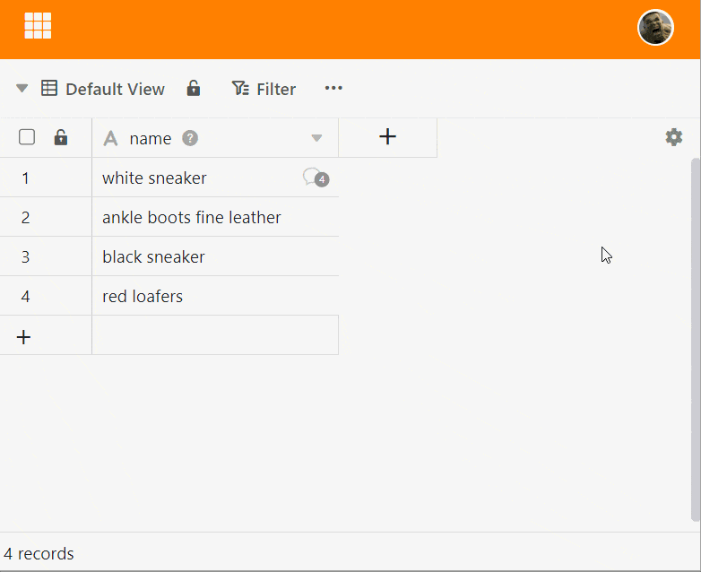
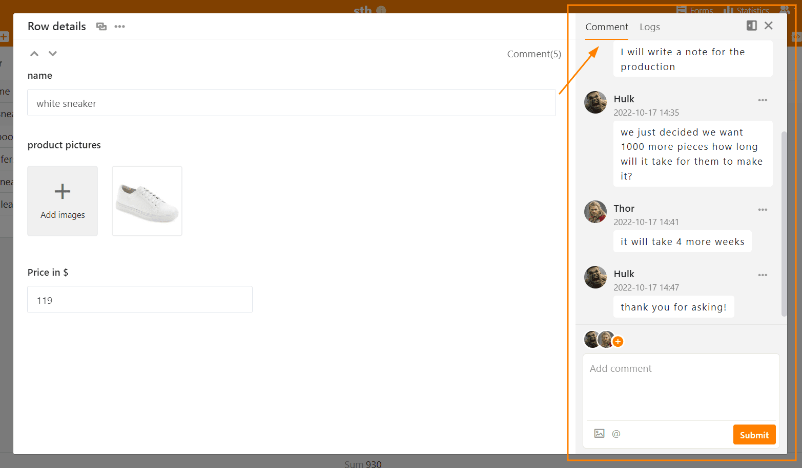

No SeaTable podem comentar as linhas, por exemplo para se darem feedback uns aos outros dentro de uma equipa. Há **duas formas de** aceder a esta função.

## Comentário de linhas através do menu drop-down

1. **Clique com o botão direito do rato** sobre uma linha para abrir o **menu pendente**.
2. Seleccionar a opção **Linha de Comentário**.
3. Abre-se uma nova janela na qual se pode escrever comentários sobre uma entrada de linha.

## Comentário de linhas através da vista detalhada

1. Mova o rato para a numeração no início da linha.
2. Abrir os **detalhes da linha** clicando no **ícone da seta dupla**.
3. Na janela que aparece, clicar no **símbolo da porta** no canto superior direito.
4. Na categoria de **comentários** pode escrever comentários.

## Acrescentar membros da equipa ao chat

Pode chamar a atenção dos membros da equipa para o seu comentário, contactando-os através do **Símbolo Plus** para adicionar ao chat. Em alternativa, pode também adicionar um  e a **Nome do membro** para adicionar membros da equipa ao chat. O membro recebe um **Notificação em SeaTable** e será notificado de novos comentários na história do chat, mesmo que não seja feita mais nenhuma menção sobre  tem lugar.

## Exibição das linhas comentadas

Na primeira coluna da tabela, aparece um **ícone de balão de diálogo** com um número que indica o **número de comentários** nos últimos 180 dias para as linhas comentadas. Clique no ícone para abrir a janela de comentários com o histórico do chat.



## Eliminar comentários e marcar como feito

Só o próprio **criador** pode **apagar** os seus comentários ou **marcá-los como feitos**. Para o fazer, clique nos **três pontos** à direita do comentário e seleccione a opção desejada. Os comentários marcados como feitos são indicados por uma cor verde.

## Adicionar imagens a um comentário

Também pode adicionar **imagens** aos seus comentários através do **ícone de imagem** por baixo do campo de entrada. Estas só são visíveis na janela de comentários e não são guardadas numa [coluna de imagens da](https://seatable.io/pt/docs/dateien-und-bilder/die-bild-spalte/) tabela, mas sim na [gestão de ficheiros da base](https://seatable.io/pt/docs/dateien-und-bilder/das-dateimanagement-einer-base/).
