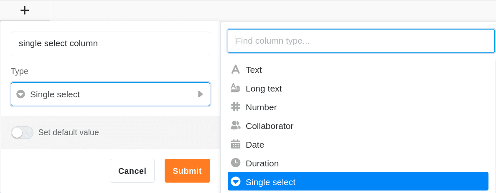

A single-selection column is ideal if you want to assign**exactly one option** to your rows from a list of options to be defined. The options are given colorful **labels** that you can use to **categorize** your records and organize tables clearly.

## Create a single selection column

Creating a single-selection column is child's play and done with just a few clicks. For detailed information, see [Add a column]().

1. Click the **\[+\] icon** to the right of the last column of any table.
2. Give the new column a **name**.
3. Select **Single selection** as the column type.
4. Confirm with **Submit**.

## Add options

You can add new options to a single-selection column in several ways. Learn all about it in the article [Adding options to a single-selection column]().

Currently, 24 colors are available to visually highlight the respective options.

With an [Enterprise subscription](https://seatable.io/en/docs/teamverwaltung-abonnement/abo-pakete/#3-toc-title), you also have the option to create your [own colors](https://seatable.io/en/docs/arbeiten-mit-bases/eigene-farben-in-einer-base-hinzufuegen/) for your single-selection options.

## Change the sorting of the options

The options are **not** sorted **alphabetically**, but according to the [order of the options](https://seatable.io/en/docs/auswahlspalten/aendern-der-reihenfolge-von-einfachauswahl-optionen/), which you can define as you wish.

## Set default value

When creating a single selection column, you have the option to set a preset **default value**. The default value is**automatically** assigned as an option to each new row .

## Single selection or link column?

If you wish to be able to store **additional information** for each selection option, you should consider converting the single selection column into a [link column](). Then you can create a complete record for each option in a separate table.

## More helpful articles on the topic of single-selection columns

- [Adding options to a single-selection column]()
- [Changing the order of single-selection options](https://seatable.io/en/docs/auswahlspalten/aendern-der-reihenfolge-von-einfachauswahl-optionen/)
- [Define a cascading for a single-selection column](https://seatable.io/en/docs/auswahlspalten/kaskadierung-einer-einfachauswahl/)
- [Export and import single selection options](https://seatable.io/en/docs/auswahlspalten/einfachauswahl-optionen-exportieren-und-importieren/)
