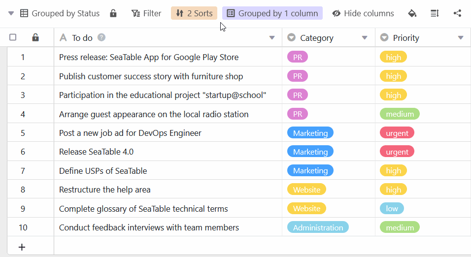
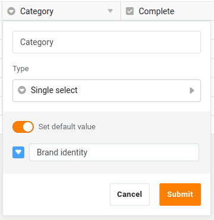

Uma coluna de selecção única é ideal se quiser atribuir **exactamente uma opção** de uma lista de opções a ser definida para as suas linhas. As opções são dadas **etiquetas** coloridas, que pode utilizar para **categorizar** os seus registos e tornar as tabelas claras.

## Criar uma coluna de selecção única

A criação de uma coluna de selecção única é uma brincadeira de criança e feita com apenas alguns cliques. Para informações detalhadas, ver [Acrescentar uma coluna]().

1. Clique no **símbolo \[+\]** à direita da última coluna de qualquer tabela.
2. Dê um **nome** à nova coluna.
3. Seleccione **Selecção única** como o tipo de coluna.
4. Confirmar com **Submeter**.

## Adicionar opções

Pode adicionar novas opções a uma coluna de selecção única de várias maneiras. Saiba tudo sobre isso no artigo [Adicionando opções a uma coluna de selecção única]().

Actualmente, estão disponíveis 24 cores para destacar visualmente as respectivas opções.

Com uma [subscrição Enterprise](https://seatable.io/pt/docs/teamverwaltung-abonnement/abo-pakete/#3-toc-title), tem também a possibilidade de criar as suas [próprias cores](https://seatable.io/pt/docs/arbeiten-mit-bases/eigene-farben-in-einer-base-hinzufuegen/) para as opções de selecção única.

## Alterar a ordenação das opções

As opções **não** estão ordenadas **alfabeticamente**, mas sim de acordo com a [ordem das opções](https://seatable.io/pt/docs/auswahlspalten/aendern-der-reihenfolge-von-einfachauswahl-optionen/), que pode definir como quiser.

## Definir valor por defeito

Ao criar uma coluna de selecção única, tem a opção de definir um **valor pré** -definido **por defeito**. O valor por defeito é **automaticamente** atribuído como opção a cada nova linha.

## Selecção única ou coluna de ligação?

Se desejar poder armazenar **informação adicional** para cada opção de selecção, deve considerar converter a coluna de selecção única numa [coluna de ligação](). Depois pode criar um registo completo para cada opção numa tabela separada.

## Artigos mais úteis sobre o tema das colunas de selecção única

- [Acrescentar opções a uma coluna de selecção única]()
- [Alterar a ordem das opções de seleção individuais](https://seatable.io/pt/docs/auswahlspalten/aendern-der-reihenfolge-von-einfachauswahl-optionen/)
- [Definir um cascata para uma coluna de selecção única](https://seatable.io/pt/docs/auswahlspalten/kaskadierung-einer-einfachauswahl/)
- [Opções de selecção única de exportação e importação](https://seatable.io/pt/docs/auswahlspalten/einfachauswahl-optionen-exportieren-und-importieren/)
