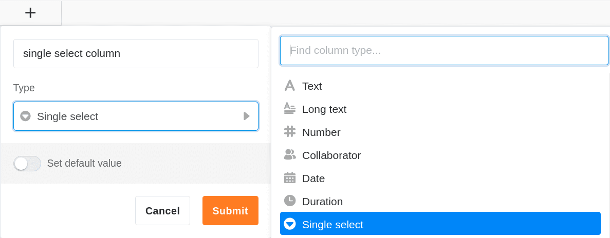

Колонка с одним выбором идеально подходит, если вы хотите назначить строкам **ровно один вариант** из списка определяемых вариантов. Варианты снабжены красочными **ярлыками**, которые можно использовать для **категоризации** записей и наглядности таблиц.

## Создайте колонку с одним выбором

Создание колонки с одним выбором - это детская забава, которая выполняется всего несколькими щелчками мыши. Подробную информацию см. в разделе [Добавление колонки]().

1. Нажмите на **символ \[+\]** справа от последнего столбца любой таблицы.
2. Дайте новой колонке **имя**.
3. Выберите **Single Selection** в качестве типа столбца.
4. Подтвердите с помощью кнопки **Отправить**.

## Добавить опции

Вы можете добавить новые параметры в колонку с одним выбором несколькими способами. Узнайте об этом в статье [Добавление опций в колонку с одним выбором]().

В настоящее время доступны 24 цвета для визуального выделения соответствующих опций.

При [подписке Enterprise](https://seatable.io/ru/docs/teamverwaltung-abonnement/abo-pakete/#3-toc-title) у вас также есть возможность создавать свои [собственные цвета](https://seatable.io/ru/docs/arbeiten-mit-bases/eigene-farben-in-einer-base-hinzufuegen/) для опций одиночного выбора.

## Изменение сортировки опций

Опции сортируются **не по алфавиту**, а по [порядку](https://seatable.io/ru/docs/auswahlspalten/aendern-der-reihenfolge-von-einfachauswahl-optionen/), который вы можете определить по своему усмотрению.

## Установите значение по умолчанию

При создании столбца с одним выбором у вас есть возможность установить предустановленное **значение по умолчанию**. Значение по умолчанию **автоматически** присваивается в качестве опции каждой новой строке.

## Одиночный выбор или колонка ссылок?

Если вы хотите иметь возможность хранить **дополнительную информацию** для каждого варианта выбора, вам следует рассмотреть возможность преобразования единственного столбца выбора в [столбец ссылок](). Затем вы можете создать полную запись для каждого варианта в отдельной таблице.

## Другие полезные статьи по теме колонок с одинарным отбором

- [Добавление опций в колонку с одним выбором]()
- [Изменение порядка опций одиночного выбора](https://seatable.io/ru/docs/auswahlspalten/aendern-der-reihenfolge-von-einfachauswahl-optionen/)
- [Определение каскадирования для колонки с одним выбором](https://seatable.io/ru/docs/auswahlspalten/kaskadierung-einer-einfachauswahl/)
- [Экспорт и импорт отдельных вариантов выбора](https://seatable.io/ru/docs/auswahlspalten/einfachauswahl-optionen-exportieren-und-importieren/)
