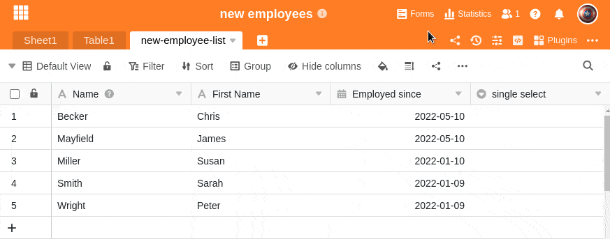
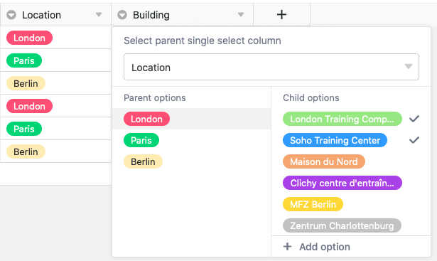
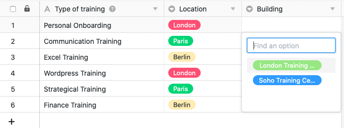

Una columna de selección única es ideal si desea asignar **exactamente una opción** de una lista de opciones a definir a sus filas. Las opciones reciben **etiquetas** de colores con las que podrá clasificar sus registros de datos en **categorías** y organizar las tablas con claridad.

## Creación de una columna de selección única

Crear una columna de selección única es un juego de niños y puede hacerse con sólo unos clics. Encontrará información detallada en [Añadir una columna]().

1. Haga clic en el **símbolo más** situado a la derecha de la última columna de una tabla.
2. Dé un **nombre** a la nueva columna.
3. Seleccione **Selección única** como tipo de columna.
4. Confirme con **Submitir**.

## Añadir opciones de selección

Puede crear varias opciones en una columna de selección única, entre las que podrá elegir al rellenar las celdas. Puede añadir **nuevas opciones** a la columna de varias maneras:

- Añadir opciones a través de la configuración de la columna
- Añadir opciones a través de las celdas de la columna de selección única
- Importar opciones


Todas las funciones presentadas en esta sección se aplican del mismo modo a la [columna de selección múltiple]().


### Añadir opciones a través de la configuración de la columna

1. Haga clic en la **flecha desplegable** situada a la derecha del nombre de una columna de selección única.
2. Vaya a **Editar selección única**.
3. Cree tantas opciones como desee haciendo clic en **Añadir opción**.
4. Confirme cada entrada con el **botón Intro**.
5. Si lo desea, puede ajustar los **colores** asignados a las opciones.

### Añadir opciones a través de las celdas de la columna de selección única

1. Haga doble clic en una **celda** de la columna de selección única.
2. Introduzca en el **campo de búsqueda** un término adecuado que desee definir como **nueva opción**.
3. Haga clic en **Añadir opción**.
4. El término introducido se asigna entonces a la celda seleccionada y se añade a las distintas **opciones de selección** de la columna.


Si desea poder almacenar **datos adicionales** para cada opción de selección, debería considerar el uso de una [columna de enlace]() en lugar de una columna de selección única. Para ello, cree la selección única como primera columna en una tabla adicional. Esto le permitirá introducir registros de datos completos para todas las opciones, que podrá asignar a cualquier número de filas en las tablas vinculadas.


## Exportación e importación de opciones

No sólo puede **añadir manualmente** las opciones, sino también **exportarlas** cómodamente desde una columna existente e **importarlas** a otra columna. Esto le ahorrará mucho trabajo si desea utilizar las mismas opciones –incluso en bases diferentes– para varias **columnas de selección única** y **columnas de selección múltiple**.

### Exportar opciones de una columna de selección

1. Haga clic en la **flecha desplegable** situada a la derecha del nombre de una columna de selección única o múltiple.
2. Seleccione **Editar selección única** o **Editar selección múltiple**.
3. Haga clic en **Exportar opciones**.

Las opciones se **exportan** ahora como un archivo JSON. Dependiendo de la configuración de su navegador, la descarga se habrá guardado directamente en su dispositivo o aún deberá especificar una ubicación de almacenamiento. En el siguiente paso, puede **importar** las opciones a otra columna de selección única o múltiple.

### Importar opciones a una columna de selección

1. Haga clic en la **flecha desplegable** situada a la derecha del nombre de una columna de selección única o múltiple.
2. Seleccione **Editar selección única** o **Editar selección múltiple**.
3. Haga clic en **Importar opciones**.
4. Seleccione el **archivo JSON** de su dispositivo y confirme la carga.

Las opciones se **importarán** a la columna seleccionada y estarán listas para ser rellenadas en las celdas correspondientes. Por supuesto, puede seguir añadiendo, eliminando y editando opciones como desee.

## Colores de las opciones de selección

Para diseñar visualmente la vista dentro de una tabla, SeaTable asigna un **color** a cada opción de una columna de selección única o múltiple. Posteriormente puede **ajustar** este color asignado aleatoriamente mediante la ruta mencionada a las opciones.

Abrirá el **selector de color** haciendo clic en el **símbolo de triángulo coloreado situado delante del nombre de la opción**.

Actualmente hay **24 colores** disponibles para resaltar visualmente las opciones respectivas. Con una [suscripción Enterprise]() también tiene la opción de crear [colores personalizados]() para sus opciones de selección.

## Cambiar el orden de las opciones

El orden de las opciones es crucial si desea [ordenar]() o [agrupar]() por una sola columna de selección. SeaTable **no organiza las opciones alfabéticamente**, sino de forma flexible según el **orden de las opciones**, que puede definir como desee.

1. Haga clic en la **flecha desplegable** situada a la derecha del nombre de la columna de selección única.
2. Vaya a **Editar selección única**.
3. **Arrastre y suelte** una opción hasta la posición deseada. Para ello, utilice los **seis puntos** situados a la izquierda delante de cada opción.

## Fijar valor por defecto

Para cada columna de selección única, tiene la opción de establecer un [valor por defecto](). El valor predeterminado se asigna **automáticamente** a cada nueva fila como opción.

1. Haga clic en la **flecha desplegable** situada a la derecha del nombre de la columna de selección única.
2. Vaya a **Fijar valor por defecto**.
3. En la lista, seleccione la **opción** que se va a utilizar como valor por defecto.

Si desea borrar de nuevo el valor por defecto, haga clic en el **icono de la papelera** .

## Selección única en cascada

Mediante la función de cascada, puede definir una columna padre del mismo tipo para cada columna de selección única, que restringe las opciones disponibles de la columna de selección única subordinada. Esto ofrece las siguientes ventajas:

- La función en cascada le permite **reducir el número de opciones** disponibles en otra columna de selección única.
- Al definir dependencias, puede **crear relaciones lógicas** entre dos columnas de selección única.
- Especialmente con un gran número de opciones, esto puede ser muy útil para **minimizar los errores** que pueden producirse al introducir datos.
- Además, las columnas de selección única en cascada también pueden ayudar a **acelerar los procesos de trabajo**.

1. Haga clic en la **flecha desplegable** de una columna de selección única.
2. Haga clic en **Definir cascada**.
3. Seleccione una **columna de selección única** que vaya a actuar como columna padre.
4. Asigne cualquier número de **opciones subordinadas de la columna actual** a las **opciones padre** de esta columna.



### Ejemplo de cascada con sentido

En este ejemplo, la tabla contiene datos sobre diversas unidades de educación/formación continua para los empleados. Además de la primera columna, que registra diversas **formaciones**, ya existe una columna de selección única que especifica la **localización** respectiva de la formación. En este ejemplo se define una **cascada** para otra columna de selección única, que registra el **edificio** exacto.

En este ejemplo, la columna **"Location"**, que especifica la ciudad en la que tiene lugar el entrenamiento correspondiente, sirve como **columna de selección única superior**. El siguiente paso consiste en asignar **opciones subordinadas** de la recién creada columna de selección única **"Building"** a las tres ciudades de esta columna. En concreto, a las tres opciones **Londres**, **París** y **Berlín** se les asignan los edificios que se encuentran en la ciudad respectiva.

Las opciones o edificios que pueden seleccionarse en una celda de la columna subordinada "Building" dependen ahora de la ciudad seleccionada en la misma fila de la columna de selección única "Location". Esto le permite seleccionar **sólo** los edificios que se encuentran realmente en la ciudad correspondiente.