Колонка с одним выбором идеально подходит, если Вы хотите назначить **только одну опцию** из списка опций, которые нужно определить для Ваших строк. Вариантам присваиваются разноцветные **ярлыки**, с помощью которых Вы можете классифицировать записи данных по **категориям** и четко организовать таблицы.

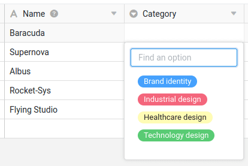

## Создание колонки с одним выбором

Создание колонки с одним выбором - это детская забава, и сделать это можно всего несколькими щелчками мыши. Подробную информацию Вы можете найти в разделе [Добавить колонку]().

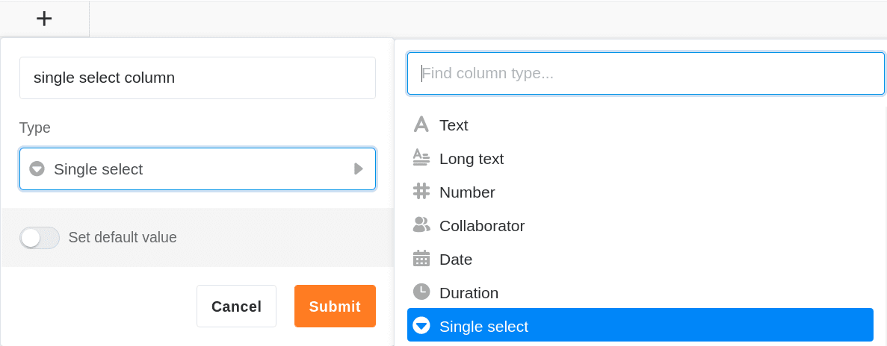

1. Нажмите на символ **Плюс** справа от последнего столбца таблицы.
2. Дайте новому столбцу **имя**.
3. Выберите **Одиночный выбор** в качестве типа столбца.
4. Подтвердите выбор нажатием **Отправить**.

## Добавьте опции выбора

В столбце с одним выбором можно создавать различные опции, которые затем можно выбирать при заполнении ячеек. вы можете добавить **новые опции** в колонку несколькими способами:

- Добавить опции через настройки столбца
- Добавление опций через ячейки единственного столбца выбора
- Импортировать опции


Все функции, представленные в этом разделе, одинаково применимы и к [столбцу мультивыбора]().


### Добавление опций через настройки колонки

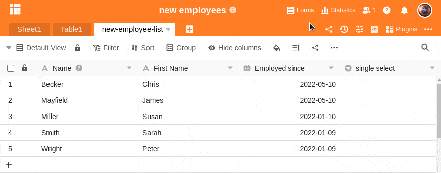

1. Нажмите на **стрелку** справа от названия колонки с одиночным выбором.
2. Перейдите к разделу **Редактировать одиночный выбор**.
3. Создайте столько опций, сколько Вам нужно, нажав на **Добавить опцию**.
4. Подтвердите каждую запись кнопкой **Enter**.
5. При необходимости Вы можете настроить **Цвета**, присвоенные опциям.

### Добавление опций через ячейки столбца одиночного выбора

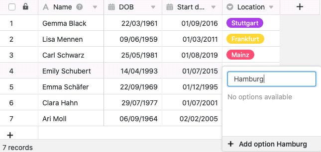

1. Дважды щелкните на **ячейке** столбца одиночного выбора.
2. Введите в поле **поиска** подходящий термин, который Вы хотите определить как **новый вариант**.
3. Нажмите на **Добавить опцию**.
4. Введенный термин будет присвоен выбранной ячейке и добавлен к различным **опциям выбора** в столбце.


Если Вы хотите иметь возможность хранить **дополнительные данные** для каждого варианта выбора, Вам следует рассмотреть возможность использования [столбца ссылок]() вместо столбца одиночного выбора. Для этого создайте одиночный выбор в качестве первого столбца в отдельной таблице. Это позволит Вам вводить полные записи данных для всех вариантов, которые Вы можете назначить любому количеству строк в связанных таблицах.


## Экспорт и импорт опций

Вы можете не только **ручно вводить** опции, но и удобно **экспортировать** их из существующего столбца и **импортировать** их в другой столбец. Это сэкономит Вам много работы, если Вы хотите использовать одни и те же параметры – даже в разных базах – для нескольких **одиночных** и **множественных колонок выбора**.

### Экспорт опций из колонки выбора

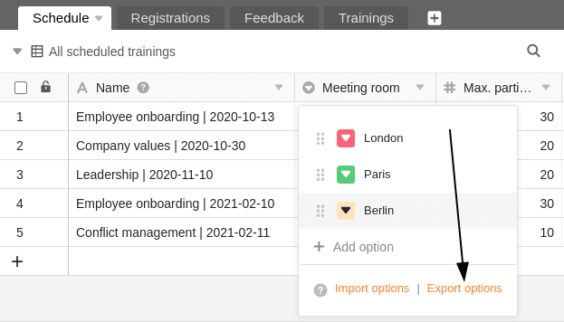

1. Нажмите на **удаляющуюся стрелку** справа от названия колонки одиночного или множественного выбора.
2. Выберите **Редактировать одиночный выбор** или **Редактировать множественный выбор**.
3. Нажмите на **Опции экспорта**.

Теперь параметры **экспортированы** в виде JSON-файла. В зависимости от настроек Вашего браузера, загрузка либо была сохранена непосредственно на Вашем устройстве, либо Вам еще нужно указать место хранения. На следующем этапе Вы можете **импортировать** опции в другой столбец с одиночным или множественным выбором.

### Импорт опций в колонку выбора

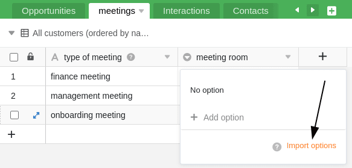

1. Щелкните на **удаляющейся стрелке** справа от названия столбца одиночного или множественного выбора.
2. Выберите **Редактировать одиночный выбор** или **Редактировать множественный выбор**.
3. Нажмите на **Опции импорта**.
4. Выберите **JSON-файл** с Вашего устройства и подтвердите загрузку.

После этого параметры будут **импортированы** в выбранный столбец и готовы к заполнению соответствующих ячеек. Разумеется, Вы можете продолжать добавлять, удалять и редактировать опции по своему усмотрению.

## Цвета опций выбора

Чтобы визуально оформить вид внутри таблицы, SeaTable присваивает **цвет** каждому варианту в столбце с одним или несколькими вариантами выбора. Впоследствии Вы можете **настроить** этот случайно назначенный цвет с помощью вышеупомянутого пути к опциям.

Вы открываете **селектор цвета**, нажав на цветной **символ треугольника перед названием опции**.

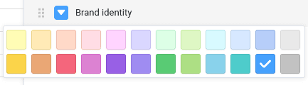

В настоящее время доступно **24 цвета** для визуального выделения соответствующих опций. С подпиской [Enterprise]() у Вас также есть возможность создать [пользовательские цвета]() для Ваших опций выбора.

## Измените порядок опций

Порядок опций имеет решающее значение, если Вы хотите [сортировать]() или [группировать]() по одному столбцу выбора. SeaTable **не упорядочивает опции в алфавитном порядке**, а гибко использует **порядок опций**, который Вы можете определить по своему усмотрению.

1. Щелкните на **уменьшающейся стрелке** справа от названия столбца одиночного выбора.
2. Перейдите к разделу **Редактировать одиночный выбор**.
3. **Перетащите** опцию в нужное место. Для этого используйте **шесть точек** слева перед каждой опцией.

## Установить значение по умолчанию

Для каждого отдельного столбца выбора у Вас есть возможность установить предустановленное [значение по умолчанию](). Значение по умолчанию **автоматически** присваивается каждой новой строке в качестве опции.

1. Нажмите на **уменьшающуюся стрелку** справа от названия колонки с одним выбором.
2. Перейдите к разделу **Установить значение по умолчанию**.
3. Из списка выберите **опцию**, которая будет использоваться в качестве значения по умолчанию.

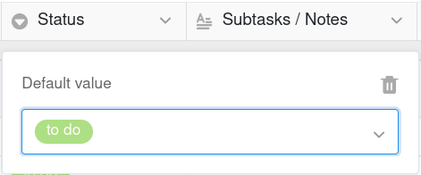

Если Вы хотите снова удалить значение по умолчанию, нажмите на **значок бумажной корзины** .

## Каскадирование одиночного выбора

Используя функцию каскадирования, Вы можете определить родительский столбец того же типа для каждого столбца одиночного выбора, который ограничивает доступные опции подчиненного столбца одиночного выбора. Это дает следующие преимущества:

- Каскадирование позволяет Вам **уменьшить количество вариантов**, доступных в другом столбце одиночного выбора.
- Определив зависимости, Вы можете **создать логические отношения** между двумя колонками с одним выбором.
- Особенно при большом количестве вариантов это может быть очень полезно для **минимизации ошибок**, которые могут возникнуть при вводе данных.
- Кроме того, каскадирование столбцов с одним выбором может помочь **ускорить рабочие процессы**.

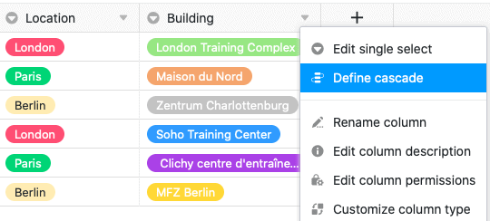

1. Щелкните на **стрелке раскрытия** одиночного столбца выбора.
2. Нажмите на **Определить каскадирование**.
3. Выберите **Один столбец выбора**, который будет выступать в качестве родительского столбца.
4. Назначьте любое количество **подчиненных опций в текущем столбце** на **родительские опции** этого столбца.

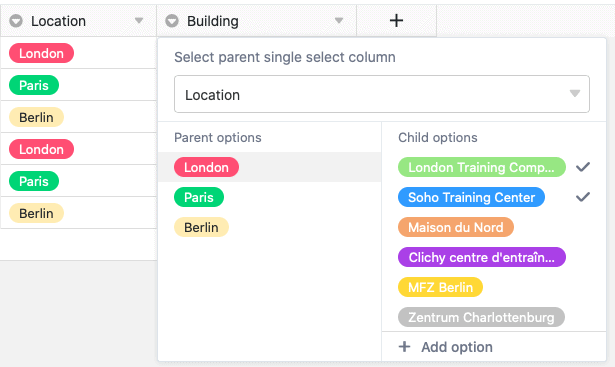



### Пример осмысленного каскадирования

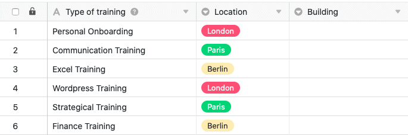

В этом примере таблица содержит данные о различных курсах повышения квалификации/обучения для сотрудников. В дополнение к первому столбцу, в котором записаны различные **обучения**, уже есть столбец с одним выбором, в котором указано соответствующее **место** проведения обучения. В этом примере **каскадирование** определено для еще одного столбца с одиночным выбором, в котором указывается точное **здание**.

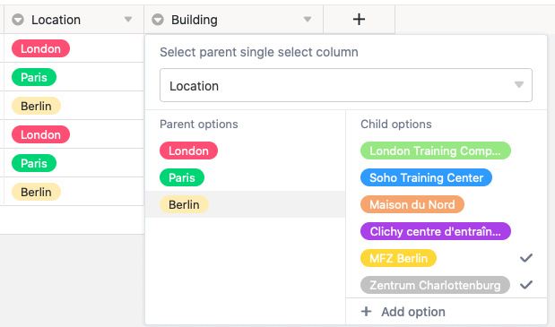

В этом примере столбец **"Location"**, в котором указан город, в котором проходит соответствующее обучение, служит **родительским одиночным столбцом выбора**. Следующим шагом будет назначение **подчиненных вариантов** из вновь созданного столбца одиночного выбора **"Building"** трем городам в этом столбце. В частности, трем вариантам **Лондон**, **Париж** и **Берлин** присваиваются здания, расположенные в соответствующем городе.

То, какие опции или здания можно выбрать в ячейке подчиненного столбца "Building", теперь зависит от города, выбранного в той же строке в одиночном столбце выбора "Location". Это позволит Вам выбрать **только** здания, которые действительно расположены в соответствующем городе.