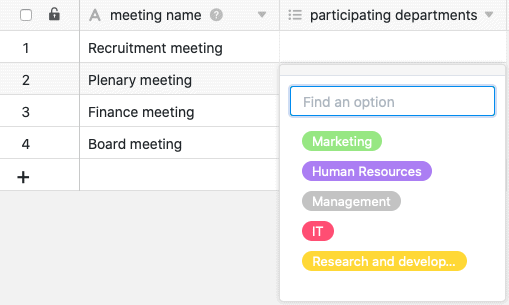

Una columna de selección múltiple es ideal si desea asignar a las filas de una columna **varias opciones** de una lista de opciones por definir. Las opciones reciben etiquetas de colores que puede utilizar para etiquetar sus registros y hacer tablas claras, por ejemplo, [filtrando]() por opciones específicas.

## Crear una columna de selección múltiple

Crear una columna de selección múltiple es un juego de niños y se hace con unos pocos clics. Para obtener información detallada, consulte [Añadir una columna]().

1. Haga clic en el **símbolo \[+\] situado** a la derecha de la última columna de cualquier tabla.
2. Dale un **nombre** a la nueva columna.
3. Seleccione **Selección múltiple** como tipo de columna.
4. Confirme con **Enviar**.

## Añadir opciones

La adición de opciones a una columna de selección múltiple funciona del mismo modo que **para una columna de selección única**. Puede añadir nuevas opciones de varias maneras. Para más información, consulta el artículo Añadir opciones [a]() una columna de selección simple.

Actualmente hay 24 colores disponibles para resaltar visualmente las respectivas opciones.

Con una [suscripción Enterprise](), también tiene la opción de crear [sus propios colores]() para sus múltiples opciones de selección.

## Establecer el valor por defecto

Al crear una columna de selección múltiple, a diferencia de la columna de selección única, **no** tiene la opción de establecer un valor por defecto.

## ¿Selección múltiple o columna de enlace?

Si desea poder almacenar **información adicional** para cada opción de selección, debería considerar convertir la columna de selección múltiple en una [columna de enlace](). Entonces podrá crear un registro completo para cada opción en una tabla independiente.

## Cambiar el orden de las opciones de selección múltiple

El orden de las opciones de selección múltiple puede ajustarse del **mismo** modo que para una columna de selección única. Encontrará instrucciones detalladas [aquí]().

## Exportación e importación de múltiples opciones de selección

Puede **exportar** e **importar** las **opciones de** una columna de selección múltiple del mismo modo que las de una columna de selección simple. Puedes encontrar más información al respecto en [este artículo]().
