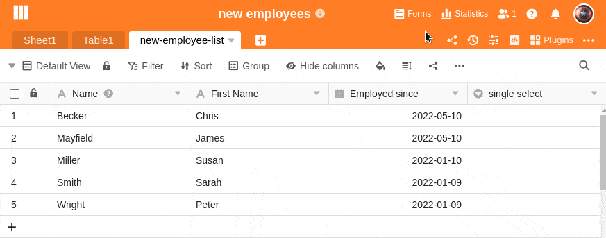

Pode adicionar várias **opções** a uma coluna de selecção única, a partir da qual pode então escolher ao preencher as células. Basicamente, tem **três** formas diferentes de criar opções de selecção única.

- Adicionar opções através das definições das colunas
- Acréscimo de opções através das células da coluna de selecção única
- Opções de importação



## Adicionar opções através das definições das colunas

1. Clique no **símbolo do triângulo** à direita do nome de qualquer coluna de selecção única.
2. Clique em **Editar selecção única**.
3. Adicione tantas **opções** quantas desejar à selecção única.
4. Se necessário, é possível ajustar as **cores** atribuídas às opções.
5. Confirmar cada entrada clicando na **opção Adicionar** ou utilizando a **tecla Enter**.

## Acréscimo de opções através das células da coluna de selecção única

1. Clique duas vezes em qualquer **célula da** coluna de selecção única.
2. No campo de pesquisa que aparece, introduza qualquer **valor** (número, termo, etc.) que pretenda definir como uma **nova opção**.
3. Clique em **Add Option**.
4. O valor introduzido é então atribuído à célula seleccionada e adicionado às várias **opções de selecção da** coluna.

## Opções de importação

Além da **entrada manual**, também pode convenientemente exportar opções a partir de uma coluna de selecção única existente e **importá-las** para outra coluna deste tipo. Isto é muito útil se quiser usar **as mesmas opções** repetidamente através de colunas diferentes.

Pode saber mais sobre isto no artigo [Exportar e importar opções em colunas de selecção simples ou múltiplas]().

## Cores da opção de selecção

Para tornar a visualização dos dados dentro de uma tabela mais clara, SeaTable atribui uma **cor** diferente a cada opção numa coluna de selecção única ou de selecção múltipla. Pode **personalizar** esta cor atribuída aleatoriamente através das **definições da coluna**. Abre-se o **selector de cores** clicando no **símbolo do triângulo** colorido em frente ao nome da opção.

Com uma [subscrição Enterprise](), tem também a possibilidade de criar as suas [próprias cores]() para as opções de selecção.

## Artigos mais úteis sobre o tema das colunas de selecção única

- [Criar uma coluna de selecção única]()
- [Alterar a ordem das opções de seleção individuais]()
- [Definir um cascata para uma coluna de selecção única]()
- [Opções de selecção única de exportação e importação]()
