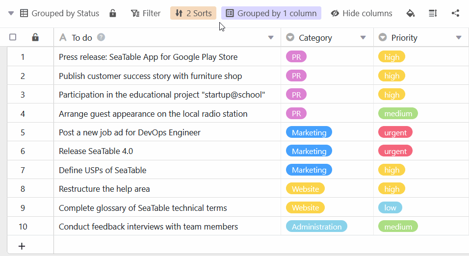

El orden en que aparecen las opciones de una columna de selección única puede ajustarse posteriormente.



## Organice las opciones con sólo arrastrar y soltar

1. Haga clic en el **símbolo del triángulo** situado a la derecha del nombre de cualquier columna de selección única.
2. Vaya a **Editar selección única**.
3. **Arrastre y suelte** una opción en la ubicación deseada. Para ello, utilice la zona con los **seis puntos** situada en el extremo izquierdo del nombre de cada opción.

## Clasificación y agrupación

El orden de las opciones es crucial a la hora de [ordenar](https://seatable.io/es/docs/ansichtsoptionen/sortieren-von-eintraegen-in-einer-ansicht/) o [agrupar](https://seatable.io/es/docs/ansichtsoptionen/gruppieren-von-eintraegen-in-einer-ansicht/) por una sola columna de selección. Puede organizar sus vistas de forma flexible ordenando las opciones como desee.

