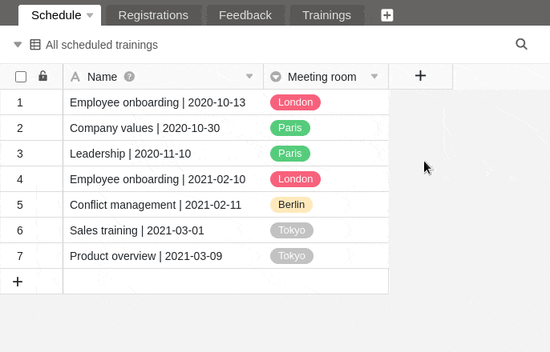

In SeaTable haben Sie die Möglichkeit, Ihren Tabellen **Checkbox-Spalten** hinzuzufügen. Diese eignen sich beispielsweise gut, um Aufgaben als erledigt zu markieren – also für den Überblick, ob Zeilen eine bestimmte **Ja/Nein-Bedingung** erfüllen. Daher können Sie Checkbox-Spalten hervorragend zum [Filtern](https://seatable.io/docs/ansichtsoptionen/filtern-von-eintraegen-in-einer-ansicht/), [Sortieren](https://seatable.io/docs/ansichtsoptionen/sortieren-von-eintraegen-in-einer-ansicht/) oder [Gruppieren](https://seatable.io/docs/ansichtsoptionen/gruppieren-von-eintraegen-in-einer-ansicht/) nutzen.

## Anlegen einer Checkbox-Spalte

1. Klicken Sie auf das **\[+\]-Symbol** rechts neben der letzten Spalte einer beliebigen Tabelle.
2. Geben Sie der Spalte einen **Namen**.
3. Wählen Sie als Spaltentyp **Checkbox** aus.
4. Entscheiden Sie, ob der [Standardwert](https://seatable.io/docs/arbeiten-mit-spalten/standardwert-fuer-eine-spalte-festlegen/) der Spalte **leer** oder **abgehakt** sein soll.
5. Bestätigen Sie mit **Abschicken**.

## Stiloptionen einer Checkbox-Spalte

Ihnen gefällt der standardmäßig gesetzte **grüne Haken** nicht? Kein Problem! Sie haben 70 verschiedene Stiloptionen, um Ihre Checkboxen so auszufüllen, wie Sie möchten.

