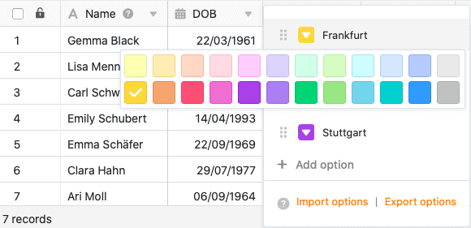

Vous pouvez ajouter diverses **options** à une colonne de sélection simple, parmi lesquelles vous pourrez ensuite choisir lorsque vous remplirez les cellules. Vous pouvez créer des options de sélection simple de **trois** manières différentes.

- Ajouter des options via les paramètres de colonne
- Ajouter des options via les cellules de la colonne de sélection simple
- Importer des options



## Ajouter des options via les paramètres de colonne

1. Cliquez sur l'**icône en forme de triangle** à droite du nom de n'importe quelle colonne de sélection simple.
2. Cliquez sur **Modifier la sélection simple**.
3. Ajoutez autant d'**options** que vous le souhaitez à la sélection simple.
4. Si nécessaire, vous pouvez personnaliser les **couleurs** attribuées aux options.
5. Confirmez chaque entrée en cliquant sur **Ajouter une option** ou en utilisant la **touche Entrée**.

## Ajouter des options via les cellules de la colonne de sélection simple

1. Double-cliquez sur n'importe quelle **cellule** de la colonne de sélection simple.
2. Dans le champ de recherche qui s'affiche, saisissez une **valeur** de votre choix (chiffre, terme, etc.) que vous souhaitez définir comme **nouvelle option**.
3. Cliquez sur **Ajouter une option**.
4. La valeur saisie est ensuite attribuée à la cellule sélectionnée et ajoutée aux différentes **options de sélection** de la colonne.

## Importer des options

Outre la **saisie manuelle**, vous pouvez également exporter facilement des options à partir d'une colonne de sélection simple existante et **les importer** dans une autre colonne de ce type. Cela s'avère très utile si vous souhaitez toujours utiliser **les mêmes options** à travers différentes colonnes.

Pour en savoir plus, consultez l'article Exporter [et importer des options dans des colonnes de sélection simples ou multiples](https://seatable.io/fr/docs/auswahlspalten/einfachauswahl-optionen-exportieren-und-importieren/).

## Couleurs des options de sélection

Pour rendre l'affichage des données plus clair au sein d'un tableau, SeaTable attribue une **couleur** différente à chaque option d'une colonne à sélection unique ou multiple. Les **paramètres de colonne** vous permettent de **personnaliser** cette couleur aléatoire. Vous ouvrez le **sélecteur de couleur** en cliquant sur l'**icône triangulaire** colorée située devant le nom de l'option.

Avec un [abonnement Enterprise](https://seatable.io/fr/docs/teamverwaltung-abonnement/abo-pakete/#3-toc-title), vous avez en outre la possibilité de créer [vos propres couleurs](https://seatable.io/fr/docs/arbeiten-mit-bases/eigene-farben-in-einer-base-hinzufuegen/) pour vos options de sélection.

## Autres articles utiles sur le thème des colonnes à sélection simple

- [Création d'une colonne de sélection simple](https://seatable.io/fr/docs/auswahlspalten/anlegen-einer-einfachauswahl-spalte/)
- [Modifier l'ordre des options de sélection simple](https://seatable.io/fr/docs/auswahlspalten/aendern-der-reihenfolge-von-einfachauswahl-optionen/)
- [Définir un cascadage pour une colonne de sélection simple](https://seatable.io/fr/docs/auswahlspalten/kaskadierung-einer-einfachauswahl/)
- [Exporter et importer des options de sélection simple](https://seatable.io/fr/docs/auswahlspalten/einfachauswahl-optionen-exportieren-und-importieren/)
