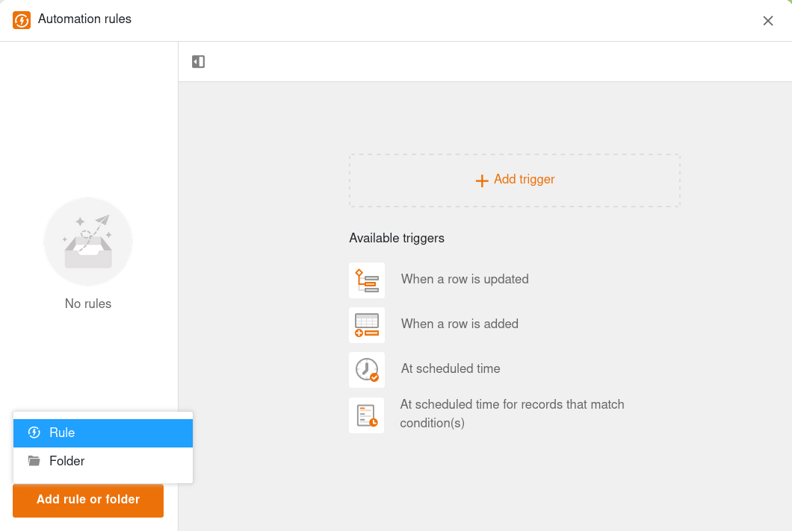
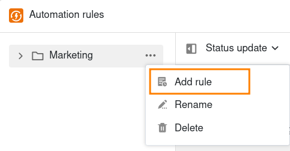
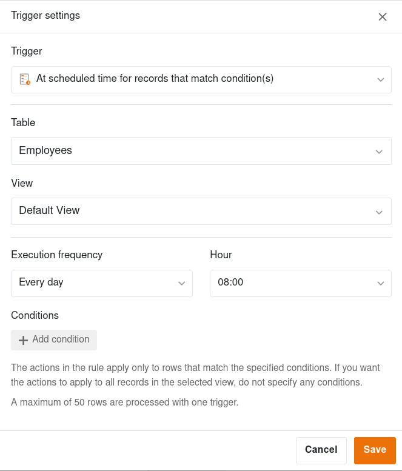
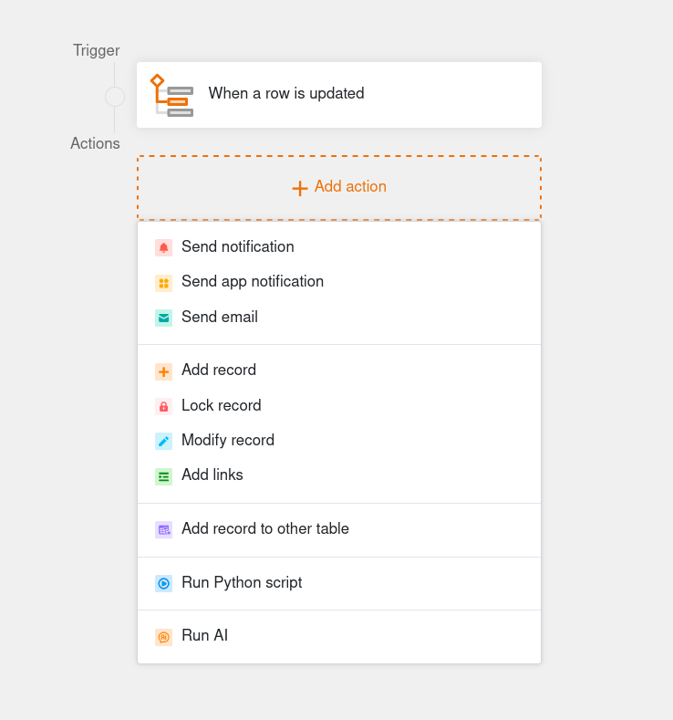



Con la ayuda de las automatizaciones, puede **automatizar procesos** de modo que no sólo ahorre tiempo, sino que también minimice el número de errores humanos. El primer paso hacia los flujos de trabajo automatizados es crear una automatización.

## Crear una regla de automatización

1. Abra la **Base** en la que desea crear una automatización.

2. En la cabecera de la base, haga clic en  y después en **Reglas de automatización**.

3. Haga clic en **Añadir regla o carpeta** y después en **Regla**.

4. Dé un **nombre** a la regla de automatización.

5. Cree la automatización deseada definiendo un **disparador** y varias **acciones**.



### Crear una regla de automatización en una carpeta

Si ya ha creado una carpeta para las reglas de automatización, también puede crear una regla directamente en la carpeta. Para ello, mueva el puntero del ratón sobre la carpeta, haga clic en los **tres puntos** y en **Añadir regla**.

## Más pasos de automatización

### Administración

En primer lugar, puede administrar la nueva regla de automatización, por ejemplo **renombrar**, **borrar** o **mover a una carpeta**.



### Disparadores

En el siguiente paso, usted define un evento que sirve como disparador e inicia la automatización. Aquí también se especifica en qué **tabla** y en qué **vista** debe tener efecto la automatización. El **disparador** puede ser que se añada una fila o que se cumplan determinadas condiciones tras una modificación. También puede configurar la automatización para que se active diaria, semanal o mensualmente a una hora determinada.



### Acciones

Por último, defina una o varias **acciones** que se desencadenen por el evento desencadenante previamente definido. Dependiendo del tipo de disparador, las acciones posibles pueden incluir el envío de notificaciones y correos electrónicos, la adición o bloqueo de entradas o la ejecución de una función de AI.

