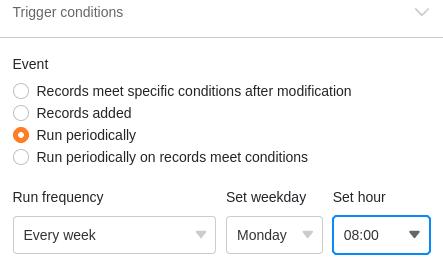



Con la ayuda de las automatizaciones, puede **automatizar procesos** de modo que no sólo ahorre tiempo, sino que también minimice el número de errores humanos. El primer paso hacia los flujos de trabajo automatizados es crear una automatización.

## Crear una automatización

1. Abra una **Base** en la que desee crear una automatización.
2. Haga clic en  en la cabecera Base y luego en **Reglas de automatización**.
3. Haga clic en **Añadir Regla**.
4. Cree la **automatización** deseada y confirme con **Enviar**.

## Pasos individuales

En primer lugar, configure **los parámetros básicos de** la nueva regla de automatización. En este paso se **asigna un nombre a la** automatización y se determina en qué **tabla** y en qué **vista** debe funcionar la automatización.

En el siguiente paso, se define un evento que sirve como **disparador** y **activa** la automatización. Puede elegir entre las entradas que se han añadido o las que cumplen determinadas condiciones tras una modificación. También puede seleccionar una activación **periódica** para que la automatización se active diaria, semanal o mensualmente a una hora determinada.

También puede limitar el número de **columnas supervisadas** y establecer una o varias **condiciones de filtro para** el activador.

Por último, defina una o varias **acciones automatizadas** que se desencadenen por el evento desencadenante previamente definido. Según el tipo de activador, las acciones posibles pueden ser, por ejemplo, enviar notificaciones y correos electrónicos, añadir o bloquear entradas y ejecutar un script de Python.

