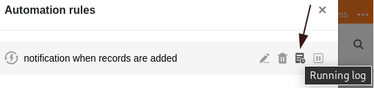



Pour vérifier la **bonne exécution d'une automatisation**, vous avez la possibilité de consulter le **journal d'exécution**. SeaTable y consigne les informations suivantes pour chaque exécution d'automatisation : heure d'exécution, condition d'exécution, état et avertissements éventuels.



## Pour jeter un coup d'œil au journal d'exécution

1. Cliquez sur  dans l'en-tête de base, puis sur **Règles d'automatisation**.
2. Passez le curseur de la souris sur la **règle d'automatisation** dont vous souhaitez consulter le log.
3. Cliquez sur le **journal d'exécution** .

## Structure du journal d'exécution

Vous pouvez consulter les informations suivantes dans le journal d'exécution d'une automatisation :

**Heure d'exécution**  
SeaTable enregistre ici l'heure exacte à laquelle le déclencheur a déclenché l'automation.

**Condition d'exécution**  
Si l'automation est déclenchée par la modification ou l'ajout d'une entrée, le message **per_update** apparaît. En revanche, si l'automatisation est déclenchée périodiquement, le message **per_day/week/month** apparaît.

**Statut**  
Le statut indique si l'automatisation a été exécutée avec succès. Si c'est le cas, le message **Succès** s'affiche ici.

**Avertissements**  
S'il y a eu des problèmes lors de l'exécution d'une automatisation, un message d'avertissement correspondant apparaît ici.

### D'autres articles utiles dans la rubrique Automations :

- [Travailler avec des automatisations](https://seatable.io/fr/docs-category/arbeiten-mit-automationen/)
- [Exemples d'automatisation](https://seatable.io/fr/docs-category/beispiele-fuer-automationen/)
