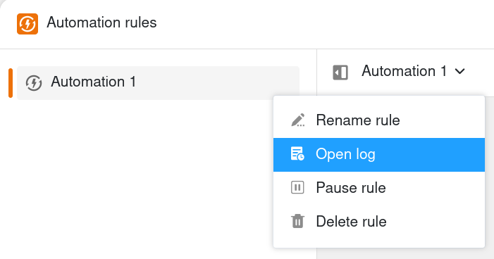



Чтобы проверить **правильность выполнения автоматизации**, у вас есть возможность просмотреть **журнал выполнения**. SeaTable записывает следующую информацию для каждого запуска автоматизации: время выполнения, условие выполнения, статус и любые предупреждения.



## Чтобы взглянуть на журнал выполнения

1. Нажмите на  в заголовке Base, а затем на **Automation Rules**.
2. Наведите указатель мыши на **правило автоматизации**, журнал которого вы хотите просмотреть.
3. Нажмите на **три точки**, а затем на  **Открыть журнал**.

## Структура журнала исполнения

В журнале выполнения автоматизации можно просмотреть следующую информацию:

**Время выполнения**  
Здесь SeaTable сохраняет точное время, в которое триггер инициировал автоматизацию.

**Условие выполнения**  
Если автоматизация срабатывает при изменении или добавлении записи, появляется сообщение **per_update**. Если же автоматизация срабатывает периодически, то появляется сообщение **per_day/week/month**.

**Статус**  
Статус показывает, была ли автоматизация выполнена успешно. В этом случае появится сообщение **Success**.

**Предупреждения**  
Если во время выполнения автоматизации возникли проблемы, здесь появляется соответствующее предупреждающее сообщение.
