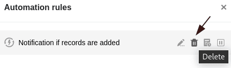



Bereits angelegte **Automatisierungsregeln** können Sie jederzeit wieder **löschen**. Beachten Sie dabei, welche Auswirkungen die Löschung auf die verschiedenen **automatisierten Aktionen** hat.

## So löschen Sie eine Automation

1. Öffnen Sie eine **Tabelle**, in der Sie eine bereits angelegte Automation löschen möchten.
2. Klicken Sie auf  und im Anschluss auf **Automatisierungsregeln**.
3. Klicken Sie rechts neben der entsprechenden Automatisierungsregel auf das **Papierkorb-Symbol** .
4. Bestätigen Sie mit **Löschen**.



## Auswirkungen

Je nachdem, welche Aktionen Sie für eine Automation definiert hatten, kann die Löschung einer Automatisierungsregel **unterschiedliche Konsequenzen** nach sich ziehen. Grundsätzlich gilt aber, dass das für eine Automation definierte Trigger-Ereignis nach der Löschung **keine** Aktion mehr auslösen wird, solange es nicht für eine noch bestehende Automation als Trigger fungiert.

Welche Auswirkungen die Löschung von Automationen auf die verschiedenen Aktionen hat, können Sie in der folgenden Tabelle ablesen:

| Aktion                                      | Auswirkung bei Löschung der Automatisierungsregel                                                                                                           |
| ------------------------------------------- | ----------------------------------------------------------------------------------------------------------------------------------------------------------- |
| Benachrichtigung versenden                  | Bei Eintritt des Trigger-Ereignisses werden keine Benachrichtigungen mehr versendet.                                                                        |
| E-Mail versenden                            | Bei Eintritt des Trigger-Ereignisses werden keine E-Mails mehr versendet.                                                                                   |
| Zeile hinzufügen                            | Bei Eintritt des Trigger-Ereignisses werden keine Zeilen mehr hinzugefügt.                                                                                  |
| Eintrag sperren                             | Bei Eintritt des Trigger-Ereignisses werden die Zeilen nicht mehr für die Bearbeitung gesperrt. Bereits gesperrte Zeilen bleiben jedoch weiterhin gesperrt. |
| Eintrag bearbeiten                          | Bei Eintritt des Trigger-Ereignisses werden keine Einträge mehr bearbeitet.                                                                                 |
| Links hinzufügen                            | Bei Eintritt des Trigger-Ereignisses werden keine Links mehr hinzugefügt.                                                                                   |
| Neuen Eintrag in anderer Tabelle hinzufügen | Bei Eintritt des Trigger-Ereignisses werden keine Einträge mehr in eine andere Tabelle hinzugefügt.                                                         |
| Python-Skript ausführen                     | Bei Eintritt des Trigger-Ereignisses werden keine Python-Skripte mehr ausgeführt.                                                                           |

### Weitere hilfreiche Artikel in der Rubrik Automationen:

- [Arbeiten mit Automationen](https://seatable.io/docs-category/arbeiten-mit-automationen/)
- [Beispiele für Automationen](https://seatable.io/docs-category/beispiele-fuer-automationen/)
