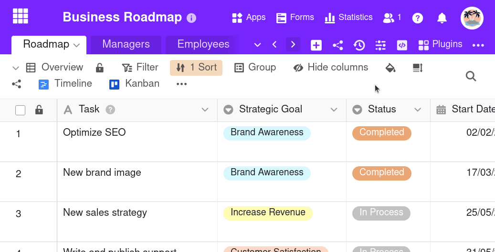



You can **delete automation rules** that have already been created at any time. Please note what effects the deletion has on the various **automated actions**.

## To delete an automation

1. Open a **Base** in which you want to delete an automation that has already been created.
2. In the base header, click on  and then on **Automation rules**.
3. Move the mouse pointer over the corresponding automation rule, click on the three dots and then on  **Delete rule** .
4. Confirm with **Delete**.



## Effects

Depending on which actions you had defined for an automation, the deletion of an automation rule can have **different consequences**. In principle, however, the defined trigger event will **no longer trigger any actions** after deletion – unless it is still used as a trigger for another existing automation.

Particularly in the case of complex actions such as sending emails, Python scripts or AI functions, you should consider only [pausing the automation]() instead of deleting it permanently.