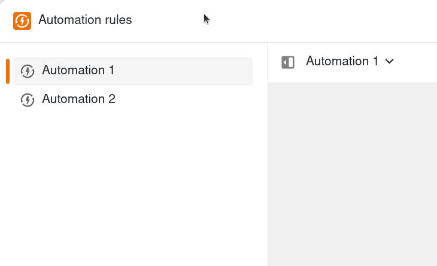
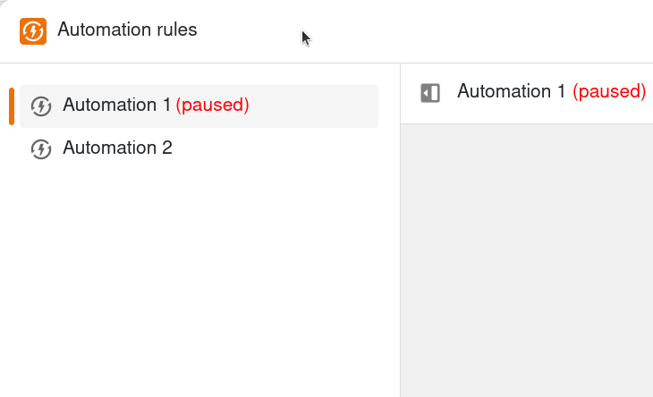



If you do not want to run automations for a certain period of time, you can **pause** them instead of [deleting]() them. This has the advantage that you can simply **restart** paused automations, while you have to create deleted automations from scratch again.

## Temporarily stop automations

1. Open a **Base** in which you want to pause an active automation.
2. In the base header, click on  and then on **Automation rules**.
3. Move the mouse pointer over the corresponding automation rule, click on the three dots and then on  **Pause rule** .

The selected automation rule is then **paused**. You can recognize this by the note **(paused)**, which is added to the name of the automation in red.



## Restart automations

To **activate** paused automations again, simply follow the steps described above and click  **Start rule** .

The **(paused)** note to the right of the automation name then disappears again.
