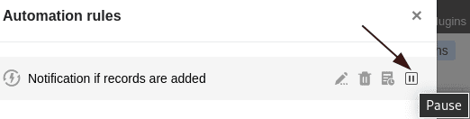



If you do not want to run automations for a certain period of time, you can **pause** them instead of [deleting]() them. This has the advantage that you can simply **reactivate** paused automations, while you have to create deleted automations from scratch again.

## Temporarily stop automations

1. Open a **table** where you want to pause an active automation.
2. Click  in the base header and then click **Automation Rules**.
3. Hover the mouse cursor over the corresponding automation rule and click the **pause icon** on the far right .

The selected automation rule is then **paused**. You can recognize this by the note **(paused)** added in red to the name of the automation and by the fact that the pause icon changes to a **play icon** .



## Re-enable automations

To **reactivate** paused automations, simply follow the steps already described above and click on the **Play icon** .

The note **(paused)** to the right of the automation name then disappears again and the **pause icon** returns.

