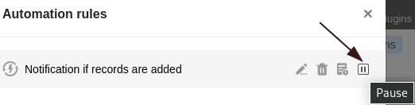
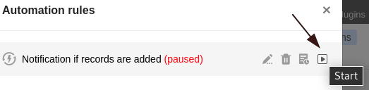



Se já não quiser executar as automatizações durante um determinado período de tempo, pode **fazer uma pausa** em vez de as [apagar](https://seatable.io/pt/docs/arbeiten-mit-automationen/automationen-loeschen/). Isto tem a vantagem de poder simplesmente **reactivar** as automatizações pausadas, enquanto que tem de criar automatizações apagadas do zero.

## Parar temporariamente as automatizações

1. Abrir uma **mesa** na qual se pretende fazer uma pausa numa automatização activa.
2. Clique em  no cabeçalho da Base e depois nas **Regras de Automatização**.
3. Mova o ponteiro do rato sobre a regra de automatização correspondente e clique no **símbolo de pausa** na extrema direita .

A regra de automatização seleccionada é então **pausada**. Pode reconhecer isto pela nota **(pausa)** que é acrescentada a vermelho ao nome da automatização e pelo facto de o símbolo de pausa mudar para um **símbolo de jogo** .



## Automatismos reutilizáveis

Para **reactivar** as automatizações pausadas, basta seguir os passos já descritos acima e clicar no **ícone de jogo** .

A nota **(pausada)** à direita do nome de automatização desaparece então novamente e o **símbolo de pausa** regressa.

### Artigos mais úteis na secção de automatização:

- [Trabalhar com automatismos](https://seatable.io/pt/docs-category/arbeiten-mit-automationen/)
- [Exemplos de automatizações](https://seatable.io/pt/docs-category/beispiele-fuer-automationen/)
