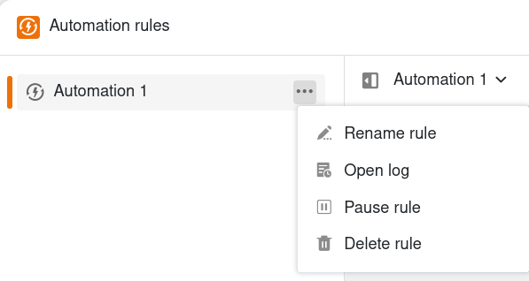
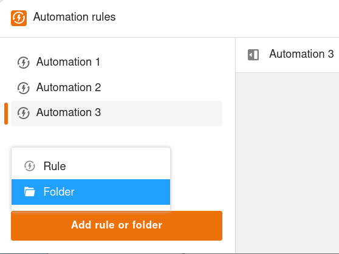
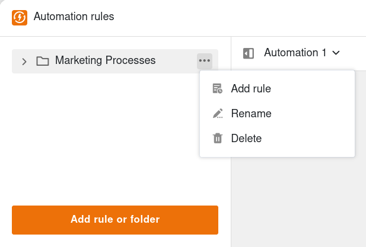
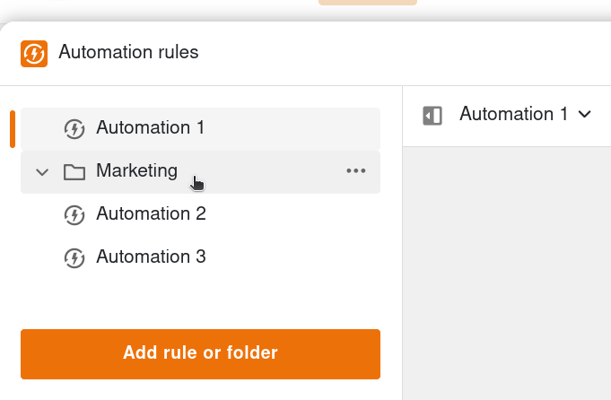



Pour pouvoir adapter à tout moment les automatisations déjà créées, vous avez la possibilité de gérer, de regrouper et de déplacer les règles d'automatisation que vous avez créées.

## Gérer les règles d'automatisation

1. Ouvrez une **base** dans laquelle vous avez déjà créé une automatisation.
2. Cliquez sur  dans l'en-tête de la base, puis sur **Règles d'automatisation**.
3. Placez le curseur de la souris sur la règle d'automatisation correspondante et cliquez sur les **trois points**.
4. Effectuez les **ajustements** souhaités sur l'automation.

Une fois que vous avez sélectionné une règle d'automatisation, vous pouvez également ouvrir le même menu en cliquant sur son titre dans la zone centrale.

Les options de gestion suivantes sont disponibles pour chaque règle d'automatisation :

- **Renommer la règle**
- [Ouvrir l'historique]()
- [Suspendre la règle]()
- [Supprimer la règle]()

Pour en savoir plus sur les différentes options, consultez les articles en lien.

## Regrouper les règles d'automatisation

Pour regrouper les règles d'automatisation, vous pouvez créer des dossiers correspondants.

Pour ce faire, cliquez sur **Ajouter une règle ou un dossier**, puis sur **Dossier**.

Donnez un **nom** au dossier et confirmez avec la touche **Enter**.

Passez le curseur de la souris sur le dossier et cliquez sur les **trois points** pour renommer ou supprimer le dossier. Vous pouvez également ajouter une nouvelle règle d'automatisation directement dans le dossier.

## Déplacer les règles d'automatisation

Pour modifier l'ordre des règles d'automatisation ou les déplacer vers un dossier, maintenez le bouton gauche de la souris enfoncé et faites glisser la règle **par glisser-déposer** vers l'emplacement souhaité. Vous pouvez déplacer des dossiers de la même manière.

