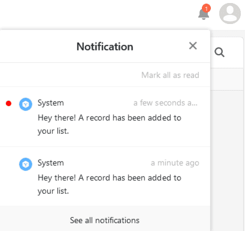
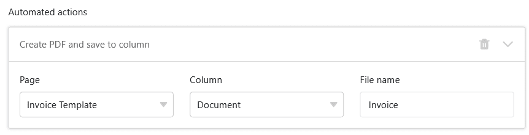
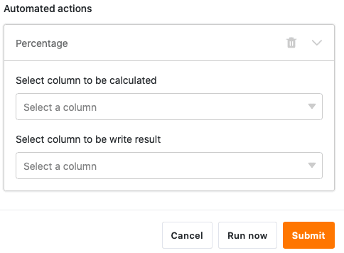
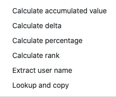



**Automatisierte Aktionen** stellen eine der beiden wesentlichen Komponenten von Automationen dar. Die Aktionen werden dabei von definierten **Trigger-Ereignissen** ausgelöst. Je nach [Trigger](https://seatable.io/docs/arbeiten-mit-automationen/automations-trigger/) kann SeaTable unterschiedliche Automations-Aktionen ausführen. Dieser Artikel bietet Ihnen einen **Überblick** über die verschiedenen Arten von automatisierten Aktionen.

## Verfügbare Automations-Aktionen

In der aktuellsten Version von SeaTable stehen ingesamt **elf** verschiedene Automations-Aktionen zur Auswahl:

- Benachrichtigung versenden
- App-Benachrichtigung versenden
- E-Mail versenden
- Zeile hinzufügen
- Eintrag sperren
- Eintrag bearbeiten
- Links hinzufügen
- Neuen Eintrag in anderer Tabelle hinzufügen
- Seite in PDF umwandeln
- Python-Skript ausführen
- Datenverarbeitungsoperation ausführen

## Automations-Aktion: Benachrichtigung versenden

Indem Sie "Benachrichtigung versenden" als automatisierte Aktion definieren, können Sie eine Benachrichtigung an einen oder mehrere Benutzer einstellen. Die ausgewählten Benutzer erhalten jedes Mal eine **Benachrichtigung**, wenn der entsprechende **Trigger** ausgelöst wird.

**Empfänger** und **Inhalt** der Benachrichtigungen können Sie jederzeit in den **Einstellungen** der Automation bearbeiten. Bei den Empfängern können Sie konkret einzelne Nutzer auswählen oder Nutzer in einer bestimmten Spalte vom Typ Mitarbeiter, Ersteller oder Letzter Bearbeiter.

Die Nutzer können ihre Benachrichtigungen über das  **Glocken-Symbol** neben ihrem Avatar in der rechten oberen Ecke abrufen.

Die Automations-Aktion "Benachrichtigung versenden" steht Ihnen derzeit bei folgenden **Automations-Triggern** zur Verfügung:

- Wenn ein neuer Eintrag hinzufügt wird
- Einträge erfüllen nach Bearbeitung bestimmte Bedingungen
- Periodischer Trigger
- Periodischer Trigger für Einträge, die eine bestimmte Bedingung erfüllen

Der Artikel [Benachrichtigungen per Automation versenden](https://seatable.io/docs/benachrichtigungen/benachrichtigungen-per-automation-versenden/) spielt diese Automation anhand eines konkreten Anwendungsfalls durch.

## Automations-Aktion: App-Benachrichtigung versenden

Indem Sie "App-Benachrichtigung versenden" als automatisierte Aktion definieren, können Sie eine Benachrichtigung an einen oder mehrere Benutzer einer App einstellen. Die ausgewählten Benutzer erhalten jedes Mal eine **Benachrichtigung** in der App, wenn der entsprechende **Trigger** ausgelöst wird.

In den **Einstellungen** der Automation können Sie definieren, an welche **App** und welche **Empfänger** die Benachrichtigungen gesendet werden sollen. Bei den Empfängern können Sie konkret einzelne Nutzer auswählen oder Nutzer in einer bestimmten Spalte vom Typ Mitarbeiter, Ersteller oder Letzter Bearbeiter. Schreiben Sie den gewünschten **Inhalt** der Benachrichtigung in das Textfeld.

Die Nutzer der jeweiligen App können ihre Benachrichtigungen über das  **Glocken-Symbol** neben ihrem Avatar in der rechten oberen Ecke abrufen.

Die Automations-Aktion "App-Benachrichtigung versenden" steht Ihnen derzeit bei folgenden **Automations-Triggern** zur Verfügung:

- Wenn ein neuer Eintrag hinzufügt wird
- Einträge erfüllen nach Bearbeitung bestimmte Bedingungen
- Periodischer Trigger
- Periodischer Trigger für Einträge, die eine bestimmte Bedingung erfüllen

## Automations-Aktion: E-Mail versenden

Indem Sie "E-Mail versenden" als automatisierte Aktion definieren, können Sie vorab definierte E-Mails an einen oder mehrere Benutzer versenden. Dabei schickt SeaTable an jeden ausgewählten Benutzer eine **E-Mail**, sobald der entsprechende **Trigger** ausgelöst wird. Empfänger, Betreff, Inhalt und Anhänge der E-Mail können Sie jederzeit in den **Einstellungen** der Automation bearbeiten.

Die Automations-Aktion "E-Mail versenden" steht Ihnen derzeit bei folgenden **Automations-Triggern** zur Verfügung:

- Wenn ein neuer Eintrag hinzufügt wird
- Einträge erfüllen nach Bearbeitung bestimmte Bedingungen
- Periodischer Trigger
- Periodischer Trigger für Einträge, die eine bestimmte Bedingung erfüllen

Der Artikel [E-Mail-Versand per Automation](https://seatable.io/docs/beispiel-automationen/e-mail-versand-per-automation/) spielt diese Automation anhand eines konkreten Anwendungsfalls durch.

## Automations-Aktion: Zeile hinzufügen

Wenn Sie "Zeile hinzufügen" als automatisierte Aktion definieren, wird der Tabelle ein **neuer Eintrag** hinzugefügt, sobald der entsprechende **Trigger** ausgelöst wird. Den genauen **Inhalt** des Eintrags können Sie im Vorhinein für jede Spalte individuell bestimmen.

Die Automations-Aktion "Zeile hinzufügen" steht Ihnen derzeit bei folgenden **Automations-Triggern** zur Verfügung:

- Wenn ein neuer Eintrag hinzufügt wird
- Einträge erfüllen nach Bearbeitung bestimmte Bedingungen
- Periodischer Trigger

Der Artikel [Zeilen per Automation hinzufügen](https://seatable.io/docs/beispiel-automationen/zeilen-per-automation-hinzufuegen/) spielt diese Automation anhand eines konkreten Anwendungsfalls durch.

## Automations-Aktion: Eintrag sperren

Wenn Sie "Eintrag sperren" als automatisierte Aktion definieren, wird die **Zeile** mit dem Eintrag, der die Automation ausgelöst hat, für die Bearbeitung **gesperrt**. Beachten Sie dabei, dass Sie gesperrte Zeilen ohne Administratorrechte **nicht** mehr **entsperren** können.

 

Die Automations-Aktion "Eintrag sperren" steht Ihnen derzeit bei folgenden **Automations-Triggern** zur Verfügung:

- Wenn ein neuer Eintrag hinzufügt wird
- Einträge erfüllen nach Bearbeitung bestimmte Bedingungen
- Periodischer Trigger für Einträge, die eine bestimmte Bedingung erfüllen

Der Artikel [Zeilen per Automation sperren](https://seatable.io/docs/beispiel-automationen/zeilen-per-automation-sperren/) spielt diese Automation anhand eines konkreten Anwendungsfalls durch.

## Automations-Aktion: Eintrag bearbeiten

Wenn Sie "Eintrag bearbeiten" als automatisierte Aktion auswählen, werden **Einträge** in der Tabelle nach Auslösung des **Triggers** gemäß den im Vorhinein definierten **Einstellungen** angepasst. Wie im Screenshot zu sehen, kann beispielsweise das Einstiegsdatum eines neuen Mitarbeiters, der neu in die Tabelle eingetragen wird, automatisch auf das heutige Datum gesetzt werden.

Die Automations-Aktion "Eintrag bearbeiten" steht Ihnen derzeit bei folgenden **Automations-Triggern** zur Verfügung:

- Wenn ein neuer Eintrag hinzufügt wird
- Einträge erfüllen nach Bearbeitung bestimmte Bedingungen
- Periodischer Trigger für Einträge, die eine bestimmte Bedingung erfüllen

## Automations-Aktion: Links hinzufügen

Wenn Sie "Links hinzufügen" als automatisierte Aktion auswählen, wird in der entsprechenden Spalte bei Auslösung des **Triggers** eine [Verknüpfung zu Einträgen einer anderen Tabelle](https://seatable.io/docs/verknuepfungen/wie-man-tabellen-in-seatable-miteinander-verknuepft/) herstellt. In den **Einstellungen** der Automatisierungsregel können Sie dabei genauestens festlegen, unter welchen Bedingungen welcher Link in der Tabelle hinzugefügt wird.

Die Automations-Aktion "Links hinzufügen" steht Ihnen derzeit bei folgenden **Automations-Triggern** zur Verfügung:

- Wenn ein neuer Eintrag hinzufügt wird
- Einträge erfüllen nach Bearbeitung bestimmte Bedingungen
- Periodischer Trigger

Der Artikel [Verlinken von Einträgen per Automation](https://seatable.io/docs/beispiel-automationen/verlinken-von-eintraegen-per-automation/) spielt diese Automation anhand eines konkreten Anwendungsfalls durch.

## Automations-Aktion: Neuen Eintrag in anderer Tabelle hinzufügen

Wenn Sie "Neuen Eintrag in anderer Tabelle hinzufügen" als automatisierte Aktion auswählen, wird bei Auslösung des **Triggers** ein **Eintrag** in einer **anderen** Tabelle erstellt. In den **Einstellungen** der Automatisierungsregel können Sie dabei individuelle Einträge definieren, die den ausgewählten Tabellen im Zuge der Automation hinzugefügt werden.

Die Automations-Aktion "Neuen Eintrag in anderer Tabelle hinzufügen" steht Ihnen derzeit bei folgenden **Automations-Triggern** zur Verfügung:

- Wenn ein neuer Eintrag hinzufügt wird
- Einträge erfüllen nach Bearbeitung bestimmte Bedingungen

Der Artikel [Einträge in andere Tabellen per Automation hinzufügen](https://seatable.io/docs/beispiel-automationen/eintraege-in-andere-tabellen-per-automation-hinzufuegen/) spielt diese Automation anhand eines konkreten Anwendungsfalls durch.

## Automations-Aktion: Seite in PDF umwandeln

Wenn Sie "Seite in PDF umwandeln" als automatisierte Aktion auswählen, wird bei Auslösung des **Triggers** ein PDF-Dokument aus dem Datensatz erzeugt und in einer [Datei-Spalte](https://seatable.io/docs/dateien-und-bilder/die-datei-spalte/) gespeichert. Dazu wählen Sie eine **Vorlage** aus, die Sie zuvor im [Seitendesign-Plugin](https://seatable.io/docs/seitendesign-plugin/anleitung-zum-seitendesign-plugin/) erstellt haben. In den Einstellungen der Automatisierungsregel können Sie auch den **Dateinamen** definieren.

Die Automations-Aktion "Seite in PDF umwandeln" steht Ihnen derzeit bei folgendem **Automations-Trigger** zur Verfügung:

- Periodischer Trigger für Einträge, die eine bestimmte Bedingung erfüllen

## Automations-Aktion: Python-Skript ausführen

Wenn Sie die Ausführung eines Python-Skripts als automatisierte Aktion auswählen, kann SeaTable ein im Vorhinein definiertes **Python-Skript** in der ausgewählten Tabelle ausführen. Das Skript können Sie jederzeit im [Skript-Editor](https://seatable.io/docs/javascript-python/anlegen-und-loeschen-eines-skriptes/) anlegen oder bearbeiten und dann in den **Einstellungen** der Automatisierungsregel auswählen.

Die Automations-Aktion "Python-Skript ausführen" steht Ihnen derzeit bei folgenden **Automations-Triggern** zur Verfügung:

- Wenn ein neuer Eintrag hinzufügt wird
- Einträge erfüllen nach Bearbeitung bestimmte Bedingungen
- Periodischer Trigger

## Automations-Aktion: Datenverarbeitungsoperation ausführen

Wenn Sie die Ausführung einer Datenverarbeitungsoperation als automatisierte Aktion auswählen, wird bei Auslösung des **Triggers** eine im Vorhinein definierte [Datenverarbeitungsoperation]() in der Tabelle ausgeführt. Die auszuführende Datenverarbeitungsoperation können Sie in den **Einstellungen** der Automatisierungsregel festlegen.

Folgende **Datenverarbeitungsoperationen** können Sie mit einer Automation ausführen lassen:

- [Kumulierte Werte berechnen](https://seatable.io/docs/datenverarbeitung/datenverarbeitung-kumulierte-werte-berechnen/)
- [Rangliste berechnen](https://seatable.io/docs/datenverarbeitung/datenverarbeitung-rangliste-berechnen/)
- [Veränderungen berechnen](https://seatable.io/docs/datenverarbeitung/datenverarbeitung-veraenderungen-berechnen/)
- [Prozentualen Anteil berechnen](https://seatable.io/docs/datenverarbeitung/datenverarbeitung-prozentualen-anteil-berechnen/)
- [Vergleichen und kopieren](https://seatable.io/docs/datenverarbeitung/datenverarbeitung-vergleichen-und-kopieren/)
- [Benutzernamen übertragen](https://seatable.io/docs/datenverarbeitung/datenverarbeitung-benutzernamen-uebertragen/)

Die Automations-Aktion "Datenverarbeitungsoperation ausführen" steht Ihnen derzeit bei folgendem **Automations-Trigger** zur Verfügung:

- Periodischer Trigger
