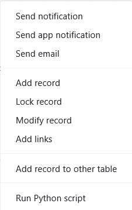
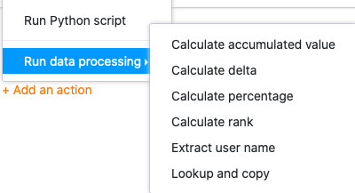
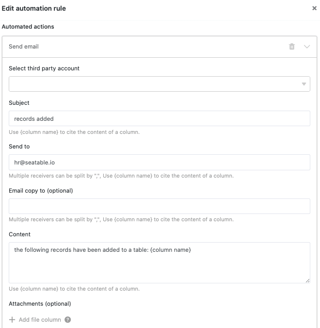
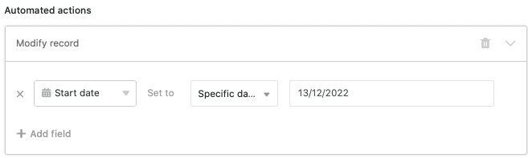



**Automated actions** represent one of the two essential components of automations. The actions are triggered by defined **trigger events**. Depending on the [trigger](https://seatable.io/en/docs/arbeiten-mit-automationen/automations-trigger/), SeaTable can perform different automation actions. This article provides you with an **overview of** the different types of automated actions.

## Available automation actions

The latest version of SeaTable offers a total of **eleven** different automation actions to choose from:

- Send notification
- Send app notification
- Send e-mail
- Addrow
- Lock entry
- Edit entry
- Add links
- Add new entry in other table
- Convert page to PDF
- Run Python script
- Execute data processing operation

## Automation action: Send notification

By defining "Send notification" as an automated action, you can set a notification to one or more users. The selected users receive a **notification** each time the corresponding **trigger** is **triggered**.

You can edit the **recipients** and **content** of the notifications at any time in the automation **settings**. For the recipients, you can select individual users or users in a specific column of the type employee, creator or last editor.

Users can access their notifications via the  **bell icon** next to their avatar in the top right-hand corner.

The automation action "Send notification" is currently available for the following **automation triggers**:

- When a new entry is added
- Entries meet certain conditions after editing
- Periodic trigger
- Periodic trigger for entries that meet a certain condition

The article [Sending notifications via automation](https://seatable.io/en/docs/benachrichtigungen/benachrichtigungen-per-automation-versenden/) plays through this automation using a concrete use case.

## Automation action: Send app notification

By defining "Send app notification" as an automated action, you can set a notification to one or more users of an app. The selected users receive a **notification** in the app each time the corresponding **trigger is triggered**.

In the automation **settings**, you can define which **app** and which **recipients** the notifications should be sent to. For the recipients, you can specifically select individual users or users in a certain column of the type employee, creator or last editor. Enter the desired **content** of the notification in the text field.

Users of the respective app can access their notifications via the  **bell icon** next to their avatar in the top right-hand corner.

The "Send app notification" automation action is currently available for the following **automation triggers**:

- When a new entry is added
- Entries meet certain conditions after editing
- Periodic trigger
- Periodic trigger for entries that meet a certain condition

## Automation action: Send e-mail

By defining "Send email" as an automated action, you can send predefined emails to one or more users. SeaTable sends an **email** to each selected user as soon as the corresponding **trigger** is **triggered**. You can edit the recipient, subject, content and attachments of the email at any time in the automation **settings**.

The automation action "Send e-mail" is currently available for the following **automation triggers**:

- When a new entry is added
- Entries meet certain conditions after editing
- Periodic trigger
- Periodic trigger for entries that meet a certain condition

The article [Email Sending by Automation](https://seatable.io/en/docs/beispiel-automationen/e-mail-versand-per-automation/) plays through this automation using a concrete use case.

## Automation Action: Add row

If you define "Addrow " as an automated action, a **new entry** is added to the table as soon as the corresponding **trigger** is activated. You can define the exact **content** of the entry individually for each column in advance.

The automation action "row add" is currently available for the following **automation triggers**:

- When a new entry is added
- Entries meet certain conditions after editing
- Periodic trigger

The article [rows add by automation](https://seatable.io/en/docs/beispiel-automationen/zeilen-per-automation-hinzufuegen/) plays through this automation using a concrete use case.

## Automation action: Lock entry

If you define "Lock entry" as an automated action, the **row** with the entry that triggered the automation is **locked** for editing. Please note that you can **no** longer **unlock** locked rows without administrator rights.

  

The automation action "Lock entry" is currently available for the following **automation triggers**:

- When a new entry is added
- Entries meet certain conditions after editing
- Periodic trigger for entries that meet a certain condition

The article [rows Locking via Automation](https://seatable.io/en/docs/beispiel-automationen/zeilen-per-automation-sperren/) runs through this automation using a concrete use case.

## Automation action: Edit entry

If you select "Edit entry" as an automated action, **entries** in the table are adjusted according to the **settings** defined in advance after the **trigger is triggered**. As can be seen in the screenshot, for example, the start date of a new employee who is entered in the table can be automatically set to today's date.

The "Edit entry" automation action is currently available for the following **automation triggers**:

- When a new entry is added
- Entries meet certain conditions after editing
- Periodic trigger for entries that meet a certain condition

## Automation action: Add links

If you select "Add links" as an automated action, a link [to entries in another table]() is created in the corresponding column when the **trigger is triggered**. In the automation rule **settings**, you can specify exactly under which conditions which link is added to the table.

The Add Links automation action is currently available for the following **automation triggers**:

- When a new entry is added
- Entries meet certain conditions after editing
- Periodic trigger

The article [Linking entries via automation](https://seatable.io/en/docs/beispiel-automationen/verlinken-von-eintraegen-per-automation/) plays through this automation using a concrete use case.

## Automation action: Add new entry in other table

If you select "Add new entry in another table" as an automated action, an **entry** is created in **another** table when the **trigger is triggered**. In the automation rule **settings**, you can define individual entries that are added to the selected tables as part of the automation.

The automation action "Add new entry in other table" is currently available for the following **automation triggers**:

- When a new entry is added
- Entries meet certain conditions after editing

The article [Adding Entries to Other Tables via Automation](https://seatable.io/en/docs/beispiel-automationen/eintraege-in-andere-tabellen-per-automation-hinzufuegen/) runs through this automation using a concrete use case.

## Automation action: Convert page to PDF

If you select "Convert page to PDF" as an automated action, a PDF document is created from the data set and saved in a [file column](https://seatable.io/en/docs/dateien-und-bilder/die-datei-spalte/) when the **trigger is triggered**. To do this, select a **template** that you have previously created in the [page design plugin](https://seatable.io/en/docs/seitendesign-plugin/anleitung-zum-seitendesign-plugin/). You can also define the **file name** in the automation rule settings.

The "Convert page to PDF" automation action is currently available with the following **automation trigger**:

- Periodic trigger for entries that meet a certain condition

## Automation action: Run Python script

If you select the execution of a Python script as an automated action, SeaTable can execute a pre-defined **Python script** in the selected table. You can create or edit the script at any time in the [script editor](https://seatable.io/en/docs/javascript-python/anlegen-und-loeschen-eines-skriptes/) and then select it in the automation rule **settings**.

The Run Python Script automation action is currently available with the following **automation triggers**:

- When a new entry is added
- Entries meet certain conditions after editing
- Periodic trigger

## Automation action: perform data processing operation

If you select the execution of a data processing operation as an automated action, a [data processing operation]() defined in advance in the table is executed when the **trigger is triggered**. You can define the data processing operation to be executed in the automation rule **settings**.

You can have the following **data processing operations** performed with automation:

- [Calculate cumulative values]()
- [Calculate ranking]()
- [Calculate changes]()
- [Calculate percentage]()
- [Compare and copy]()
- [Transfer user name]()

The "Execute data processing operation" automation action is currently available for the following **automation trigger**:

- Periodic trigger
