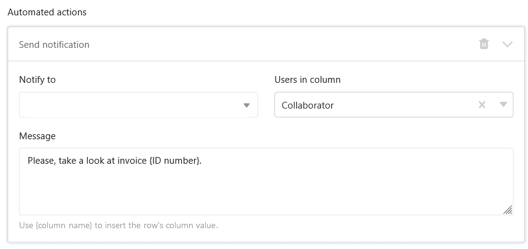
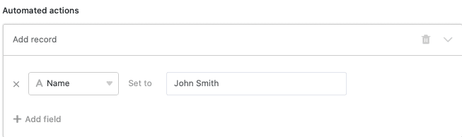
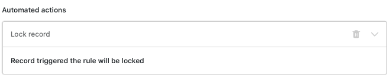
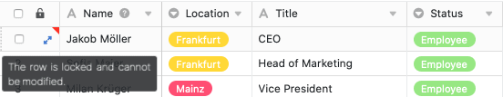
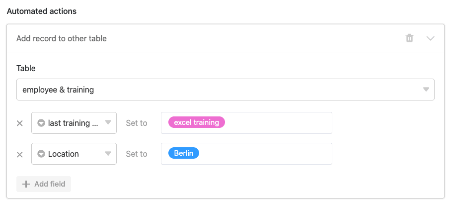
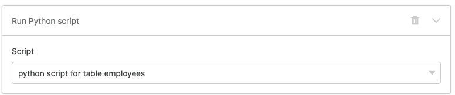



**Les actions automatisées** représentent l'une des deux composantes essentielles des automatisations. Les actions sont alors déclenchées par des **événements déclencheurs** définis. Selon le [déclencheur](), SeaTable peut exécuter différentes actions d'automatisation. Cet article vous donne un **aperçu** des différents types d'actions automatisées.

## Actions d'automatisation disponibles

Dans la dernière version de SeaTable, il y a en tout **onze** actions d'automatisation différentes au choix :

- Envoyer une notification
- Envoyer une notification d'application
- Envoyer un e-mail
- Ajouter une ligne
- Entrée de la serrure
- Modifier l'entrée
- Ajouter des liens
- Ajouter une nouvelle entrée dans un autre tableau
- Convertir une page en PDF
- Exécuter un script Python
- Exécuter une opération de traitement de données

## Action d'automatisation : envoyer une notification

En définissant "Envoyer une notification" comme action automatisée, vous pouvez définir une notification à un ou plusieurs utilisateurs. Les utilisateurs sélectionnés recevront une **notification** chaque fois que le **déclencheur** correspondant sera déclenché.

Vous pouvez à tout moment modifier les **destinataires** et **le contenu** des notifications dans les **paramètres** de l'automatisation. Pour les destinataires, vous pouvez concrètement sélectionner des utilisateurs individuels ou des utilisateurs dans une colonne spécifique de type collaborateur, créateur ou dernier intervenant.

Les utilisateurs peuvent consulter leurs notifications en cliquant sur l'**icône de la cloche**  à côté de leur avatar dans le coin supérieur droit.

L'action d'automatisation "Envoyer une notification" est actuellement disponible pour les **déclencheurs d'automatisation** suivants :

- Si une nouvelle entrée est ajoutée
- Les entrées remplissent certaines conditions après traitement
- Déclencheur périodique
- Déclenchement périodique pour les entrées qui remplissent une certaine condition

L'article [Envoyer des notifications par automatisation]() présente cette automatisation à l'aide d'un cas d'application concret.

## Action d'automatisation : envoyer une notification d'application

En définissant "Envoyer une notification d'app" comme action automatisée, vous pouvez définir une notification à un ou plusieurs utilisateurs d'une app. Les utilisateurs sélectionnés recevront une **notification** dans l'app à chaque fois que le **déclencheur** correspondant sera déclenché.

Dans les **paramètres** de l'automatisation, vous pouvez définir à quelle **application** et à quels **destinataires** les notifications doivent être envoyées. Pour les destinataires, vous pouvez concrètement sélectionner des utilisateurs individuels ou des utilisateurs dans une certaine colonne de type collaborateur, créateur ou dernier intervenant. Écrivez le **contenu** souhaité de la notification dans le champ de texte.

Les utilisateurs de chaque application peuvent consulter leurs notifications en cliquant sur l'**icône de la cloche**  à côté de leur avatar dans le coin supérieur droit.

L'action d'automatisation "Envoyer une notification d'application" est actuellement disponible pour les **déclencheurs d'automatisation** suivants :

- Si une nouvelle entrée est ajoutée
- Les entrées remplissent certaines conditions après traitement
- Déclencheur périodique
- Déclenchement périodique pour les entrées qui remplissent une certaine condition

## Action d'automatisation : envoyer un e-mail

En définissant "Envoyer un e-mail" comme action automatisée, vous pouvez envoyer des e-mails prédéfinis à un ou plusieurs utilisateurs. SeaTable envoie alors un **e-mail** à chaque utilisateur sélectionné dès que le **déclencheur** correspondant est déclenché. Vous pouvez modifier à tout moment le destinataire, l'objet, le contenu et les pièces jointes de l'e-mail dans les **paramètres** d'automatisation.

L'action d'automatisation "Envoyer un e-mail" est actuellement disponible pour les **déclencheurs d'automatisation** suivants :

- Si une nouvelle entrée est ajoutée
- Les entrées remplissent certaines conditions après traitement
- Déclencheur périodique
- Déclenchement périodique pour les entrées qui remplissent une certaine condition

L'article [Envoi d'e-mails par automatisation]() met en scène cette automatisation à l'aide d'un cas d'application concret.

## Action d'automatisation : ajouter une ligne

Si vous définissez "Ajouter une ligne" comme action automatisée, une **nouvelle entrée** est ajoutée au tableau dès que le **déclencheur** correspondant est **déclenché**. Vous pouvez définir à l'avance le **contenu** exact de l'entrée individuellement pour chaque colonne.

L'action d'automatisation "Ajouter une ligne" est actuellement disponible pour les **déclencheurs d'automatisation** suivants :

- Si une nouvelle entrée est ajoutée
- Les entrées remplissent certaines conditions après traitement
- Déclencheur périodique

L'article [Ajouter des lignes par automation]() joue cette automation à l'aide d'un cas d'application concret.

## Action d'automatisation : bloquer l'entrée

Si vous définissez "Verrouiller l'entrée" comme action automatisée, la **ligne** contenant l'entrée qui a déclenché l'automatisation sera **bloquée** pour l'édition. Notez que vous ne pouvez **pas** **débloquer** les lignes bloquées sans droits d'administrateur.

  

L'action d'automatisation "Bloquer l'entrée" est actuellement disponible pour les **déclencheurs d'automatisation** suivants :

- Si une nouvelle entrée est ajoutée
- Les entrées remplissent certaines conditions après traitement
- Déclenchement périodique pour les entrées qui remplissent une certaine condition

L'article [Verrouiller des lignes par automation]() joue sur cette automation à l'aide d'un cas d'application concret.

## Action d'automatisation : modifier l'entrée

Si vous sélectionnez "Modifier l'entrée" comme action automatisée, **les entrées** du tableau seront adaptées après le **déclenchement** du **trigger** selon les **paramètres** définis au préalable. Comme on peut le voir dans la capture d'écran, la date d'entrée d'un nouvel employé qui vient d'être saisi dans le tableau peut par exemple être automatiquement définie à la date du jour.

L'action d'automatisation "Modifier l'entrée" est actuellement disponible pour les **déclencheurs d'automatisation** suivants :

- Si une nouvelle entrée est ajoutée
- Les entrées remplissent certaines conditions après traitement
- Déclenchement périodique pour les entrées qui remplissent une certaine condition

## Action d'automatisation : ajouter des liens

Si vous sélectionnez "Ajouter des liens" comme action automatisée, un [lien vers les entrées d'un autre tableau]() est créé dans la colonne correspondante lorsque le **déclencheur** est **déclenché**. Dans les **paramètres** de la règle d'automatisation, vous pouvez alors définir très précisément dans quelles conditions tel ou tel lien sera ajouté dans le tableau.

L'action d'automatisation "Ajouter des liens" est actuellement disponible pour les **déclencheurs d'automatisation** suivants :

- Si une nouvelle entrée est ajoutée
- Les entrées remplissent certaines conditions après traitement
- Déclencheur périodique

L'article [Lier des entrées par automatisation]() joue cette automatisation à l'aide d'un cas d'application concret.

## Action d'automatisation : ajouter une nouvelle entrée dans un autre tableau

Si vous sélectionnez "Ajouter une nouvelle entrée dans un autre tableau" comme action automatisée, une **entrée** est créée dans un autre tableau lorsque le **déclencheur** est **déclenché**. Dans les **paramètres** de la règle d'automatisation, vous pouvez alors définir des entrées individuelles qui seront ajoutées aux tableaux sélectionnés au cours de l'automatisation.

L'action d'automatisation "Ajouter une nouvelle entrée dans un autre tableau" est actuellement disponible pour les **déclencheurs d'automatisation** suivants :

- Si une nouvelle entrée est ajoutée
- Les entrées remplissent certaines conditions après traitement

L'article [Ajouter des entrées dans d'autres tableaux par automatisation]() montre cette automatisation à l'aide d'un cas d'application concret.

## Action d'automatisation : convertir une page en PDF

Si vous sélectionnez "Convertir la page en PDF" comme action automatisée, un document PDF sera créé à partir de l'ensemble de données et enregistré dans une [colonne de fichier](). Dans les paramètres de la règle d'automatisation, vous pouvez également définir le **nom du fichier**.

L'action d'automatisation "Convertir la page en PDF" est actuellement disponible pour le **déclencheur d'automatisation** suivant :

- Déclenchement périodique pour les entrées qui remplissent une certaine condition

## Action d'automatisation : exécuter un script Python

Si vous sélectionnez l'exécution d'un script Python comme action automatisée, SeaTable peut exécuter un **script Python** défini à l'avance dans le tableau sélectionné. Vous pouvez créer ou modifier le script à tout moment dans l'[éditeur de script](), puis le sélectionner dans les **paramètres** de la règle d'automatisation.

L'action d'automatisation "Exécuter un script Python" est actuellement disponible pour les **déclencheurs d'automatisation** suivants :

- Si une nouvelle entrée est ajoutée
- Les entrées remplissent certaines conditions après traitement
- Déclencheur périodique

## Action d'automatisation : exécuter une opération de traitement des données

Si vous sélectionnez l'exécution d'une opération de traitement des données en tant qu'action automatisée, une [opération de traitement des données]() définie au préalable dans le tableau est exécutée lorsque le **déclencheur est déclenché**. Vous pouvez définir l'opération de traitement des données à exécuter dans les **paramètres** de la règle d'automatisation.

Vous pouvez faire exécuter les **opérations de traitement de données** suivantes par une automatisation :

- [Calculer les valeurs cumulées]()
- [Calculer le classement]()
- [Calculer les changements]()
- [Calculer le pourcentage]()
- [Comparer et copier]()
- [Transférer le nom d'utilisateur]()

L'action d'automatisation "Exécuter une opération de traitement des données" est actuellement disponible pour le **déclencheur d'automatisation** suivant :

- Déclencheur périodique
