

**Автоматизированные действия** представляют собой один из двух основных компонентов автоматики. Действия запускаются определенными **триггерными событиями**. В зависимости от [триггера]() SeaTable может выполнять различные действия по автоматизации. В этой статье представлен **обзор** различных типов автоматизированных действий.

## Доступные действия автоматизации

Последняя версия SeaTable предлагает на выбор 13 различных действий по автоматизации:

- Отправить уведомление
- Отправить уведомление приложения
- Отправить электронное письмо
- Добавить запись
- Заблокировать запись
- Изменить запись
- Добавить ссылки
- Добавить запись в другую таблицу
- Запустить скрипт Python
- Запустить AI (искусственного интеллекта)
- Запустить обработку данных
- Преобразование страницы в PDF
- Сгенерировать PDF из документа и отправить

## Добавляйте, дублируйте, перемещайте и удаляйте действия автоматизации

Чтобы добавить действие, нажмите на **большую кнопку с символом плюса** и выберите соответствующее действие из выпадающего списка. Обратите внимание, что доступные действия различаются в зависимости от триггера.

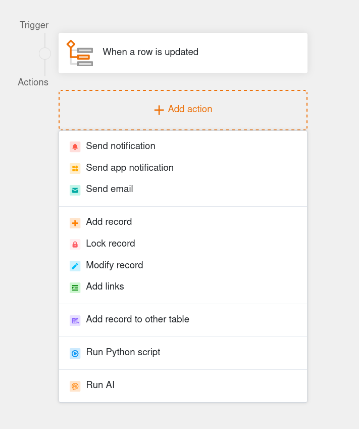

Если Вы уже настроили более сложные действия, такие как отправка электронной почты, обработка данных или функции искусственного интеллекта, Вы также можете продублировать их. Просто нажмите на **три точки**, а затем на **Дублировать**. Это означает, что Вам придется вносить лишь незначительные изменения в эти действия, и сэкономит Вам массу времени.

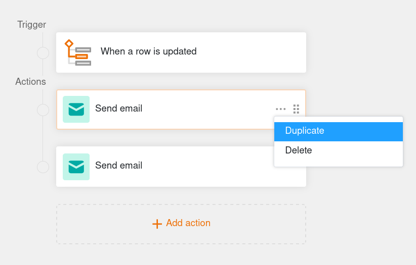

Порядок действий можно легко изменить **путем перетаскивания**. Наведите указатель мыши на поле действия, удерживайте левую кнопку мыши в **шеститочечной области перетаскивания** и переместите действие в нужное место. Это позволяет Вам гибко настраивать последовательность автоматизации.

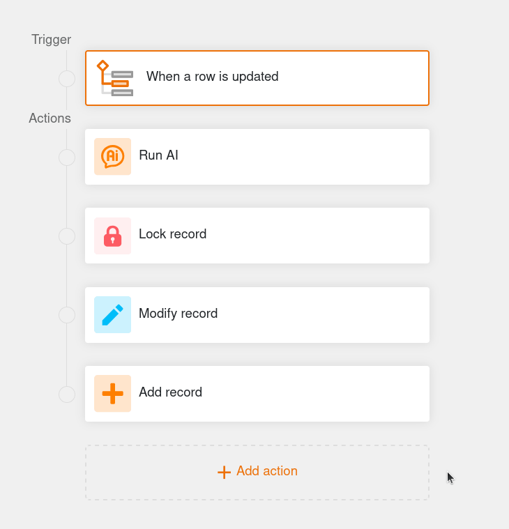

Конечно же, Вы можете удалить действия, которые больше не нужны. Для этого нажмите на **три точки**, а затем на **Удалить**. Обратите внимание, что автоматизированные действия удаляются **немедленно и навсегда** и не могут быть восстановлены.

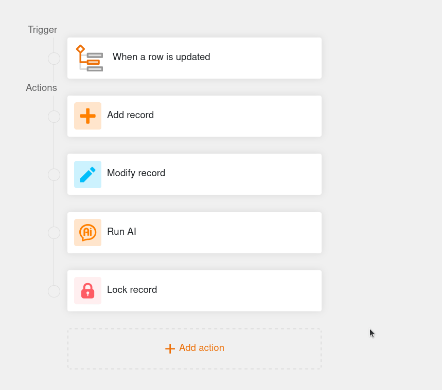

## Действие автоматизации: Отправить уведомление

Определив "Отправить уведомление" в качестве автоматического действия, Вы можете установить уведомление для одного или нескольких пользователей. Выбранные пользователи будут получать **уведомление** каждый раз, когда сработает соответствующий триггер. Это действие автоматизации доступно **для всех триггеров автоматизации**.

Вы можете в любой момент изменить **получателей** и **содержание** уведомлений в **настройках** действия. Для получателей Вы можете выбрать **отдельных пользователей** или пользователей в определенной колонке типа [Сотрудник](), [Создатель]() или [Последний редактор](). Напишите нужное сообщение в текстовом поле и работайте со ссылками на столбцы в фигурных скобках, чтобы вставить определенные значения.

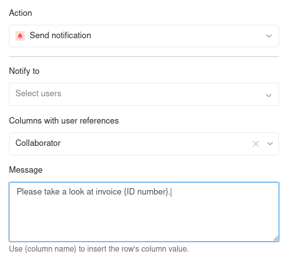

Пользователи могут проверять свои уведомления через  **значок звонка** рядом с их аватаром в правом верхнем углу.

В статье [Отправка уведомлений с помощью автоматизации]() рассматривается эта автоматизация на примере конкретного случая использования.

## Действие автоматизации: Отправить уведомление приложения

Определив "Отправить уведомление приложения" в качестве автоматического действия, Вы можете отправить уведомление одному или нескольким пользователям приложения. Выбранные пользователи получают **уведомление** в приложении каждый раз, когда срабатывает соответствующий триггер. Это автоматическое действие доступно **для всех триггеров автоматизации**.

В **Настройках** действия Вы можете определить, в какое **Приложение** и каким **Получателям** должны быть отправлены уведомления. Для получателей Вы можете выбрать **отдельных пользователей приложения** или уведомить пользователей в определенной колонке типа **сотрудник, создатель или последний редактор**. Введите желаемое **содержание** уведомления в текстовое поле. Используйте ссылки на столбцы в фигурных скобках, чтобы вставить определенные значения.

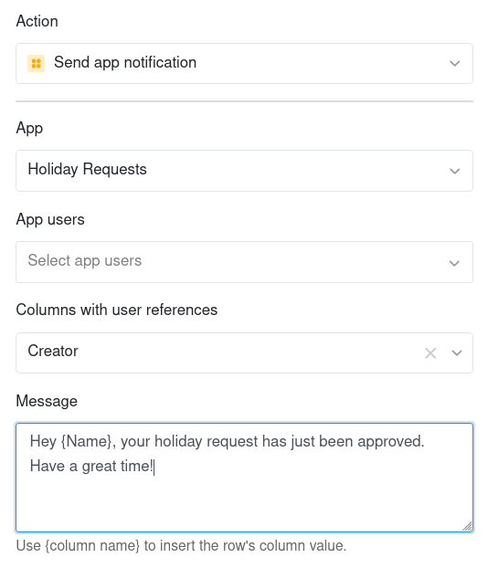

Пользователи соответствующего приложения могут проверять свои уведомления через  **значок звонка** рядом с их аватаром в правом верхнем углу.

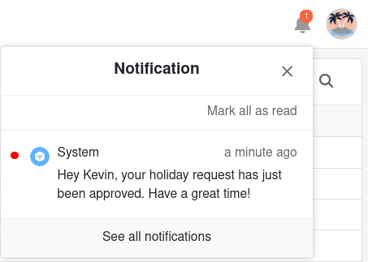

## Действие автоматизации: Отправить электронное письмо

Определив "Отправить электронное письмо" как автоматическое действие, Вы можете отправлять предопределенные электронные письма одному или нескольким пользователям. SeaTable отправит **электронное письмо** каждому выбранному пользователю, как только сработает соответствующий триггер. Это автоматическое действие доступно **для всех триггеров автоматизации**.

Вы можете в любой момент изменить **учетную запись**, **субъект**, **получателя**, **сообщение** и **вложения** письма в **настройках** действия. Используйте ссылки на столбцы в фигурных скобках, чтобы вставить определенные значения в текстовые поля.

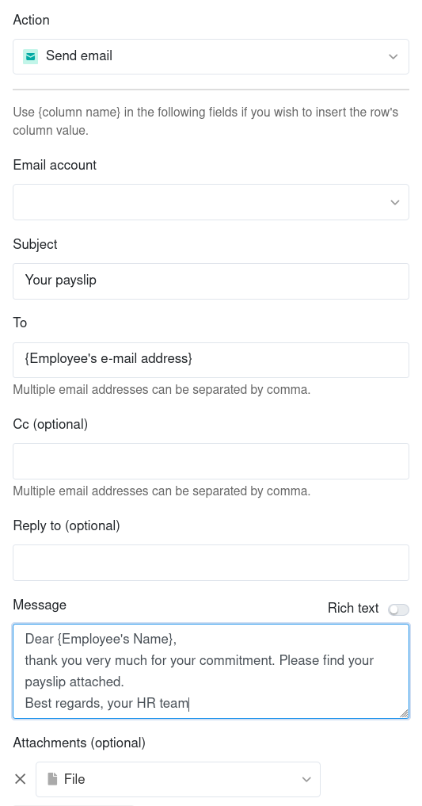

В статье [Отправка электронной почты с помощью автоматизации]() рассматривается эта автоматизация на примере конкретного случая использования.

## Действие автоматизации: Добавить запись

Если Вы определите "Добавить запись" в качестве автоматического действия, то **новая строка** будет добавляться в таблицу каждый раз, когда срабатывает соответствующий триггер. Вы можете заранее определить точные значения для каждого столбца в отдельности.

Действие автоматизации "Добавить запись" в настоящее время доступно для следующих **автоматических триггеров**:
- Когда строка обновляется
- Когда строка добавляется
- В заданное время

В статье [Добавление строк с помощью автоматизации]() рассматривается эта автоматизация на примере конкретного случая использования.

## Действие автоматизации: Заблокировать запись

Если Вы определите "Заблокировать запись" в качестве автоматического действия, **строка**, которая вызвала автоматизацию, будет заблокирована для редактирования. Вы не можете сделать никаких дополнительных настроек для этого действия - Вы должны настроить условия для блокировки строки в **Триггере**. Обратите внимание, что Вы больше не можете **разблокировать** заблокированные строки без прав администратора.

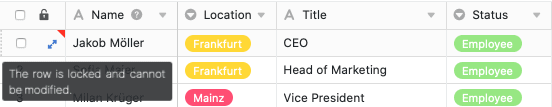

Действие автоматизации "Заблокировать запись" в настоящее время доступно для следующих **автоматических триггеров**:
- Когда строка обновляется
- Когда строка добавляется
- В заданное время по условию

В статье [Блокировка строк с помощью автоматизации]() рассматривается эта автоматизация на примере конкретного случая использования.

## Действие автоматизации: Изменить запись

Если Вы выберете "Изменить запись" в качестве автоматического действия, **строки** в таблице будут скорректированы в соответствии с ранее заданными **настройками** после срабатывания триггера. Вы можете задать значение для каждого столбца, которое строки автоматически примут после изменения.

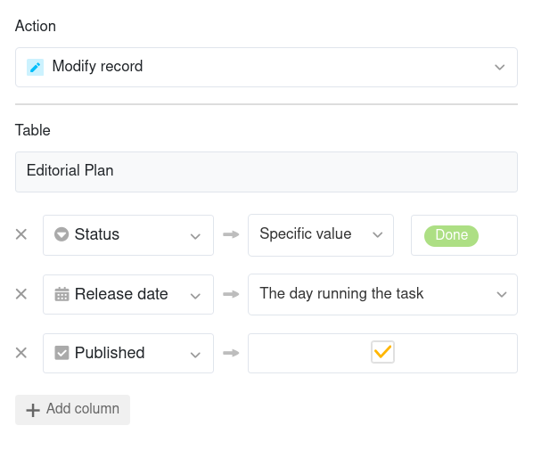

Действие автоматизации "Изменить запись" в настоящее время доступно для следующих **триггеров автоматизации**:
- Когда строка обновляется
- Когда строка добавляется
- В заданное время по условию

## Действие автоматизации: Добавить ссылки

Если Вы выберете "Добавить ссылки" в качестве автоматического действия, то при срабатывании триггера в соответствующем столбце будет создана [ссылка на другие записи](). В **Настройках** действия Вы можете указать, при каких именно условиях ссылка будет добавлена в таблицу.

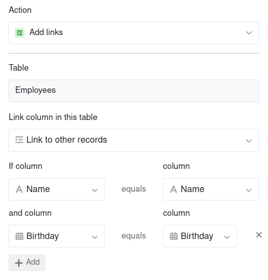

Действие автоматизации "Добавление ссылок" в настоящее время доступно для следующих **триггеров автоматизации**:
- Когда строка обновляется
- Когда строка добавляется
- В заданное время

В статье [Связывание записей с помощью автоматизации]() рассматривается эта автоматизация на примере конкретного случая использования.

## Действие автоматизации: Добавить новую запись в другую таблицу

Если Вы выберете "Добавить новую запись в другую таблицу" в качестве автоматического действия, то при срабатывании триггера **в другой таблице будет создана строка**. В **Настройках** действия Вы можете задать индивидуальные значения для каждого столбца, которые будут присвоены строкам выбранной таблицы в рамках автоматизации. Вы также можете выбрать столбцы того же типа в исходной таблице, чтобы скопировать записи строк в другую таблицу.

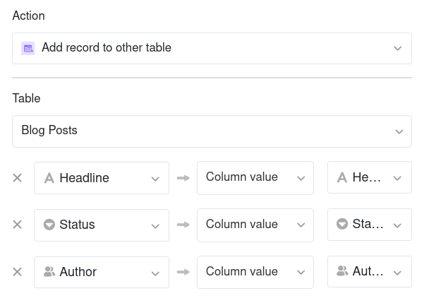

Действие автоматизации "Добавить новую запись в другую таблицу" в настоящее время доступно для следующих **триггеров автоматизации**:
- Когда строка обновляется
- Когда строка добавляется

В статье [Добавление записей в другие таблицы с помощью автоматизации]() рассматривается эта автоматизация на примере конкретного случая использования.

## Действие автоматизации: Запустить скрипт Python

Если Вы выбрали выполнение скрипта Python в качестве автоматического действия, триггер приводит в движение ранее определенный **скрипт Python**. Вы можете в любой момент создать или отредактировать сценарий в [редакторе скрипта](), а затем выбрать его в **Настройках** действия.

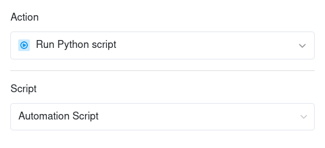

Действие автоматизации "Запуск скрипта Python" в настоящее время доступно для следующих **триггеров автоматизации**:
- Когда строка обновляется
- Когда строка добавляется
- В заданное время

## Действие автоматизации: Запустить AI (искусственного интеллекта)

Если Вы выбрали в качестве автоматического действия выполнение функции AI, триггер вызывает **AI-модель**, которая выполняет предопределенное действие в таблице. Вы можете настроить точное действие, которое должно быть выполнено, в **Настройках**. В зависимости от типа функции искусственного интеллекта, могут потребоваться **входные столбцы**, **выходные столбцы** и **опрос**.

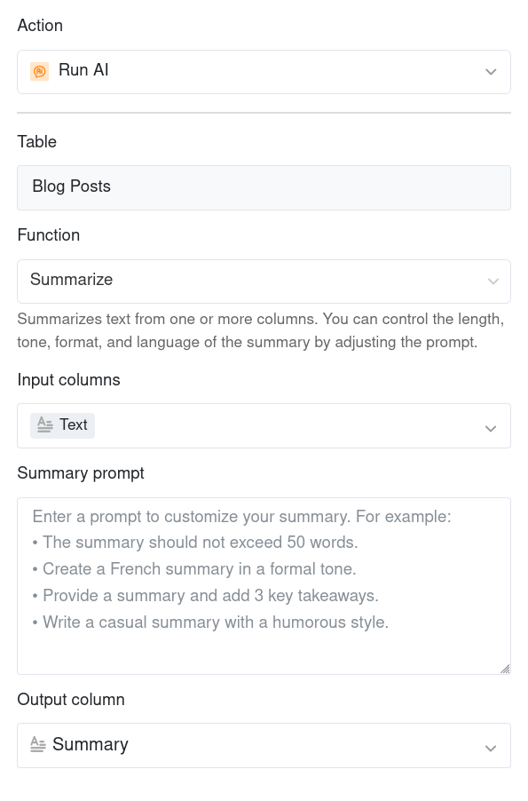

С помощью автоматизации Вы можете выполнять следующие **функции AI**:

- **Резюмировать**: Резюмирует текст из одной или нескольких колонок. Вы можете контролировать длину, тон, формат и язык резюме, настраивая подсказку.
- **Классифицировать**: Классифицирует записи из одного или нескольких столбцов. Вы можете настроить категории и правила с помощью подсказки. В итоге получается [одиночный выбор]() или [Множественный выбор]().
- **OCR**: Извлекает текст из [колонки изображений](). Распознанное содержимое записывается в результирующий столбец типа [Текст или Форматированный текст]().
- **Извлечь**: Извлекает определенную информацию из колонки типа текст или число в соответствии с Вашими требованиями. Извлеченная информация записывается в столбцы-результаты.
- **Пользовательский**: Генерирует содержимое на основе Вашего запроса. Используйте {имя столбца} в фигурных скобках, чтобы вставить значение столбца в строку.

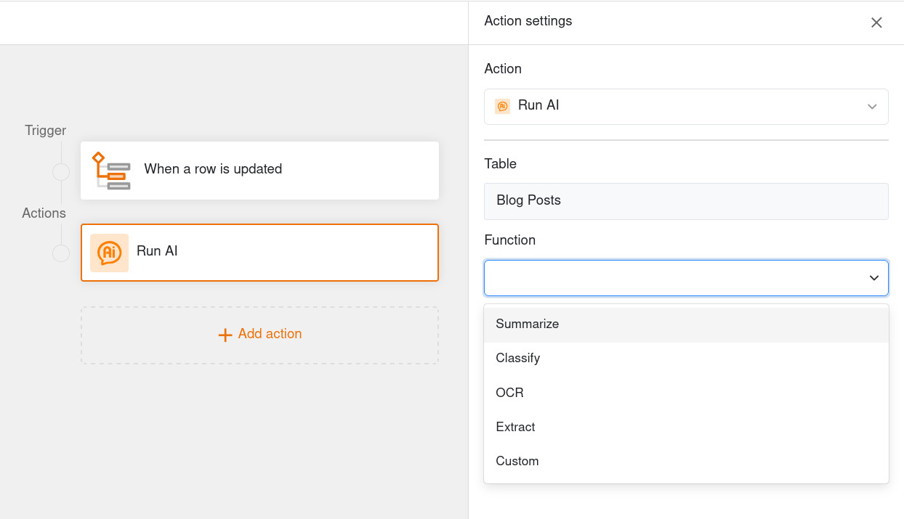

Действие автоматизации "Запустить AI" в настоящее время доступно для следующих **триггеров автоматизации**:
- Когда строка обновляется
- Когда строка добавляется
- В заданное время

## Действие автоматизации: Запустить обработку данных

Если Вы выбрали выполнение операции обработки данных в качестве автоматического действия, триггер инициирует предопределенную [операцию обработки данных]() в таблице. Вы можете настроить точное действие, которое будет выполнено, в **Настройках**. В зависимости от типа операции, могут потребоваться **определенные столбцы ввода и вывода**.

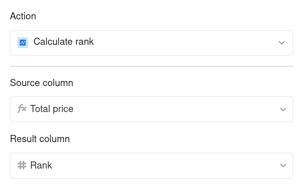

С помощью автоматизации Вы можете выполнить следующие **операции обработки данных**:

- [Рассчитать дельту]()
- [Расчет процентного соотношения]()
- [Вычислить рейтинг]()
- [Извлечь имя пользователя]()
- [Сравнение и копирование]()

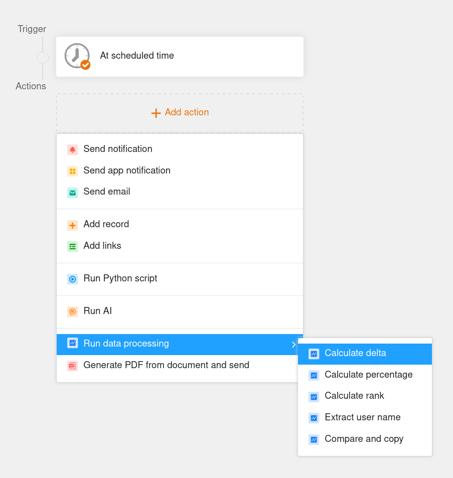

Действие автоматизации "Запустить операцию обработки данных" в настоящее время доступно для следующих **триггеров автоматизации**:
- В заданное время

## Действие автоматизации: Преобразование страницы в PDF

Если Вы выберете "Преобразование страницы в PDF" в качестве автоматического действия, SeaTable **создаст PDF-документ из набора данных** при срабатывании триггера и сохранит его в [колонке файлов](). Для этого выберите **шаблон**, который Вы ранее создали в плагине [Page design](). Вы также можете задать **имя файла** в настройках действия.

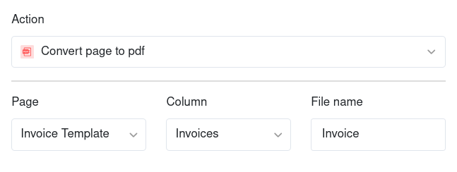

Действие автоматизации "Преобразование страницы в PDF" в настоящее время доступно со следующим **триггером автоматизации**:
- В заданное время по условию

## Действие автоматизации: Сгенерировать PDF из документа и отправить

Если Вы выберете "Сгенерировать PDF из документа и отправить" в качестве автоматического действия, SeaTable **создаст PDF-документ** при срабатывании триггера и сохранит его в [управлении файлами](). SeaTable также может отправить его непосредственно по электронной почте.

В **Настройках** действия выберите **шаблон**, который Вы ранее создали в плагине **Дизайн отчета**, и назначьте **имя файла**. Затем активируйте ползунок, чтобы выбрать **собственную папку**, в которой Вы хотели бы сохранить файл. Если Вы хотите только сгенерировать документ, Вы можете завершить настройку на этом этапе.

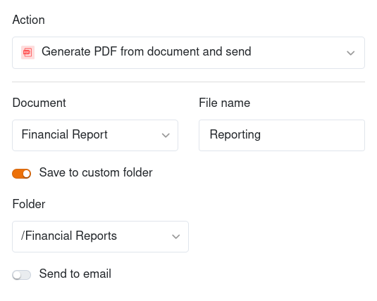

Если Вы хотите отправить сгенерированный документ, активируйте ползунок "Отправить на e-mail". В **настройках** действия Вы можете в любой момент изменить **учетную запись электронной почты**, **получателя**, **предмет** и **сообщение** письма.

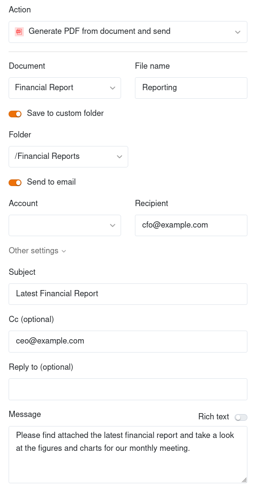

Действие автоматизации "Сгенерировать PDF из документа и отправить" в настоящее время доступно со следующим **триггером автоматизации**:
- В заданное время
