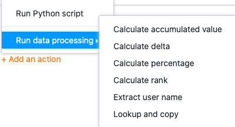
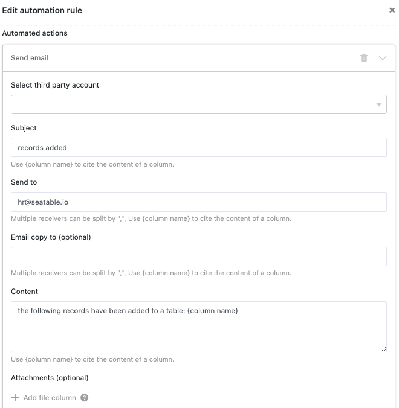
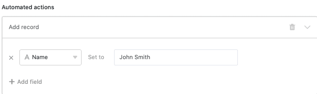
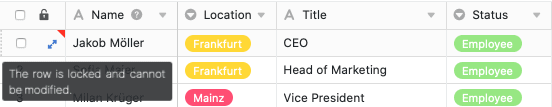
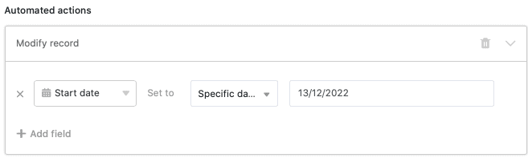
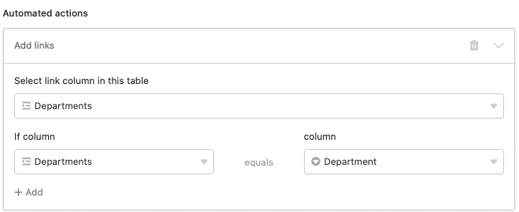
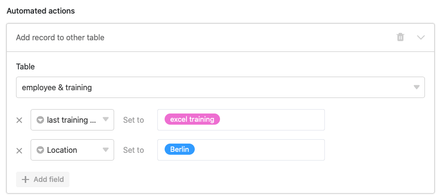



**Автоматизированные действия** представляют собой один из двух основных компонентов автоматики. Действия запускаются определенными **триггерными событиями**. В зависимости от [триггера]() SeaTable может выполнять различные действия по автоматизации. В этой статье представлен **обзор** различных типов автоматизированных действий.

## Доступные действия автоматизации

Последняя версия SeaTable предлагает на выбор **одиннадцать** различных действий по автоматизации:

- Отправить уведомление
- Отправка уведомления о приложении
- Отправить электронное письмо
- Добавить строку
- Ввод замка
- Редактировать запись
- Добавить ссылки
- Добавить новую запись в другую таблицу
- Преобразование страницы в PDF
- Запуск сценария Python
- Выполнение операции обработки данных

## Действие автоматизации: Отправить уведомление

Определив "Отправить уведомление" в качестве автоматического действия, вы можете настроить уведомление для одного или нескольких пользователей. Выбранные пользователи получают **уведомление** каждый раз, когда **срабатывает** соответствующий **триггер**.

Вы можете в любой момент изменить **получателей** и **содержание** уведомлений в **настройках** автоматизации. В качестве получателей можно выбрать отдельных пользователей или пользователей в определенной колонке типа сотрудник, создатель или последний редактор.

Пользователи могут получить доступ к своим уведомлениям через **значок колокольчика**  рядом со своим аватаром в правом верхнем углу.

Действие автоматизации "Отправить уведомление" в настоящее время доступно для следующих **триггеров автоматизации**:

- Когда добавляется новая запись
- Записи соответствуют определенным условиям после редактирования
- Периодическое срабатывание
- Периодическое срабатывание для записей, выполняющих определенное условие

В статье [Отправка уведомлений с помощью автоматизации]() рассматривается эта автоматизация на конкретном примере.

## Действие автоматизации: отправка уведомления о приложении

Определив "Отправить уведомление о приложении" в качестве автоматического действия, вы можете установить уведомление для одного или нескольких пользователей приложения. Выбранные пользователи получают **уведомление** в приложении каждый раз, когда **срабатывает** соответствующий **триггер**.

В **настройках** автоматизации вы можете определить, в какое **приложение** и каким **получателям** должны отправляться уведомления. В качестве получателей можно выбрать отдельных пользователей или пользователей в определенном столбце типа сотрудник, создатель или последний редактор. Введите желаемое **содержание** уведомления в текстовое поле.

Пользователи соответствующего приложения могут получить доступ к своим уведомлениям через **значок колокольчика**  рядом со своим аватаром в правом верхнем углу.

Действие автоматизации "Отправить уведомление приложения" в настоящее время доступно для следующих **триггеров автоматизации**:

- Когда добавляется новая запись
- Записи соответствуют определенным условиям после редактирования
- Периодическое срабатывание
- Периодическое срабатывание для записей, выполняющих определенное условие

## Действие автоматизации: Отправить электронное письмо

Определив "Отправить электронное письмо" как автоматическое действие, вы можете отправлять предопределенные электронные письма одному или нескольким пользователям. SeaTable отправляет **электронное письмо** каждому выбранному пользователю, как только срабатывает соответствующий **триггер**. Вы можете в любой момент изменить получателя, тему, содержание и вложения письма в **настройках** автоматизации.

Действие автоматизации "Отправить письмо" в настоящее время доступно для следующих **триггеров автоматизации**:

- Когда добавляется новая запись
- Записи соответствуют определенным условиям после редактирования
- Периодическое срабатывание
- Периодическое срабатывание для записей, выполняющих определенное условие

В статье [Email Dispatch by Automation]() эта автоматизация рассматривается на конкретном примере.

## Действие автоматизации: Добавить строку

Если вы определите "Добавить строку" как автоматическое действие, **новая запись** будет добавлена в таблицу, как только **сработает** соответствующий **триггер**. Вы можете заранее определить точное **содержание** записи отдельно для каждого столбца.

Действие автоматизации "Добавить строку" в настоящее время доступно для следующих **триггеров автоматизации**:

- Когда добавляется новая запись
- Записи соответствуют определенным условиям после редактирования
- Периодическое срабатывание

В статье [Добавление строк с помощью автоматизации]() рассматривается эта автоматизация на конкретном примере.

## Автоматическое действие: Ввод замка

Если вы определили "Заблокировать запись" в качестве автоматического действия, **строка** с записью, вызвавшей автоматизацию, будет **заблокирована** для редактирования. Обратите внимание, что вы больше **не** можете **разблокировать** заблокированные строки без прав администратора.

  

Действие автоматизации "Заблокировать вход" в настоящее время доступно для следующих **триггеров автоматизации**:

- Когда добавляется новая запись
- Записи соответствуют определенным условиям после редактирования
- Периодическое срабатывание для записей, выполняющих определенное условие

В статье [Locking Lines by Automation]() эта автоматизация рассматривается на конкретном примере.

## Автоматическое действие: Редактирование записи

Если в качестве автоматического действия выбрать "Редактировать запись", то после срабатывания **триггера** **записи** в таблице будут скорректированы в соответствии с заранее заданными **настройками**. Как видно на скриншоте, например, дата начала работы нового сотрудника, внесенного в таблицу, может быть автоматически установлена на сегодняшнюю дату.

Действие автоматизации "Редактировать запись" в настоящее время доступно для следующих **триггеров автоматизации**:

- Когда добавляется новая запись
- Записи соответствуют определенным условиям после редактирования
- Периодическое срабатывание для записей, выполняющих определенное условие

## Действие автоматизации: Добавить ссылки

Если в качестве автоматического действия выбрать "Добавить ссылки", то при срабатывании **триггера** в соответствующем столбце будет создана ссылка [на записи в другой таблице](). В **настройках** правила автоматизации можно указать, при каких именно условиях ссылка будет добавлена в таблицу.

Действие автоматизации "Добавить ссылки" в настоящее время доступно для следующих **триггеров автоматизации**:

- Когда добавляется новая запись
- Записи соответствуют определенным условиям после редактирования
- Периодическое срабатывание

В статье [Связывание записей с помощью автоматизации]() рассматривается эта автоматизация на конкретном примере.

## Действие автоматизации: Добавить новую запись в другую таблицу

Если в качестве автоматического действия выбрать "Добавить новую запись в другую таблицу", то при срабатывании **триггера** в **другой** таблице будет создана **запись**. В **настройках** правила автоматизации можно определить отдельные записи, которые будут добавлены в выбранные таблицы в рамках автоматизации.

Действие автоматизации "Добавить новую запись в другую таблицу" в настоящее время доступно для следующих **триггеров автоматизации**:

- Когда добавляется новая запись
- Записи соответствуют определенным условиям после редактирования

В статье [Добавление записей в другие таблицы с помощью автоматизации]() рассматривается эта автоматизация на конкретном примере.

## Действие автоматизации: Преобразование страницы в PDF

Если в качестве автоматического действия выбрать "Преобразовать страницу в PDF", то при **срабатывании триггера** из набора данных будет создан PDF-документ и сохранен в [колонке файлов](). **Имя файла** также можно задать в настройках правила автоматизации.

Действие автоматизации "Преобразование страницы в PDF" в настоящее время доступно со следующими **триггерами автоматизации**:

- Периодическое срабатывание для записей, выполняющих определенное условие

## Действие автоматизации: Выполнение сценария Python

Если в качестве автоматического действия выбрать выполнение сценария Python, SeaTable может выполнить в выбранной таблице заранее определенный **сценарий Python**. Вы можете создать или отредактировать сценарий в любое время в [редакторе сценариев](), а затем выбрать его в **настройках** правила автоматизации.

Действие автоматизации "Выполнить Python-скрипт" в настоящее время доступно для следующих **триггеров автоматизации**:

- Когда добавляется новая запись
- Записи соответствуют определенным условиям после редактирования
- Периодическое срабатывание

## Действие автоматизации: Выполнить операцию обработки данных

Если в качестве автоматического действия выбрать выполнение операции обработки данных, то при **срабатывании триггера** будет выполнена [операция обработки данных](), заранее определенная в таблице. Операцию обработки данных, которая будет выполняться, можно задать в **настройках** правила автоматизации.

С помощью автоматизации можно выполнить следующие **операции по обработке данных**:

- [Рассчитать суммарные значения]()
- [Рассчитать рейтинг]()
- [Рассчитать изменения]()
- [Рассчитать процент]()
- [Сравнение и копирование]()
- [Передача имен пользователей]()

Действие автоматизации "Выполнить операцию обработки данных" в настоящее время доступно для следующих **триггеров автоматизации**:

- Периодическое срабатывание
