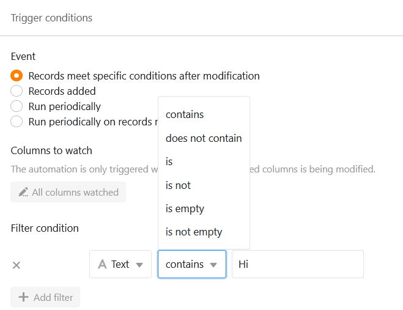



**Trigger-Ereignisse** stellen eine der beiden wesentlichen Komponenten von Automationen dar. Die Ereignisse lösen dabei verschiedene Arten von **Aktionen** aus, die Sie für jede Automation individuell festlegen können. Dieser Artikel bietet Ihnen einen **Überblick** über die verschiedenen Arten von Trigger-Ereignissen.

## Verfügbare Automations-Trigger

In der aktuellsten Version von SeaTable stehen ingesamt **vier** verschiedene Trigger-Ereignisse zur Auswahl:

- Einträge erfüllen nach Bearbeitung bestimmte Bedingungen
- Ein neuer Eintrag wird hinzugefügt
- Periodischer Trigger
- Periodischer Trigger für Einträge, die bestimmte Bedingungen erfüllen

## Automations-Trigger: Einträge erfüllen nach Bearbeitung bestimmte Bedingungen

Wenn Sie dieses Ereignis als Trigger auswählen, wird die entsprechende Automation jedes Mal ausgelöst, wenn in der ausgewählten Tabellenansicht ein Eintrag nach der Bearbeitung bestimmte **Bedingungen** erfüllt.

Bei den Bedingungen können Sie individuell für jede **Spalte** festlegen, wie der entsprechende **Wert** nach der Bearbeitung **aussehen muss**, um die Automation auszulösen. Im Zuge dessen können Sie entscheiden, ob **alle** oder lediglich **ausgewählte** Spalten der Tabellenansicht auf das Eintreten des Trigger-Ereignisses hin überwacht werden sollen.

Wenn Sie das Ereignis "Einträge erfüllen nach Bearbeitung bestimmte Bedingungen" als Trigger einer Automation auswählen, stehen Ihnen folgende **automatische Aktionen** zur Auswahl:

- Benachrichtigung versenden
- App-Benachrichtigung versenden
- E-Mail versenden
- Zeile hinzufügen
- Eintrag sperren
- Eintrag bearbeiten
- Links hinzufügen
- Neuen Eintrag in anderer Tabelle hinzufügen
- Python-Skript ausführen

## Automations-Trigger: Ein neuer Eintrag wird hinzugefügt

Wenn Sie dieses Ereignis als Trigger auswählen, wird die entsprechende Automation jedes Mal ausgelöst, wenn in der ausgewählten Tabellenansicht ein neuer **Eintrag** hinzugefügt wird. Darüber hinaus können Sie das Eintreten des Ereignisses weiter einschränken, indem Sie individuell für jede Spalte einen **Wert** festlegen, den der neue Eintrag **enthalten muss**, um die Automation auszulösen.

Wenn Sie das Ereignis "Ein neuer Eintrag wird hinzugefügt" als Trigger einer Automation auswählen, stehen Ihnen folgende **automatische Aktionen** zur Auswahl:

- Benachrichtigung versenden
- App-Benachrichtigung versenden
- E-Mail versenden
- Zeile hinzufügen
- Eintrag sperren
- Eintrag bearbeiten
- Links hinzufügen
- Neuen Eintrag in anderer Tabelle hinzufügen
- Python-Skript ausführen

## Automations-Trigger: Periodischer Trigger

Wenn Sie einer Automation einen periodischen Trigger zuweisen, können Sie anschließend einen **Zeitpunkt** definieren, zu dem die Automation **täglich**, **wöchentlich** oder **monatlich** ausgelöst wird. Während Sie für eine tägliche Automation nur die **Uhrzeit** festlegen können, können Sie für eine wöchentliche Automation auch einen **Wochentag** bzw. für eine monatliche Automation ein genaues **Datum** angeben.

Wenn Sie einen periodischen Trigger für eine Automation festlegen, stehen Ihnen folgende **automatische Aktionen** zur Auswahl:

- Benachrichtigung versenden
- App-Benachrichtigung versenden
- E-Mail versenden
- Zeile hinzufügen
- Links hinzufügen
- Python-Skript ausführen
- Datenverarbeitungsoperation ausführen

## Automations-Trigger: Periodischer Trigger für Einträge, die bestimmte Bedingungen erfüllen

Dieser Trigger stellt eine Mischung aus dem periodischen Trigger und dem Trigger "Einträge erfüllen nach Bearbeitung bestimmte Bedingungen" dar. Auf der einen Seite können Sie dabei kongruent zum periodischen Trigger einen **Zeitpunkt** angeben, zu dem die Automation **täglich**, **wöchentlich** oder **monatlich** ausgelöst wird.

Darüber hinaus können Sie bei diesem Trigger-Ereignis individuell für jede Spalte der Tabelle bestimmte **Bedingungen** festlegen, denen die **Einträge** in der jeweiligen Spalte entsprechen müssen, damit die Automation zum festgelegten Zeitpunkt vollzogen wird.

Wenn Sie den "Periodischen Trigger für Einträge, die bestimmte Bedingungen erfüllen" für eine Automation auswählen, stehen Ihnen folgende **automatische Aktionen** zur Auswahl:

- Benachrichtigung versenden
- App-Benachrichtigung versenden
- E-Mail versenden
- Eintrag sperren
- Eintrag bearbeiten
- Seite in PDF umwandeln

### Weitere hilfreiche Artikel in der Rubrik Automationen:

- [Arbeiten mit Automationen](https://seatable.io/docs-category/arbeiten-mit-automationen/)
- [Beispiele für Automationen](https://seatable.io/docs-category/beispiele-fuer-automationen/)
