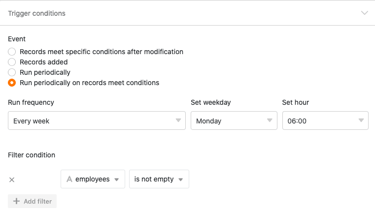



**Trigger events** represent one of the two essential components of automations. The events trigger different types of **actions**, which you can define individually for each automation. This article provides you with an **overview of** the different types of trigger events.

## Available automation triggers

In the latest version of SeaTable there are a total of **four** different trigger events to choose from:

- Entries meet certain conditions after editing
- A new entry is added
- Periodic trigger
- Periodic trigger for entries that meet certain conditions

## Automation trigger: entries fulfill certain conditions after processing

If you select this event as a trigger, the corresponding automation will be fired each time an entry in the selected table view meets certain **conditions** after editing.

In the conditions, you can specify individually for each **column** what the corresponding **value** **must look like** after editing in order to trigger the automation. In the course of this, you can decide whether **all** or only **selected** columns of the table view are to be monitored for the occurrence of the trigger event.

If you select the event "Entries meet certain conditions after editing" as a trigger of an automation, the following **automatic actions** are available for selection:

- Send notification
- Send app notification
- Send e-mail
- Addrow
- Lock entry
- Edit entry
- Add links
- Add new entry in other table
- Run Python script

## Automation trigger: A new entry is added

If you select this event as a trigger, the corresponding automation will be fired every time a new **entry** is added in the selected table view. In addition, you can further restrict the occurrence of the event by individually setting a **value** for each column that the new entry **must contain** to trigger the automation.

If you select the "A new entry is added" event as a trigger of an automation, the following **automatic actions** are available for selection:

- Send notification
- Send app notification
- Send e-mail
- Addrow
- Lock entry
- Edit entry
- Add links
- Add new entry in other table
- Run Python script

## Automation trigger: Periodic trigger

If you assign a periodic trigger to an automation, you can then define a **time at** which the automation is triggered **daily**, **weekly** or **monthly**. While you can only specify the **time** for a daily automation, you can also specify a **day of the week** for a weekly automation or an exact **date for** a monthly automation.

When you set a periodic trigger for an automation, the following **automatic actions** are available for selection:

- Send notification
- Send app notification
- Send e-mail
- Addrow
- Add links
- Run Python script
- Execute data processing operation

## Automation trigger: periodic trigger for entries that meet certain conditions

This trigger is a mixture of the periodic trigger and the "Entries fulfill certain conditions after processing" trigger. On the one hand, you can specify a **time** congruent to the periodic trigger at which the automation is triggered **daily**, **weekly** or **monthly**.

In addition, this trigger event allows you to individually specify for each column of the table certain **conditions** that the **entries** in the respective column must meet in order for the automation to be completed at the specified time.

If you select the "Periodic trigger for entries that meet certain conditions" for an automation, the following **automatic actions** are available for selection:

- Send notification
- Send app notification
- Send e-mail
- Lock entry
- Edit entry
- Convert page to PDF
