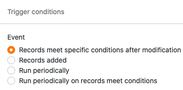
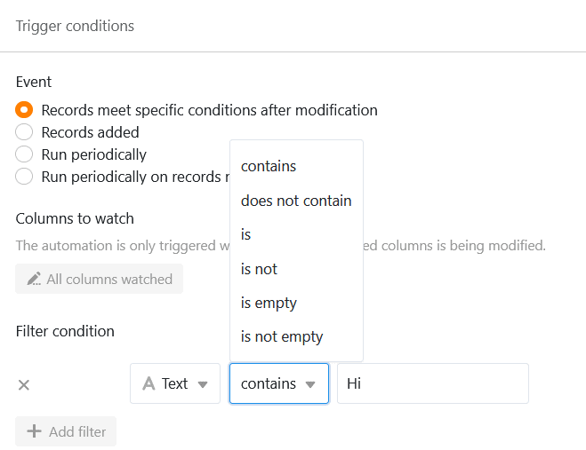
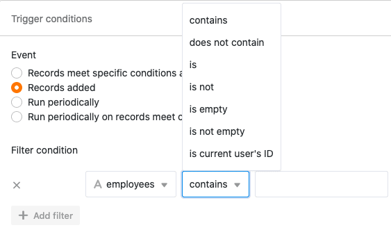
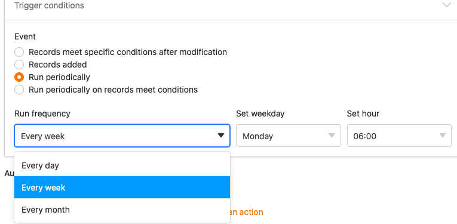
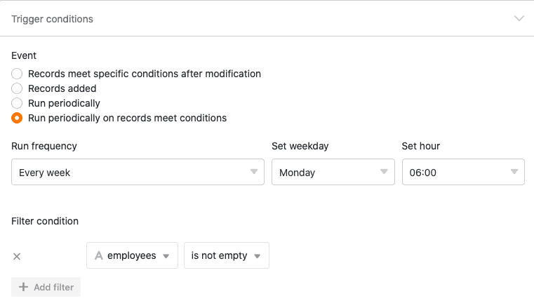



**Los eventos desencadenantes** son uno de los dos componentes esenciales de las automatizaciones. Los eventos desencadenan diferentes tipos de **acciones**, que puede definir individualmente para cada automatización. Este artículo le ofrece una **visión general** de los distintos tipos de eventos desencadenantes.

## Activadores de automatización disponibles

En la última versión de SeaTable, hay un total de **cuatro** eventos desencadenantes diferentes entre los que elegir:

- Las entradas cumplen determinadas condiciones tras la edición
- Se añade una nueva entrada
- Activador periódico
- Activación periódica de las entradas que cumplan determinadas condiciones

## Activador de automatización: las entradas cumplen determinadas condiciones tras el tratamiento

Si selecciona este evento como desencadenante, la automatización correspondiente se desencadena cada vez que una entrada de la vista de tabla seleccionada cumple determinadas **condiciones** tras la edición.

Con las condiciones, puede definir individualmente para cada **columna** **cómo debe** ser el **valor** correspondiente después de la edición para activar la automatización. En el transcurso de este proceso, puede decidir si **todas las** columnas de la vista de tabla o sólo las **seleccionadas** deben supervisarse para detectar la aparición del evento desencadenante.

Si selecciona el evento "Las entradas cumplen determinadas condiciones tras la edición" como desencadenante de una automatización, las siguientes **acciones automáticas** estarán disponibles para su selección:

- Enviar notificación
- Enviar notificación de aplicación
- Enviar correo electrónico
- Añadir línea
- Entrada de la cerradura
- Editar entrada
- Añadir enlaces
- Añadir una nueva entrada en otra tabla
- Ejecutar script Python

## Activador de automatización: se añade una nueva entrada

Si selecciona este evento como desencadenante, la automatización correspondiente se desencadenará cada vez que se añada una nueva **entrada** en la vista de tabla seleccionada. Además, puede restringir aún más la aparición del evento estableciendo individualmente un **valor** para cada columna que **debe contener** la nueva entrada para activar la automatización.

Si selecciona el evento "Se añade una nueva entrada" como desencadenante de una automatización, las siguientes **acciones automáticas** estarán disponibles para su selección:

- Enviar notificación
- Enviar notificación de aplicación
- Enviar correo electrónico
- Añadir línea
- Entrada de la cerradura
- Editar entrada
- Añadir enlaces
- Añadir una nueva entrada en otra tabla
- Ejecutar script Python

## Activación automática: Activación periódica

Si asigna una activación periódica a una automatización, puede definir una **hora a la** que la automatización se active **diaria**, **semanal** o **mensualmente**. Aunque sólo puede especificar la **hora** para una automatización diaria, también puede especificar un **día de la** semana para una automatización semanal o una **fecha exacta para** una automatización mensual.

Si establece un disparador periódico para una automatización, las siguientes **acciones automáticas** están disponibles para su selección:

- Enviar notificación
- Enviar notificación de aplicación
- Enviar correo electrónico
- Añadir línea
- Añadir enlaces
- Ejecutar script Python
- Ejecutar la operación de tratamiento de datos

## Activador de automatización: Activador periódico para entradas que cumplan determinadas condiciones

Este desencadenante es una mezcla del desencadenante periódico y del desencadenante "Las entradas cumplen determinadas condiciones tras el procesamiento". Por un lado, puede especificar un **momento** congruente con el disparador periódico en el que la automatización se active **diaria**, **semanal** o **mensualmente**.

Además, con este evento desencadenante puede definir individualmente determinadas **condiciones para** cada columna de la tabla, que las **entradas** de la columna respectiva deben cumplir para que la automatización se complete en el momento especificado.

Si selecciona la opción "Activación periódica para entradas que cumplan determinadas condiciones" para una automatización, las siguientes **acciones automáticas** estarán disponibles para su selección:

- Enviar notificación
- Enviar notificación de aplicación
- Enviar correo electrónico
- Entrada de la cerradura
- Editar entrada
- Convertir página a PDF
