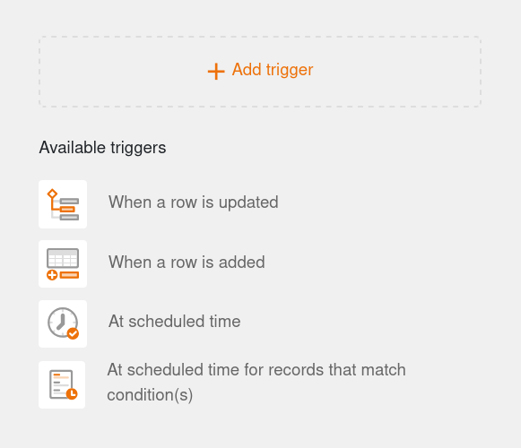
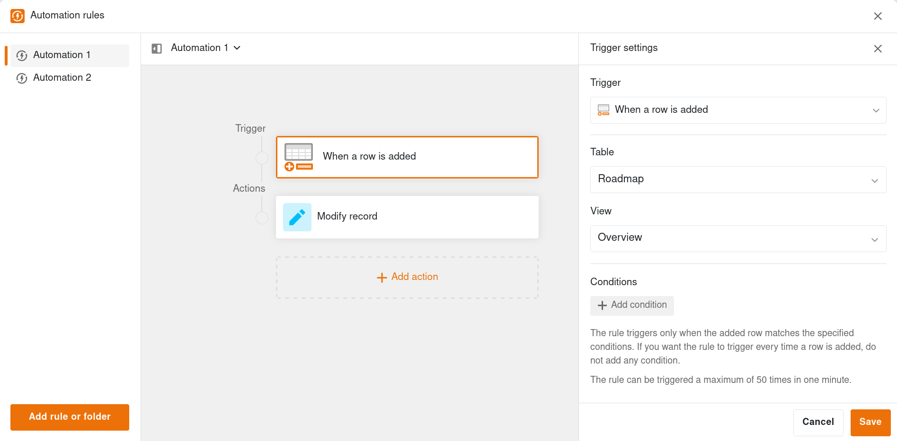
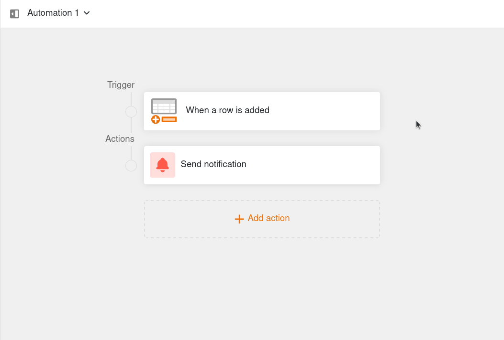
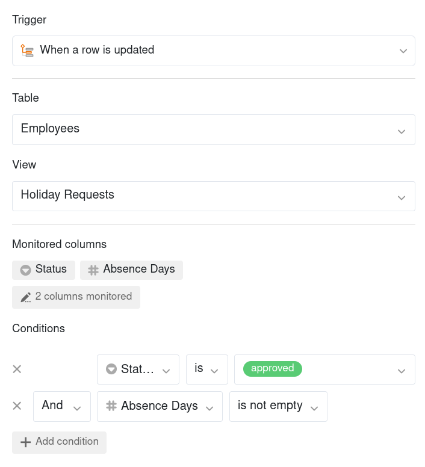
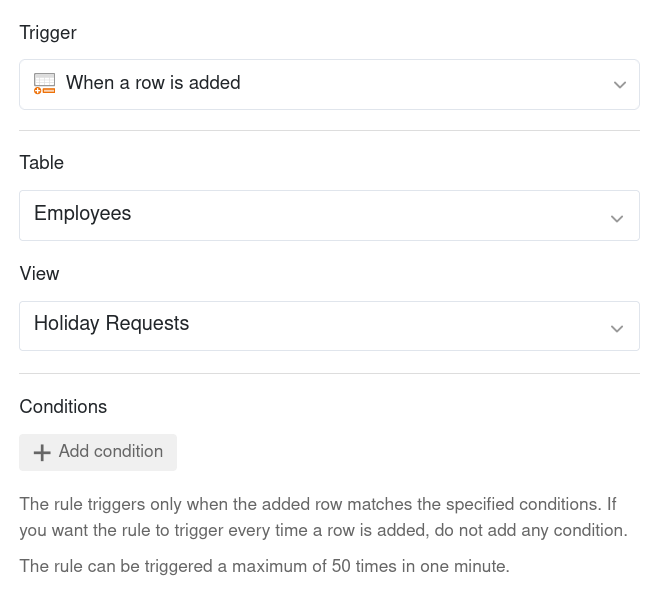
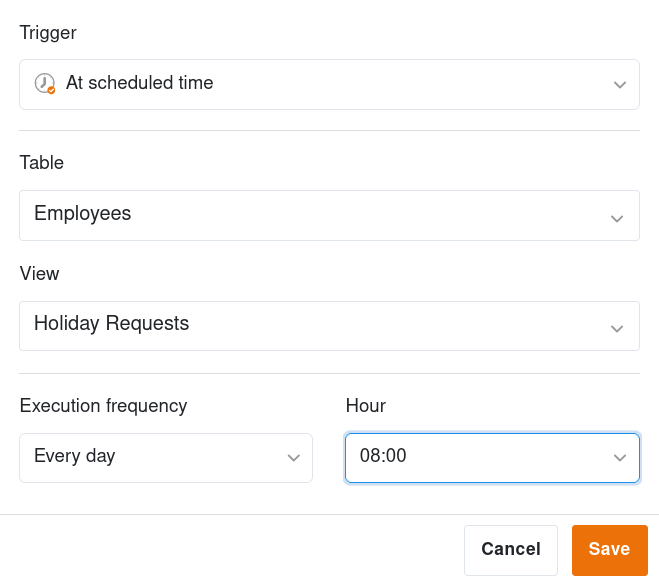
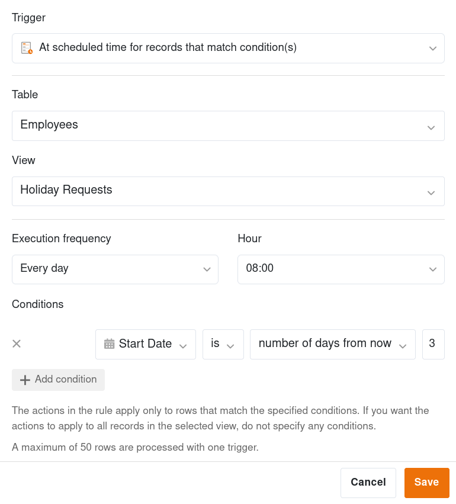



**Les événements déclencheurs** constituent l'un des deux composants essentiels des automatisations. Les événements déclenchent alors différents types d'[actions]() que vous pouvez définir individuellement pour chaque automation. Cet article vous donne un **aperçu** sur les différents types de déclencheurs.

## Déclencheurs d'automatisation disponibles

Dans la dernière version de SeaTable, il existe au total **quatre** déclencheurs différents :

- Lorsqu'une ligne est mise à jour
- Lorsqu'une ligne est ajoutée
- À une heure programmée
- À une heure programmée pour les enregistrements qui correspondent aux conditions

## Paramètres de déclenchement

Pour créer ou modifier un déclencheur, cliquez sur la boîte correspondante dans la zone centrale de l'éditeur d'automatisation. Les paramètres de déclenchement apparaissent ensuite à droite.

- A l'aide du menu déroulant, vous pouvez d'abord modifier le **déclencheur**. Pour ce faire, sélectionnez l'événement déclencheur souhaité.
- Définissez ensuite la **table** et la **vue** dans laquelle l'automatisation doit agir.
- Selon le type de déclencheur, vous pouvez encore définir d'autres paramètres, par exemple les **colonnes surveillées**, les **conditions** pour le déclenchement ou le **temps** du déclenchement.



## Déclencheur d'automatisation : Lorsqu'une ligne est mise à jour

Si vous sélectionnez cet événement comme déclencheur, l'automatisation correspondante se déclenchera chaque fois qu'une valeur sera modifiée dans l'une des colonnes surveillées et qu'une ligne de la vue sélectionnée remplira certaines conditions après modification. Si vous souhaitez que le déclencheur se déclenche à chaque modification, n'ajoutez pas de conditions.

Pour les **conditions**, vous pouvez définir individuellement pour chaque colonne à quoi doit ressembler la valeur correspondante après modification pour que l'automatisation se déclenche. Dans le même temps, vous pouvez décider si toutes les colonnes de la vue ou seulement les colonnes sélectionnées doivent être surveillées pour l'occurrence de l'événement déclencheur.

Si vous sélectionnez cet événement comme déclencheur d'une automatisation, vous pouvez choisir les **actions automatiques** suivantes :

- Envoyer une notification
- Envoyer une notification à une app
- Envoyer un e-mail
- Ajouter un enregistrement
- Verrouiller l'enregistrement
- Modifier l'enregistrement
- Ajouter des liens
- Ajouter un enregistrement dans un autre tableau
- Exécuter un script Python
- Appeler l'IA

## Déclencheur d'automatisation : Lorsqu'une ligne est ajoutée

Si vous sélectionnez cet événement comme déclencheur, l'automatisation correspondante sera déclenchée chaque fois qu'une **nouvelle ligne** est ajoutée dans la vue sélectionnée. De plus, vous pouvez limiter davantage la survenue de l'événement en définissant des **conditions** que la nouvelle ligne doit remplir.

Pour les conditions, vous pouvez définir individuellement pour chaque colonne ce que doit être la valeur correspondante pour que l'automatisation se mette en marche. Si vous souhaitez que chaque nouvelle ligne déclenche l'automation, n'ajoutez pas de conditions.



Si vous sélectionnez cet événement comme déclencheur d'une automatisation, vous pouvez choisir les **actions automatiques** suivantes :

- Envoyer une notification
- Envoyer une notification à une app
- Envoyer un e-mail
- Ajouter un enregistrement
- Verrouiller l'enregistrement
- Modifier l'enregistrement
- Ajouter des liens
- Ajouter un enregistrement dans un autre tableau
- Exécuter un script Python
- Appeler l'IA

## Déclencheur d'automatisation : À une heure programmée

Si vous sélectionnez ce déclencheur, vous pouvez ensuite définir une **heure** à laquelle l'automatisation s'exécutera **quotidiennement**, **hebdomadairement** ou **mensuellement**.

Alors que vous ne pouvez spécifier que l'**heure** pour une automation quotidienne, vous pouvez également spécifier le **jour de la semaine** pour une automation hebdomadaire ou le **jour du calendrier** pour une automation mensuelle.

Lorsque vous définissez ce déclencheur pour une automatisation, vous avez le choix entre les **actions automatiques** suivantes :

- Envoyer une notification
- Envoyer une notification à une app
- Envoyer un e-mail
- Ajouter un enregistrement
- Ajouter des liens
- Exécuter un script Python
- Appeler l'IA
- Exécuter un traitement de données
- Créer un PDF à partir d'un document et l'envoyer

## Déclencheur d'automatisation : À une heure programmée pour les enregistrements qui correspondent aux conditions

Pour ce déclencheur, vous indiquez, de manière congruente avec le déclencheur mentionné précédemment, une **heure** à laquelle l'automatisation sera déclenchée **quotidiennement**, **hebdomadairement** ou **mensuellement**. En outre, vous pouvez limiter les lignes concernées par cet événement déclencheur.

Pour les **conditions**, vous pouvez définir individuellement pour chaque colonne quelle doit être la valeur correspondante pour que l'automation soit exécutée au moment défini.

Lorsque vous sélectionnez ce déclencheur pour une automatisation, les **actions automatiques** suivantes sont disponibles :

- Envoyer une notification
- Envoyer une notification à une app
- Envoyer un e-mail
- Verrouiller l'enregistrement
- Modifier l'enregistrement
- Convertir une page en PDF
