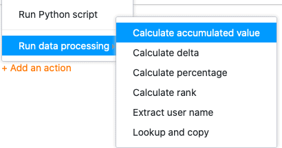
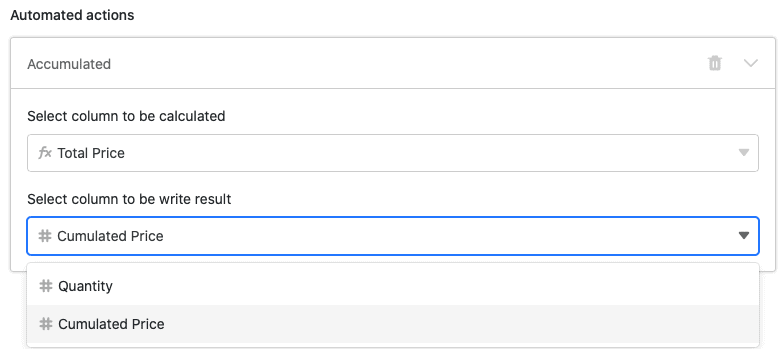
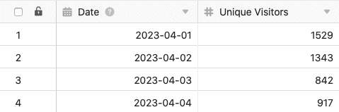
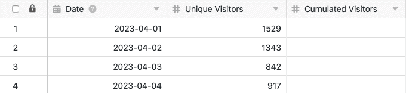
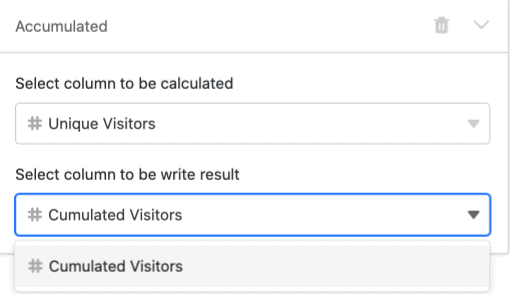
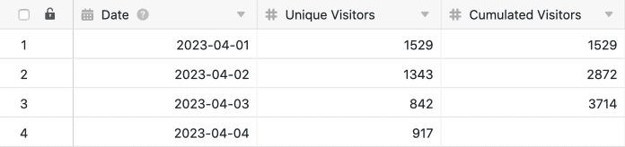
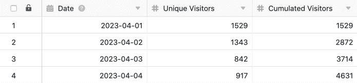

Mithilfe von Automationen müssen Sie eine Datenverarbeitungsoperation nicht mehr manuell ausführen, sondern können diese automatisch ausführen lassen. Die Vielfalt der verfügbaren [Datenverarbeitungsoperationen]() – von mathematischen Berechnungen bis hin zur Herstellung von Verknüpfungen zwischen Werten in verschiedenen Tabellen – eröffnet Ihnen dabei neue Möglichkeiten in der Automatisierung Ihrer Arbeitsprozesse.

## Eine Datenverarbeitungsoperation per Automation ausführen

1. Klicken Sie im Base-Header auf  und im Anschluss auf **Automatisierungsregeln**.
2. Klicken Sie auf **Regel hinzufügen**.
3. Geben Sie der Automation einen **Namen** und legen Sie die **Tabelle** und **Ansicht** fest, in der diese ausgelöst werden soll.
4. Definieren Sie ein **Trigger-Ereignis**, welches die Automation auslöst.
5. Klicken Sie auf **Aktion hinzufügen** und wählen Sie als automatisierte Aktion **Datenverarbeitungsoperation ausführen** aus.
6. Wählen Sie eine beliebige **Datenverarbeitungsoperation** aus.
7. Nehmen Sie die erforderlichen **Einstellungen** (z. B. Tabelle, Quellspalte, Ergebnisspalte) an der **Datenverarbeitungsoperation** vor.
8. Bestätigen Sie mit **Abschicken**.

## Anlegen der Automation

Nachdem Sie festgelegt haben, in welcher **Tabelle** und **Ansicht** die Automation ausgelöst werden soll, definieren Sie das [Trigger-Ereignis](). Aktuell kann nur ein **Periodischer Trigger** eine Datenverarbeitungsoperation nach sich ziehen. Deshalb müssen Sie einen **Zeitpunkt** festlegen, zu welchem die Automation täglich, wöchentlich oder monatlich ausgelöst werden soll.

 

Wählen Sie anschließend als automatisierte Aktion **Datenverarbeitungsoperation ausführen** aus und entscheiden Sie sich für die gewünschte [Datenverarbeitungsoperation]().

Folgende **Datenverarbeitungsoperationen** stehen Ihnen dabei zur Auswahl:

- [Kumulierte Werte berechnen]()
- [Veränderungen berechnen]()
- [Prozentualen Anteil berechnen]()
- [Rangliste berechnen]()
- [Benutzernamen übertragen]()
- [Vergleichen und kopieren]()

Im nächsten Schritt nehmen Sie spezifische **Einstellungen** an der **Datenverarbeitungsoperation** vor, die mithilfe der Automation ausgelöst werden soll. Je nach ausgewählter Operation werden Sie um die Definition von **Tabellen** und/oder **Spalten** (z. B. Quell- und Ergebnis-Spalte) gebeten, die Sie für die mathematischen Berechnungen oder die Herstellung von Beziehungen zwischen Werten in verschiedenen Tabellen nutzen wollen.

Bestätigen Sie abschließend die Automation mit **Abschicken**, um diese zu speichern und zum definierten Zeitpunkt des Triggers ausführen zu lassen, oder klicken Sie auf **Jetzt ausführen**, um die Automation **direkt** ausführen zu lassen.

## Anwendungsbeispiel

Ein konkreter Anwendungsfall für diese Art von Automation könnte beispielsweise auftreten, wenn Sie die Anzahl der täglichen Zugriffe auf eine Website in Ihrer Tabelle erheben möchten. Hierfür möchten Sie die **Zugriffszahlen** jedes einzelnen Tages, die in einer bestehenden [Zahlen-Spalte]() erfasst sind, von Zeile zu Zeile in einer neuen Spalte **aufaddieren**.

Bisher war die [Berechnung der kumulierten Zugriffszahlen mithilfe einer Datenverarbeitungsoperation]() nur **manuell** möglich. Mithilfe einer entsprechenden Automation ist es von nun an möglich, die kumulierten Zugriffszahlen **jeden Tag** zu einem festen Zeitpunkt **automatisch** berechnen zu lassen.

Für die Umsetzung benötigen Sie zunächst eine Tabelle, in der die verschiedenen **Tage** in einer [Datum-Spalte]() und die **Zugriffszahlen** auf die Website in einer [Zahlen-Spalte]() erhoben werden.

Dann fügen Sie der Tabelle eine **zweite Zahlen-Spalte** hinzu, in welcher nach jeder Ausführung der Automation die kumulierten Werte berechnet werden. Die neue, zunächst noch leere Spalte _Cumulated Visitors_ fungiert bei der Datenverarbeitungsoperation als **Ergebnisspalte**, während die Spalte _Unique Visitors_ die **Quellspalte** darstellt.

Um die Automation anzulegen, befolgen Sie die im Abschnitt [Anlegen der Automation](https://seatable.io/?post_type=docs&p=24813#anlegen_der_automation) beschriebenen Schritte. Wählen Sie zudem die Spalte _Unique Visitors_ als **Quellspalte** und die neu hinzugefügte Spalte _Cumulated Visitors_ als **Ergebnisspalte** aus.

Nach Bestätigung der Automation errechnet SeaTable täglich zum ausgewählten Zeitpunkt die **kumulierte Anzahl an Website-Bersuchern** und schreibt sie automatisch in die Ergebnisspalte. Die automatische Berechnung der kumulierten Werte setzt dabei natürlich voraus, dass die **Anzahl der Website-Besucher des vorherigen Tages** täglich, **vor** der Ausführung der Automation, in die Spalte _Unique Visitors_ geschrieben wird.

Tabelle **vor** Auslösung der Automation:

Tabelle **nach** Auslösung der Automation:

