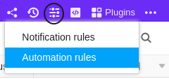
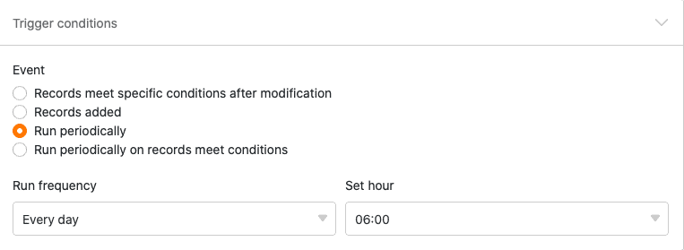

С помощью автоматики вам больше не придется выполнять операции по обработке данных вручную, а можно сделать это автоматически. Разнообразие доступных [операций обработки данных]() - от математических расчетов до создания связей между значениями в различных таблицах - открывает новые возможности для автоматизации рабочих процессов.

## Выполнить операцию обработки данных с помощью автоматизации

1. Нажмите на  в заголовке Base, а затем на **Automation Rules**.
2. Нажмите кнопку **Добавить правило**.
3. Дайте автоматике **имя** и определите **таблицу** и **представление, в** которых она должна срабатывать.
4. Определите **триггерное событие, которое запускает** автоматизацию.
5. Нажмите **Добавить действие** и выберите **Запустить операцию обработки данных** в качестве автоматического действия.
6. Выберите любую **операцию обработки данных**.
7. Выполните необходимые **настройки** (например, таблица, колонка источника, колонка результата) на **операции обработки данных**.
8. Подтвердите с помощью кнопки **Отправить**.

## Создание автоматизации

После того как вы определили, в какой **таблице** и **представлении** должна срабатывать автоматизация, определите [событие срабатывания](). В настоящее время только **периодический триггер** может привести к операции обработки данных. Поэтому необходимо определить **время**, когда автоматизация должна срабатывать ежедневно, еженедельно или ежемесячно.



