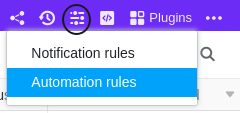
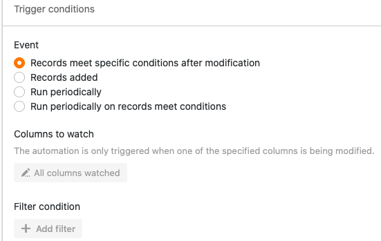
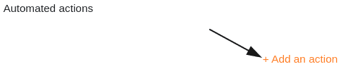
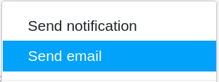
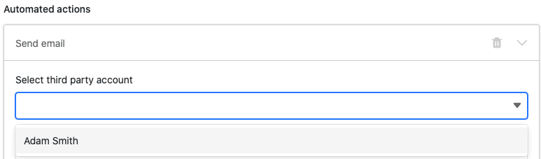
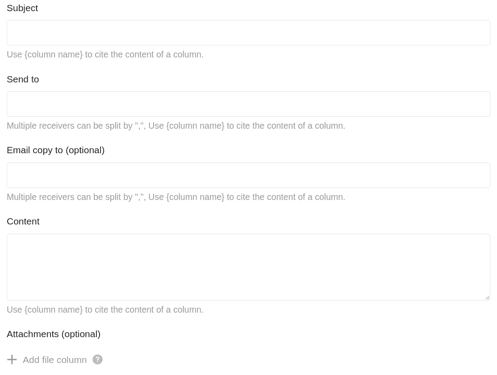
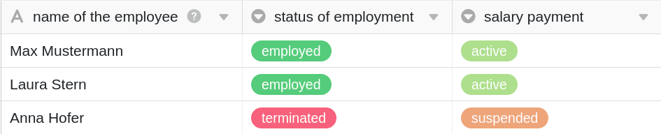
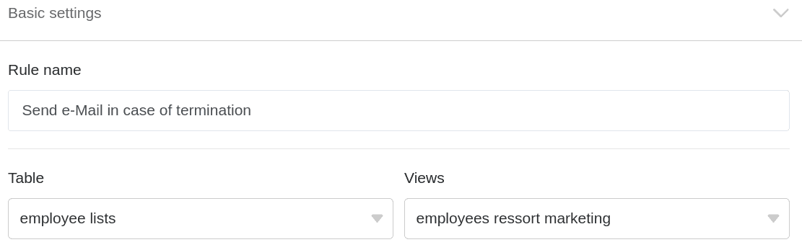
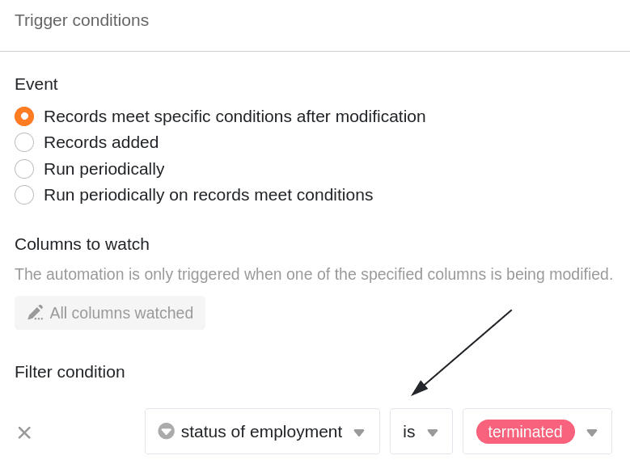
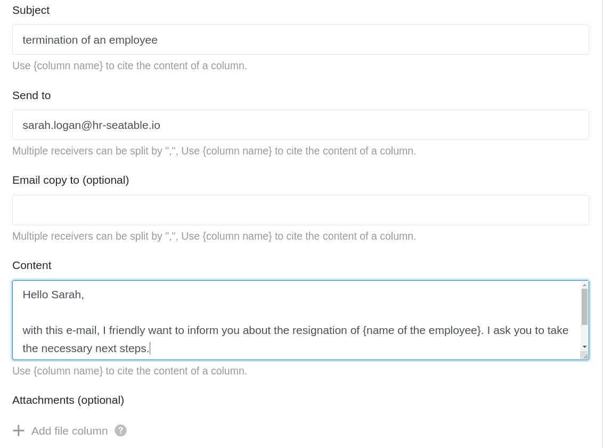

Mithilfe von Automationen müssen Sie E-Mails nicht mehr manuell an ausgewählte Benutzer versenden, sondern können diese automatisch verschicken lassen. Definieren Sie hierfür einfach eine entsprechende Automation für eine beliebige Tabellenansicht.

## E-Mails per Automation versenden

1. Klicken Sie im Base-Header auf  und im Anschluss auf **Automatisierungsregeln**.
2. Klicken Sie auf **Regel hinzufügen**.
3. **Benennen** Sie die Automation und legen Sie die **Tabelle** und **Ansicht** fest, in der diese wirken soll.
4. Definieren Sie ein **Trigger-Ereignis**, welches die Automation auslöst.
5. Klicken Sie auf **Aktion hinzufügen** und wählen Sie als automatisierte Aktion **E-Mail versenden** aus.
6. Bestätigen Sie mit **Abschicken**.

## Anlegen der Automation

Definieren Sie für die Automation zunächst ein **Trigger-Ereignis**.



Die automatisierte Aktion **E-Mail versenden** steht Ihnen nach allen Trigger-Ereignissen zur Verfügung:

- Einträge erfüllen nach Bearbeitung bestimmte Bedingungen
- Ein neuer Eintrag wird hinzugefügt
- Periodischer Trigger
- Periodischer Trigger für Einträge, die bestimmte Bedingungen erfüllen



Wählen Sie anschließend als automatisierte Aktion **E-Mail versenden** aus.

 

Im nächsten Schritt wählen Sie zunächst ein **E-Mail-Konto** aus, von welchem Sie die E-Mails versenden möchten. Um Ihr E-Mail-Konto für den Versand nutzen zu können, **müssen** Sie dieses zunächst als Drittanbieter in Ihrer SeaTable Base **hinzufügen**. Eine detaillierte Anleitung zu diesem Schritt finden Sie [hier](https://seatable.io/docs/drittanbieter-e-mail/gmail-fuer-den-versand-von-e-mails-per-smtp-einrichten/).



Nach der Auswahl des E-Mail-Kontos legen Sie den **Betreff**, **Empfänger** und **Inhalt** der E-Mail fest. Sie können **mehrere E-Mail-Adressen** per Komma getrennt und in CC eintragen. Anschließend haben Sie zudem die Möglichkeit, **Anhänge** aus einer [Dateispalte](https://seatable.io/docs/dateien-und-bilder/die-datei-spalte/) einzufügen.

Bestätigen Sie abschließend die Automation mit einem Klick auf **Abschicken**.

## Anwendungsbeispiel

Ein konkreter **Anwendungsfall** für diese Art von Automation könnte beispielsweise auftreten, wenn Sie im Betriebsrat eines Unternehmens arbeiten. Dabei möchten Sie die Personalabteilung automatisch darüber informieren, dass Sie die Kündigung eines Mitarbeiters genehmigt haben.

Konkret umsetzen lässt sich dies mithilfe einer Tabelle, in der verschiedene **Daten** aller Mitarbeiter Ihres Unternehmens gepflegt werden. In diesem Zusammenhang könnten Sie unter anderem die **Namen** der Mitarbeiter, den **Beschäftigungsstatus** und den Status ihrer **Gehaltszahlungen** erfassen.

Mithilfe einer Automation soll SeaTable nun automatisch eine **E-Mail** an die Personalabteilung senden, sobald Sie die Kündigung eines Mitarbeiters im Betriebsrat genehmigt haben.

### Anlegen der Automation

Als Erstes geben Sie der Automation einen **Namen** und wählen sowohl die **Tabelle** (employee list) als auch die **Ansicht** (employees ressort marketing) aus, in der die Automation wirken soll.

Als **Trigger-Ereignis** der Automation wählen Sie die Option **Einträge erfüllen nach Bearbeitung bestimmte Bedingungen** aus. Damit die E-Mails **ausschließlich** im Falle der Kündigung eines Mitarbeiters versendet werden, fügen Sie als **Filterbedingung** hinzu, dass der Eintrag in der Spalte **status of employment** auf **terminated** geändert werden muss.

Als **automatisierte Aktion** definieren Sie die Aktion **E-Mail versenden**.

Im nächsten Schritt wählen Sie ein **E-Mail-Konto** aus, von welchem Sie die E-Mails an die Personalabteilung senden wollen. Um Ihr E-Mail-Konto für den Versand nutzen zu können, **müssen** Sie dieses zunächst als Drittanbieter in Ihrer SeaTable Base **hinzufügen**. Eine detaillierte Anleitung zu diesem Schritt finden Sie [hier](https://seatable.io/docs/drittanbieter-e-mail/gmail-fuer-den-versand-von-e-mails-per-smtp-einrichten/).



Nach der Auswahl Ihres E-Mail-Kontos legen Sie den **Betreff**, **Empfänger** und **Inhalt** der E-Mails fest. Sie können **mehrere E-Mail-Adressen** per Komma getrennt und in CC eintragen. Abschließend haben Sie zudem die Möglichkeit, **Anhänge** aus einer [Dateispalte](https://seatable.io/docs/dateien-und-bilder/die-datei-spalte/) einzufügen.



Wenn Sie die zu versendende E-Mail fertiggestellt haben, bestätigen Sie die Automation mit **Abschicken**.

### Testen der Automation

Wenn Sie im Anschluss in der ausgewählten Tabelle den Beschäftigungsstatus eines Mitarbeiters auf **gekündigt** ändern, wird die vorgefertigte **E-Mail** automatisch an die Personalabteilung versendet, um diese über die Kündigung zu informieren.

### Weitere interessante Beispiele für Automationen:

- [Zeilen per Automation sperren](https://seatable.io/docs/beispiele-fuer-automationen/zeilen-per-automation-sperren/)
- [Verlinken von Einträgen per Automation](https://seatable.io/docs/beispiele-fuer-automationen/verlinken-von-eintraegen-per-automation/)
- [Zeilen per Automation hinzufügen](https://seatable.io/docs/beispiel-automationen/zeilen-per-automation-hinzufuegen/)
- [Einträge in andere Tabellen per Automation hinzufügen](https://seatable.io/docs/beispiel-automationen/eintraege-in-andere-tabellen-per-automation-hinzufuegen/)
- [Benachrichtigungen per Automation versenden](https://seatable.io/docs/benachrichtigungen/benachrichtigungen-per-automation-versenden/)
