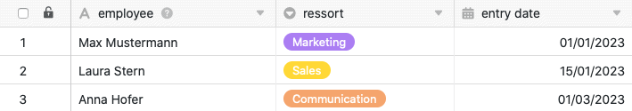

Mithilfe von Automationen müssen Sie Einträge in andere Tabellen nicht mehr manuell durchführen, sondern können diese Schritte automatisch ausführen lassen. Der große Vorteil daran ist, dass sich der Trigger nicht in derselben Tabelle befinden muss wie die ausgelöste Aktion.

## Einträge in andere Tabellen per Automation hinzufügen

1. Klicken Sie im Base-Header auf  und im Anschluss auf **Automatisierungsregeln**.
2. Klicken Sie auf **Regel hinzufügen**.
3. **Benennen** Sie die Automation und legen Sie die **Tabelle** und **Ansicht** fest, in der diese ausgelöst werden soll.
4. Definieren Sie ein **Trigger-Ereignis**, welches die Automation auslöst.
5. Klicken Sie auf **Aktion hinzufügen** und wählen Sie als automatisierte Aktion **Neuen Eintrag in anderer Tabelle hinzufügen** aus.
6. Definieren Sie die **Tabelle**, in die der Eintrag eingefügt werden soll, sowie die vorausgefüllten **Felder**.
7. Bestätigen Sie mit **Abschicken**.

## Anlegen der Automation

Definieren Sie für die Automation ein **Trigger-Ereignis**, nachdem Sie zunächst festgelegt haben, in welcher **Tabelle** und **Ansicht** dieses auftreten wird.



Die automatisierte Aktion **Neuen Eintrag in anderer Tabelle hinzufügen** steht Ihnen **ausschließlich** bei folgenden Trigger-Ereignissen zur Verfügung:

- [Einträge erfüllen nach Bearbeitung bestimmte Bedingungen](https://seatable.io/docs/automationen/automations-trigger/#automations-trigger_eintraege_erfuellen_nach_bearbeitung_bestimmte_bedingungen)
- [Ein neuer Eintrag wird hinzugefügt](https://seatable.io/docs/automationen/automations-trigger/#automations-trigger_ein_neuer_eintrag_wird_hinzugefuegt)



Wählen Sie anschließend als automatisierte Aktion **Neuen Eintrag in anderer Tabelle hinzufügen** aus.

 

Im nächsten Schritt wählen Sie die **Tabelle** aus, in welche der Eintrag nach Auslösung des Triggers hinzugefügt werden soll.

Klicken Sie im Anschluss auf **Feld hinzufügen**, um die Spalten auszuwählen, für die Sie festgelegte Werte im neuen Eintrag definieren möchten.

Wählen Sie nun im Drop-down-Menü eine entsprechende **Spalte** aus und definieren Sie den vorausgefüllten **Wert** im Eingabefeld. Je nach ausgewähltem [Spaltentyp](
) haben Sie unterschiedliche **Optionen** zur Auswahl.

Bestätigen Sie abschließend die Automation mit einem Klick auf **Abschicken**.

## Anwendungsbeispiel

Ein konkreter **Anwendungsfall** für diese Art von Automation könnte beispielsweise auftreten, wenn Sie als Führungskraft eines Unternehmens für die neu in Ihrem Team beginnenden Mitarbeiter zuständig sind. Im Onboarding-Prozess könnte festgelegt sein, dass Sie am ersten Arbeitstag die **Gehaltszahlung** für den Mitarbeiter beantragen und die **Ausgabe eines Dienstwagens** dokumentieren sollen.

Dabei möchten Sie die Personalabteilung automatisch, wenn Sie den neuen Mitarbeiter in Ihrer Tabelle eintragen, darüber informieren, dass Sie den Dienstwagen übergeben haben und dass die Personalabteilung die Gehaltsabrechnung für den ersten Monat vorbereiten kann. Dazu soll SeaTable einen **neuen Eintrag in der Tabelle der Personalabteilung hinzufügen**.

Konkret umsetzen lässt sich dies Ihrerseits mithilfe einer Tabelle, in der Sie verschiedene Mitarbeiterdaten pflegen. Erheben könnten Sie in diesem Zusammenhang unter anderem den Namen der Mitarbeiter bzw. Neuzugänge, ihr Ressort und ihr Einstiegsdatum.

Mithilfe einer Automation soll nun automatisch, wenn Sie einen neuen Mitarbeiter in die Tabelle eintragen, ein neuer Eintrag in eine andere Tabelle hinzugefügt werden, welche von der Personalabteilung zur Verwaltung der Gehaltszahlungen und Dienstwagen genutzt wird.

### Anlegen der Automation

Als Erstes geben Sie der Automation einen **Namen** und wählen sowohl die **Tabelle** (employee lists) als auch die **Ansicht** (new employees) aus, in der die Automation ausgelöst werden soll.

Als **Trigger-Ereignis** der Automation wählen Sie die Option **Einträge erfüllen nach Bearbeitung bestimmte Bedingungen** aus.

Damit **ausschließlich** neue Einträge in die Tabelle der Personalabteilung hinzugefügt werden, sobald Sie den **Namen** eines neuen Mitarbeiters **in Ihrer Tabelle** eingetragen haben, wählen Sie als **Filterbedingung** aus, dass die Spalte "employee" nach der Bearbeitung **nicht leer** sein darf.

Als **automatisierte Aktion** definieren Sie die Aktion **Neuen Eintrag in anderer Tabelle hinzufügen**.

Im nächsten Schritt wählen Sie als **Tabelle**, in welche nach Auslösung der Automation ein Eintrag hinzugefügt wird, die Tabelle "Payments" aus.

Anschließend definieren Sie die **Werte**, mit denen bestimmte Felder vorausgefüllt werden sollen. Um den Namen eines neuen Mitarbeiters im neuen Eintrag in der Tabelle der Personalabteilung zu zitieren, schreiben Sie den **Namen** der Spalte, in der dieser in Ihrer Tabelle zu finden ist, umrahmt von geschweiften Klammern in das Textfeld: {employee}

### Testen der Automation

Wenn Sie nach der Bestätigung der Automation den Namen eines neuen Mitarbeiters in Ihre Tabelle eintragen, ...

... werden die definierten Einträge automatisch in die Tabelle der Personalabteilung hinzugefügt.

### Weitere interessante Beispiele von Automationen:

- [Zeilen per Automation sperren](https://seatable.io/docs/beispiele-fuer-automationen/zeilen-per-automation-sperren/)
- [Verlinken von Einträgen per Automation](https://seatable.io/docs/beispiele-fuer-automationen/verlinken-von-eintraegen-per-automation/)
- [Zeilen per Automation hinzufügen](https://seatable.io/docs/beispiel-automationen/zeilen-per-automation-hinzufuegen/)
- [Benachrichtigungen per Automation versenden](https://seatable.io/docs/benachrichtigungen/benachrichtigungen-per-automation-versenden/)
- [E-Mail-Versand per Automation](https://seatable.io/docs/beispiel-automationen/e-mail-versand-per-automation/)
